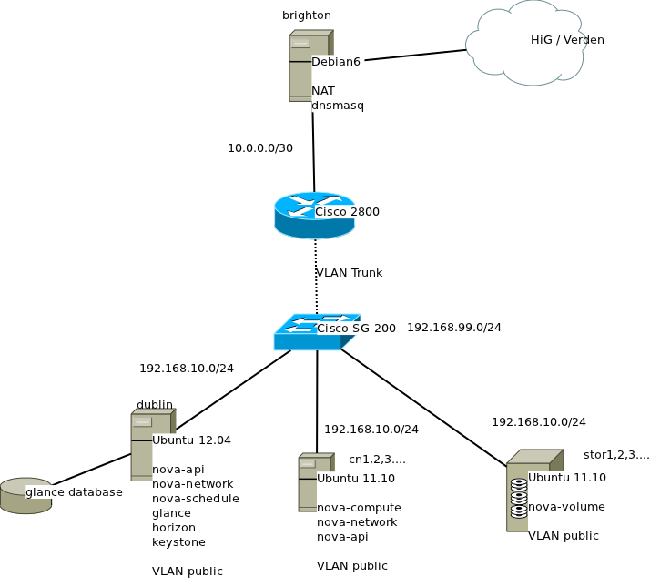
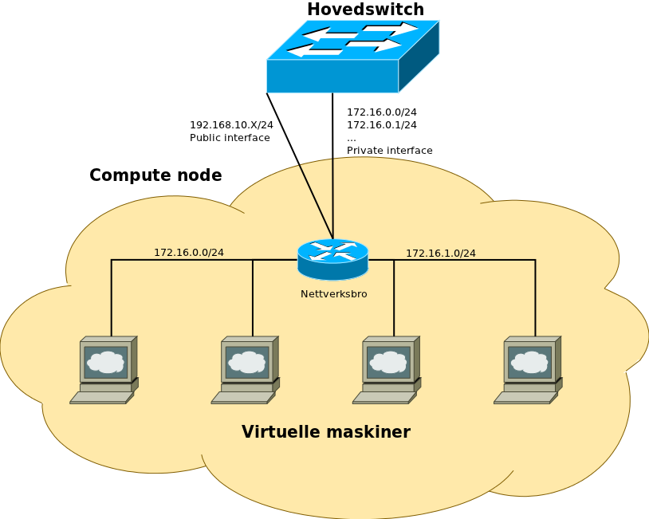

=====================
Bacheloroppgave
=====================

   Figur 1: Forsideboks

|
|
|
|
|
|
|
|
|
|
|
|
|
|
|
|
|
|
|
|
|
|
|
|
|
|
|

:Forfattere:
  Lars Erik Pedersen, Jon Arne Westgaard, Hallvard Westman

:Versjon: 0.5 - 14.05.2012

.. ``twelvepoint``

.. header:: SkyHigh Adm
.. footer:: ###Page###

.. Overskrift1 = #
.. Overskrift2 = -
.. Overskrift3 = *
.. Overskrift4 = .

.. raw:: pdf

  PageBreak

.. csv-table:: Tabell 1: Sammendrag av bacheloroppgave
   :widths: 15,50  

   "**Tittel:**", "SkyHiGh Adm      **Nr: - Dato: 24.05.12**"
   "**Deltaker(e)**", "Lars Erik Pedersen, Jon Arne Westgaard, Hallvard Westman"
   "**Veileder(e):**", "Hanno Langweg, Høgskolen i Gjøvik"
   "**Oppdragsgiver:**", "Erik Hjelmås, Høgskolen i Gjøvik"
   "**Kontaktperson:**", ""
   "**Stikkord (4stk):**", "sky, virtualisering, "
   "**Antall Sider:**", "**Antall bilag:** **Tilgjengelighet (åpen/konfidensiell):** Åpen"
   "**Kort beskrivelse av bacheloroppgaven:**", "Sette opp en skalerbar sky-tjeneste til bruk i undervisning på HiG"

Se vedlegg M. Ekstra forside? Skriv et godt sammendrag så det kan presenteres.

   
.. raw:: pdf

  PageBreak

.. csv-table:: Tabell 2: Summary of Graduate Project
  :widths: 15,50  

   "**Title:**", "SkyHiGh Adm      **Nr: - Dato: 24.05.12**"
   "**Participants**", "Lars Erik Pedersen, Jon Arne Westgaard, Hallvard Westman"
   "**Supervisor:**", "Hanno Langweg, Høgskolen i Gjøvik"
   "**Employer:**", "Erik Hjelmås, Høgskolen i Gjøvik"
   "**Contact person:**", ""
   "**Keywords:**", "sky, virtualisering, "
   "**Pages:**", "**Antall bilag:** **Tilgjengelighet (åpen/konfidensiell):** Åpen"
   "**Short description of the main project:**", "Sette opp en skalerbar sky-tjeneste til bruk i undervisning på HiG"

.. raw:: pdf

  PageBreak

Forord
#######

“Getting OpenStack up and running does earn you the title of Jedi Knight.”

Prosjektet går ut på å sette opp en intern nettsky for IMT ved HiG. Som aktive brukere av Amazons skytjenester og erfaring fra bruk av virtuelle maskiner i undervisning ved HiG var denne oppgaven tiltalende for oss. 

Takk til uksysadmin, mjfork, kiall, ohnoimdead (OpenStack utviklere), samt resten av de hjelpsomme sjelene på #openstack for support over IRC. Deres kunnskap og hjelpsomhet har bidratt i stor grad til å drive prosjektet fremover.

Takk til veileder Hanno Langweg og oppdragsgiver Erik Hjelmås for god hjelp under prosjektet.

Oppdragsgiver er Erik Hjelmås, førsteamanuensis ved Høgskolen i Gjøvik. Erik underviser i
Operativsystemer og Systemadministrasjon, hvor han benytter virtuelle maskiner i undervisningen.

.. contents:: Innholdsfortegnelse
   :depth: 2

.. sectnum::

.. raw:: pdf
   
  PageBreak

Innledning
###########

Oppgavebeskrivelse
--------------------

Formålet med bacheloroppgaven SkyHiGh ADM er å få satt opp et system hvor studenter og faglig ansatte kan opprette virtuelle maskiner via en selvbetjenings-løsning, uten at en administrator må opprette virtuelle maskiner manuelt til de som behøver dette, samt muligheten for fremtidig skalering av infrastrukturen dette kjører på hvis/når dette blir nødvendig.
Slik vil arbeidsbelastningen på administrator minskes, og forelesere vil kunne få full kontroll over de virtuelle maskiner som brukes i undervisningen.
Navnet SkyHiGh spiller på "sky" og "HiG", og er prosjektet for HiG sin nettsky.

Nettskyer har fått mye oppmerksomhet de siste årene, og er en teknologi som gjør det mulig for sluttbrukere å kjøre virtuelle maskiner på andres maskinvare og infrastruktur. Dette åpner for muligheter for dynamisk skalering av ressurser, fleksibilitet og økonomiske besparelser.
Slike skyer kan man dra nytte av i undervisning hvor man da kan bruke disse til forskning eller som lab til studenter.
I emnene Ethical Hacking And Penetration Testing (REFERANSE), Systemadministrasjon (REFERANSE) og Database- og applikasjonsdrift (REFERANSE) har virtuelle maskiner vært brukt, hvor elevene får utdelt ett sett med virtuelle maskiner som man da kan kjøre tester og gjøre oppgaver på. På denne måten får man dratt nytte av praktisk undervisning uten å måtte sette opp fysiske maskiner. Skulle man komme i skade for å kjøre en kommando eller gjøre en endring som ødelegger konfigurasjonen, skal det bare et par tastetrykk til for å gjenopprette opprinnelig konfigurasjon.
Dagens løsning er basert på MLN (REFERANSE), som er litt kompleks på administrasjons-siden samt har ytelsesproblemer. MLN er et administrasjonsverktøy for virtuelle nettverk og maskiner, og støtter Xen, VMware Server og User-Mode Linux. Selve administreringen av MLN gjøres i egne konfigurasjonsfiler, og konfigurasjonen skrives i MLNs eget språk. MLN har ikke noe grafisk grensesnitt, og all administrasjon gjøres via kommandolinjen av en administrator. Når en hel klasse bruker de virtuelle maskinene samtidig går mye av tiden til å vente på at kommandoer skal kjøres og at de virtuelle maskinene skal "reagere".

Oppdragsgiver ønsker en løsning basert på OpenStack, som er et OpenSource-cloud-computing-prosjekt. OpenStack er modulbasert og har gode muligheter for skalering, noe som (kan) bli(r) nyttig fremover ved økt bruk ved tilbud om datakraft som tjeneste til studenter eller ansatte i andre sammenhenger enn til undervisningsbruk. 
Per dags dato er det ikke mulighet for at studenter/faglig ansatte, på en lettvint måte, kan opprette og administrere en eller flere virtuelle maskiner. OpenStack har et webgrensesnitt som forenkler administrasjon noe, men må utvikles for å tilfredsstille eksisterende funksjonalitet i MLN.

Organisering av rapporten
--------------------------

Prosjektrapporten er delt inn i 9 forskjellige kapitler:

#) Innledning_ - 

#) `Analyse/Diskusjon` - 

#) Kravspesifikasjon_ - 

#) `Bakgrunn / Teoridel`_ - 

#) Design_ - 

#) Gjennomføring_ - 

#) Konklusjon_ - 

#) Underskrift_ - 

#) `Litteraturliste og referanser`_ - 

#) Vedlegg_ - 

Formål
-------

Formålet med prosjektet er først og fremst å bedre brukeropplevelsen for de som benytter seg av virtuelle maskiner og virtuelle datalaboratorierer ved Høgskolen i Gjøvik. Både studenter, emneansvarlige og driftsansvarlige skal få en mer effektiv hverdag, og mindre ansvar skal ligge på én enkelt administrator. Vi håper at resultatet av dette blir mer frigjort til forskning for de som har stått ansvarlige for den tidligere løsningen, og at vi bidrar til mer effektiv læring for studentene.

Målgruppe
----------

**Løsningens målgruppe**
SkyHiGh-prosjektet er startet av Erik Hjelmås fra IMT-avdelingen ved Høgskolen i Gjøvik. 
(Han) Hjelmås har stått som eneste administrator av MLN, og har følgelig hatt all arbeidslastning i forbindelse med behovet for virtuelle maskiner ved HiG frem til nå. Dette prosjektet retter seg mot emneansvarlige og studenter, ved å tilby mye større grad av selvhjulpenhet i forbindelse med dette. I tillegg vil arbeidsgiver være en selvskreven målgruppe, da prosjektet skal føre til mindre arbeidsbelastning for han.

**Rapportens målgruppe**
Rapporten retter seg først og fremst mot arbeidsgiver og IMT-avdelingen ved HiG, samt andre teknologiinteresserte utenfor skolen. Med bakgrunn i denne målgruppen, forventes det en grunnleggende teknologisk forståelse fra leseren.

Problemområde
--------------

Vi forventet at det ville kunne oppstå problemer i forbindelse med implementasjonen, siden OpenStack er et prosjekt i løpende utvikling, og følgelig ha en mengde forskjellige feil. I forbindelse med utviklingsdelen, så vi også på dette som en utfordring, siden man kunne ende opp med å implentere noe som allerede var planlagt i neste versjon. På forhånd visste vi at det ville bli sluppet en ny versjon i løpet av prosjektperioden, men vi så på det som urealistisk å implementere den. Dette skulle til slutt vise seg å være den eneste løsningen for å faktisk løse problemstillingen.

Videre så vi utfordringer i tilgjengelighet til den ferdige løsningen, og særlig dersom det skulle realiserers tilgang for hele studentmassen. Som kjent er verden praktisk talt tom for IPv4-adresser, og så også HiG. Løsninger vi så for oss for implementasjon av IPv6, eller tilgang via VPN. Dessverre var ikke IPv6 rullet ut på HiGs nett under prosjektperioden, og støtte for dette var heller ikke tilstede på alt av vårt testutstyr. Støtten i OpenStack er imdlertid til stede.

- Sette opp en fungerende løsning med OpenStack
- Løse ytelsesproblemer
- Løse skaleringsutfordringer
- Tilpasse OpenStack til prosjektets formål

Avgrensning
-------------

Hentet fra kravspesifikasjonen
Prosjektet skal først og fremst implementere OpenStack-rammeverket for å virkeliggjøre målene nevnt i (REFERANSE). Å bygge en privat skyløsning er et prosjekt som vanligvis spenner over en mye lengre tidsperiode enn vi har til rådighet. Vi vil ikke drive ytelsestesting og analyse dette dekkes av bacheloroppgaven SkyHiGh IO. Mulighetene for “high availability” og redundans skal ikke dekkes. Primært skal systemet utvikles for å bli brukt på HiG, for de aktuelle emnene, ikke for eksterne brukere.

Studentenes faglige bakgrunn
------------------------------

Gruppemedlemmene kommer fra to forskjellige studieretninger, Jon Arne og Lars Erik studerer Drift av Nettverk og Datasystemer og Hallvard studerer Programvareutvikling. Hallvard har gode kunnskaper innen forskjellige programmeringsspråk og utviklingsmetoder, og Jon Arne og Lars Erik stiller med kompetanse innenfor nettverk og scripting fra tidligere emner ved Høgskolen i Gjøvik. Vi har alle gode kunnskaper innen Linux, samt C++ og Java fra programmeringsfag ved HiG.

Ingen av oss har erfaring med OpenStack, så her får vi litt å sette oss inn i.
Python er et programmeringsspråk vi har hørt om, men ikke programmert noe i. Siden OpenStack er skrevet i Python kreves det at vi lærer oss dette.

Roller
--------

Vår oppdragsgiver er førsteamanuensis Erik Hjelmås ved Høgskolen i Gjøvik. Erik vil være en sterk faglig ressurs, og være til god hjelp med den tekniske biten av prosjektet. Førsteamanuensis Hanno Langweg er vår veileder. Han vil bistå med teoretisk hjelp rundt det å jobbe i et stort prosjekt, samt komme med innspill til arbeidet underveis.

Lars Erik pedersen er valgt som prosjektleder og kontaktperson, og har det helhetlige ansvaret for gruppa.
 - ansvar for nettverk

Hallvard Westman er webansvarlig samt utvikler.
	- Språk
	- Utviklingsmodeller
 
Jon Arne Westgaard er gruppemedlem
-
 

Arbeidsformer
--------------

Siden ingen av oss har noen erfaring med OpenStack kreves det at vi setter oss godt inn i OpenStack ved prosjektets begynnelse. Dokumentasjonen på http://openstack.org kommer godt med her, i tillegg til å søke etter brukserfaringer på internett. Vi har hatt løpende kontakt med utviklerene av OpenStack via IRC (REFERANSE) på kanalen #openstack og #horizon-dev.
Siden OpenStack er er forholdsvis nytt prosjekt er erfaringene og dokumentasjonen litt mangelfull, så prøv-og-feil-metoden blir hyppig brukt. Etter installasjonen av operativsystemet på serverene vi skal bruke tok vi et disk-image som vi kan rulle tilbake til hvis vi støter på problemer ved installering av OpenStack, slik at vi ikke trenger å installere hele operativsystemet på nytt. 

- Tolk kildekode
- Dokumentasjon
- IRC
- Case Studies
- Instalasjon og testing, UTDYP MASSE

Vi benyttet det vi anså som det beste fra scrum:

- Indexcards
- Sprinter
- Demoer
- Smidig utvikling

Vi valgte å ikke ta med del1, del2 fra Scrum, fordi …...

Terminologibruk
-----------------

Liste over terminologier:
- VM/virtuell maskin: En simulert versjon av et operativsystem
- Hypervisor: En programvare som ligger i bunnen og behandler og administrerer virtuelle maskiner, kontrollerer ressursene til de virtuelle maskinene (prosessor, ram, disk o.l.)
- Image: En diskfil med en ferdig installert virtuell maskin
- Flavor: Et sett med virtuell maskinvarekonfigurasjon. Antall virtuelle prosessorer, mengde RAM, lagringsplass
- Instans: Image + flavor
- Prosjekt: Samling av virtuelle maskiner. Et prosjekt har en kvote tilknyttet seg.
- Tenant: Et prosjekt (OpenStack-terminlogi)
- IP-pool: En rekke IP-adresser
- MVC: Model view controller, et pattern for å skille logikk,data og presentasjon.
- View: 

Kravspesifikasjon
##################

Et tidligere prosjekt i emnet Systemadministrasjon konkluderte med at OpenStack er anbefalt plattform, og dets webgrensesnitt skal modifiseres og videreutvikles til å tilfredstille gjeldende funksjonalitet i MLN og nye krav fra arbeidsgiver. 

Funksjonelle krav
-------------------

Siden dette prosjektet i hovedsak er å flytte et tjenestetilbud over på et nytt rammeverk, og i så måte ikke er et tradisjonelt utviklingsprosjekt, må vi se på eksisterende funksjonalitet i MLN for å se om alt dette tilfredsstilles i den nye løsningen. Tabellen nedenfor reflekterer hvilken funksjonalitet som finnes i dagens løsning, og hvorvidt det må gjøres utvikling for at det skal fungere på samme måte i OpenStack. En forutsetning for at flyttingen skal kunne sees på som gjennomførbar og suksessfull, vil være at all eksisterende funksjonalitet enten må være tilfredsstilt av OpenStacks webgrensesnitt allerede, eller at det lar seg gjøre å utvikle de manglene som finnes. I tillegg skal alle administrasjonsoppgaver kunne utføres ved hjelp av kommandolinjen. Det vil si at, eventuelle tillegg i webgrensesnittet også må realiserers i form av skript. Det legges ikke opp til at studentene skal kunne gjøre operasjoner mot sine instanser via kommandolinjen. De skal primært benyttes seg av webgrensenittet.

Rammer og funksjonalitet som er tilfredsstilt av OpenStack
-----------------------------------------------------------

.. csv-table:: Tabell 32: Oversikt
    :header: "Eksisterende krav", "Nye Krav", "Openstack", "Utvikles videre"

    "Tilbyr brukere full tilgang til et gitt antall VM’er definert av administrator", "Ja", "Nei"
    "IP-Adresse på HiGs nett", "Ja", "Nei"
    "Rulle ut flere VM’er med en gitt config(10)", "Nei", "Ja"
    "Administrere batcher som er rullet ut", "Nei", "Ja"
    "", "Mulighet for enkel administrering av VM-er for sluttbrukere", "Ja", "Nei"
    "", "Lastbalansering", "Ja", "Nei"
    "", "Skalering", "Ja", "Nei"
    "", "Webgrensesnitt", "Ja", "Ja"
    "", "Opplasting av disk-image fra egen maskin for sluttbrukere", "Nei", "Ja"

Spesifisering av krav som skal utvikles videre
------------------------------------------------

**Rulle ut flere vm’er med en gitt config**
I den eksisterende løsningen har administrator mulighet for å sette opp en konfigurasjon for et sett med virituelle maskiner som han kan rulle ut så mange sett som ønskelig. Dette kalles et prosjekt i MLN. En slik konfigurasjon kan også lagres, slik at det kan hentes opp igjen på et senere tidspunkt. Dette blir gjort ved hjelp av kommandolinje og konfigurasjonsfiler. I OpenStack kalles et slikt sett med instanser en tenant (Henvise til “2.11 Terminologibruk”). Det finnes ingen implementasjon av en samling tenants, og følgelig må dette utvikles for å tilfredsstille eksistrende funksjonalitet. Ett sett med tenants vil fra nå av kalles for en batch. Da vil altså en tenant reflektere en gruppe i ett gitt emne og en batch reflekterer alle gruppene i et enkelt emne.

**Administrere batcher som er rullet ut**
Siden eksisterende løsning ikke har konseptet batch, det vil si en abstraksjon for en samling prosjekter, finnes det heller ingen mulighet for å gjøre operasjoner på en slik. F.eks å slette alle gruppene i et emne på en gang, eller å liste alle prosjekter som hører til et spesifikt emne. Denne funksjonaliteten må følgelig også implementeres i den nye løsningen, og vil være en naturlig utvidelse av “Rulle ut flere vm’er med en gitt config” REFERANSE

**Regnekraft som tjeneste**
Det skal være mulig for studenter og ansatte å flytte en virtuell maskin fra sin egen maskin opp til OpenStack via webgrensesnittet, slik at man får mulighet til å teste programvare o.l på bedre maskinvare enn man har fysisk tilgjengelig på egen maskin. Denne funksjonaliteten finnes ikke i eksisterende løsning, og heller ikke i OpenStack via webgrensesnittet. Det er dog støtte for å registrere disk-image i både VMWare  og VirtualBox sitt diskformat, men dette skjer via kommandolinjen.

Krav til utvikling
-------------------

De funksjonelle kravene som vi skal gå inn på nå er kun ment å dekke utviklingsdelen av dette prosjektet. Oppsett, installering og implementasjon dekkes i egne kapitler REFERANSE, da dette ikke er emner som skal kravspesifiseres på samme måte som en utviklingsprosess. 

Use Case

.. figure:: use_case_v2.png

    Figure 29: Use-case V2

**Usecase-detaljer**

“Lag Batch” er knyttet til “Endre Batch” med <extends> slik at kravene for parameter til “Lag Batch” blir reflektert i “Endre Batch”.
Slett Batch er knyttet til Slett instans med <uses> fordi at nåværende funksjonalitet krever at instanser må slettes før man kan slette en tenant.  Gruppen ønsker å fremheve dette i UseCase for å poengtere at dette ikke er en løsning på et problem, men ett forhold som må tas i betraktning når løsning skal designes.

+----------------------------+-------------------------------------------------------------------------------------------+
| **Use case ID**            | 1                                                                                         |
+----------------------------+-------------------------------------------------------------------------------------------+
| **Use case navn**          | Create batch                                                                              |
+----------------------------+-------------------------------------------------------------------------------------------+
| **Hensikt**                | Opprette et sett prosjekter med et gitt antall *instanser*                                |
+----------------------------+-------------------------------------------------------------------------------------------+
| **Hovedrolle**             | Admin                                                                                     |
+----------------------------+-------------------------------------------+-----------------------------------------------+
| **Arbeidsflyt**            | **Brukerens handlingssmønster**           |                **Systemrespons**              |
+----------------------------+-------------------------------------------+-----------------------------------------------+
|                            | Legg instanser i batchens konfigurasjon   | Vis listen med instanser som skal opprettes   |
+----------------------------+-------------------------------------------+-----------------------------------------------+
|                            | Oppgi antall prosjekter og navngi batchen | Kjør Use-case 3                               |
+----------------------------+-------------------------------------------+-----------------------------------------------+
|                            | Start opprettingen                        | Vis tekstfelt for input                       |
+----------------------------+-------------------------------------------+-----------------------------------------------+
|                            |                                           | Kjører Use-case 2                             |
+----------------------------+-------------------------------------------+-----------------------------------------------+
|                            |                                           | Starter instansene                            |
+----------------------------+-------------------------------------------+-----------------------------------------------+
|                            |                                           | Opprett batchen i databasen                   |
+----------------------------+-------------------------------------------+-----------------------------------------------+
| **Alternativ arbeidsflyt** |                                           | Dersom instansene ikke starter opp, må de     |
|                            |                                           | bygges på nytt. Eventuelt gis beskjed om at   |
|                            |                                           | maksgrense for antall instanser er nådd.      |
+----------------------------+-------------------------------------------------------------------------------------------+

+----------------------------+-------------------------------------------------------------------------------------------+
| **Use case ID**            | 2                                                                                         |
+----------------------------+-------------------------------------------------------------------------------------------+
| **Use case navn**          | Add tenant                                                                                |
+----------------------------+-------------------------------------------------------------------------------------------+
| **Hensikt**                | Legge til prosjekter i en batch ved oppretting                                            |
+----------------------------+-------------------------------------------------------------------------------------------+
| **Hovedrolle**             | Admin  (Egentlig systemet)                                                                |
+----------------------------+-------------------------------------------+-----------------------------------------------+
| **Arbeidsflyt**            | **Brukerens handlingssmønster**           |               **Systemrespons**               |
+----------------------------+-------------------------------------------+-----------------------------------------------+
|                            |                                           | Prosjekter auto-opprettes med navn generert   |
|                            |                                           | fra navnet på bathen.                         |
+----------------------------+-------------------------------------------+-----------------------------------------------+
|                            |                                           | Legger admin til i alle prosjektene           |
+----------------------------+-------------------------------------------+-----------------------------------------------+
|                            |                                           | Opprett bruker, passord og nøkkelpar          |
+----------------------------+-------------------------------------------+-----------------------------------------------+
|                            |                                           | Skriv disse til fil                           |
+----------------------------+-------------------------------------------+-----------------------------------------------+
|                            |                                           | Knytt brukeren til prosjektet                 |
+----------------------------+-------------------------------------------+-----------------------------------------------+
|                            |                                           | Åpner porter                                  |
+----------------------------+-------------------------------------------+-----------------------------------------------+
| **Alternativ arbeidsflyt** |                                           | n/a                                           |
|                            |                                           |                                               |
|                            |                                           |                                               |
+----------------------------+-------------------------------------------------------------------------------------------+

+----------------------------+-------------------------------------------------------------------------------------------+
| **Use case ID**            | 3                                                                                         |
+----------------------------+-------------------------------------------------------------------------------------------+
| **Use case navn**          | Add instance                                                                              |
+----------------------------+-------------------------------------------------------------------------------------------+
| **Hensikt**                | Lage en liste med instanser som skal bygges i hvert prosjekt                              |
+----------------------------+-------------------------------------------------------------------------------------------+
| **Hovedrolle**             | Admin (system)                                                                            |
+----------------------------+-------------------------------------------+-----------------------------------------------+
| **Arbeidsflyt**            |  **Brukerens handlingssmønster**          |                **Systemrespons**              |
+----------------------------+-------------------------------------------+-----------------------------------------------+
|                            | Velg navn, maskinvareoppsett, image og    | Vis dialog                                    |
|                            | sikkerhetsgruppe                          |                                               |
+----------------------------+-------------------------------------------+-----------------------------------------------+
|                            | Legg til i lista                          | Lagre input og legg instansen i en tabell i   |
|                            |                                           | webgrensesnittet                              |
+----------------------------+-------------------------------------------+-----------------------------------------------+
| **Alternativ arbeidsflyt** |                                           | Brukeren kan avbryte sekvensen.               |
+----------------------------+-------------------------------------------------------------------------------------------+

+----------------------------+-------------------------------------------------------------------------------------------+
| **Use case ID**            | 4                                                                                         |
+----------------------------+-------------------------------------------------------------------------------------------+
| **Use case navn**          | Edit batch                                                                                |
+----------------------------+-------------------------------------------------------------------------------------------+
| **Hensikt**                | Legge til/slette prosjekter fra en batch                                                  |
+----------------------------+-------------------------------------------------------------------------------------------+
| **Hovedrolle**             | Admin                                                                                     |
+----------------------------+-------------------------------------------+-----------------------------------------------+
| **Arbeidsflyt**            |  **Brukerens handlingssmønster**          |                **Systemrespons**              |
+----------------------------+-------------------------------------------+-----------------------------------------------+
|                            | Velger batch som skal endres              | Viser informasjon om batch                    |
+----------------------------+-------------------------------------------+-----------------------------------------------+
|                            | Velger legg til/slett prosjekt            | Prosjekt legges til/slettes fra batch         |
+----------------------------+-------------------------------------------+-----------------------------------------------+
|                            |                                           | Registrerer endringen i databasen             |
+----------------------------+-------------------------------------------+-----------------------------------------------+
| **Alternativ arbeidsflyt** |                                           | Bruker kan avbryte sekvensen.                 |
+----------------------------+-------------------------------------------------------------------------------------------+

+----------------------------+-------------------------------------------------------------------------------------------+
| **Use case ID**            | 5                                                                                         |
+----------------------------+-------------------------------------------------------------------------------------------+
| **Use case navn**          | Delete batch                                                                              |
+----------------------------+-------------------------------------------------------------------------------------------+
| **Hensikt**                | Slette en hel batch                                                                       |
+----------------------------+-------------------------------------------------------------------------------------------+
| **Hovedrolle**             | Admin                                                                                     |
+----------------------------+-------------------------------------------+-----------------------------------------------+
| **Arbeidsflyt**            |  **Brukerens handlingssmønster**          |                **Systemrespons**              |
+----------------------------+-------------------------------------------+-----------------------------------------------+
|                            | Velg "Delete batch" på batch som skal     | Dialogboks hvor sletting må bekreftes         |
|                            | slettes                                   |                                               |
+----------------------------+-------------------------------------------+-----------------------------------------------+
|                            | Velger "Delete batch"                     | Sletter alle instanser i hvert prosjekt       |
+----------------------------+-------------------------------------------+-----------------------------------------------+
|                            |                                           | Sletter brukeren                              |
+----------------------------+-------------------------------------------+-----------------------------------------------+
|                            |                                           | Sletter prosjektene                           |
+----------------------------+-------------------------------------------+-----------------------------------------------+
|                            |                                           | Slett batchen fra databasen                   |
+----------------------------+-------------------------------------------+-----------------------------------------------+
| **Alternativ arbeidsflyt** |                                           | Bruker kan avbryte sletting i dialogboks.     |
+----------------------------+-------------------------------------------------------------------------------------------+

+----------------------------+-------------------------------------------------------------------------------------------+
| **Use case ID**            | 6                                                                                         |
+----------------------------+-------------------------------------------------------------------------------------------+
| **Use case navn**          | Delete instance from tenant in batch                                                      |
+----------------------------+-------------------------------------------------------------------------------------------+
| **Hensikt**                | Slette enkelt-instanser fra en tenant i en batch                                          |
+----------------------------+-------------------------------------------------------------------------------------------+
| **Hovedrolle**             | Student                                                                                   |
+----------------------------+-------------------------------------------+-----------------------------------------------+
| **Arbeidsflyt**            | **Brukerens handlingssmønster**           |                **Systemrespons**              |
+----------------------------+-------------------------------------------+-----------------------------------------------+
|                            | Velger sitt prosjekt                      | Vis listen med instanser som skal opprettes   |
+----------------------------+-------------------------------------------+-----------------------------------------------+
|                            | Velger "Delete/terminate instance" på     | Viser liste med informasjon om prosjekt       |
|                            | instans som skal slettes                  |                                               |
+----------------------------+-------------------------------------------+-----------------------------------------------+
|                            | Velger "Delete instance"                  | Dialogboks med bekreftelse                    |
+----------------------------+-------------------------------------------+-----------------------------------------------+
|                            |                                           | Instans slettes                               |
+----------------------------+-------------------------------------------+-----------------------------------------------+
| **Alternativ arbeidsflyt** |                                           | Bruker kan avbryte sletting i dialogboks      |
+----------------------------+-------------------------------------------------------------------------------------------+

+----------------------------+-------------------------------------------------------------------------------------------+
| **Use case ID**            | 7                                                                                         |
+----------------------------+-------------------------------------------------------------------------------------------+
| **Use case navn**          | Save batch configuration                                                                  |
+----------------------------+-------------------------------------------------------------------------------------------+
| **Hensikt**                | Lagre et instans-oppsett for senere bruk                                                  |
+----------------------------+-------------------------------------------------------------------------------------------+
| **Hovedrolle**             | Admin                                                                                     |
+----------------------------+-------------------------------------------+-----------------------------------------------+
| **Arbeidsflyt**            | **Brukerens handlingssmønster**           |                **Systemrespons**              |
+----------------------------+-------------------------------------------+-----------------------------------------------+
|                            | Setter opp en liste med instanser         | Lager oppsettet i databasen                   |
+----------------------------+-------------------------------------------+-----------------------------------------------+
|                            | Velger lagre oppsett                      | (Genererer konfigurasjonsfil, som brukeren    |
|                            |                                           | kan laste ned)                                |
+----------------------------+-------------------------------------------+-----------------------------------------------+
| **Alternativ arbeidsflyt** |                                           | n/a                                           |
+----------------------------+-------------------------------------------------------------------------------------------+

+----------------------------+-------------------------------------------------------------------------------------------+
| **Use case ID**            | 8                                                                                         |
+----------------------------+-------------------------------------------------------------------------------------------+
| **Use case navn**          | Create batch from stored configuration                                                    |
+----------------------------+-------------------------------------------------------------------------------------------+
| **Hensikt**                | Lage en batch ut fra tidligere lagret konfigurasjon                                       |
+----------------------------+-------------------------------------------------------------------------------------------+
| **Hovedrolle**             | Admin                                                                                     |
+----------------------------+-------------------------------------------+-----------------------------------------------+
| **Arbeidsflyt**            | **Brukerens handlingssmønster**           |                **Systemrespons**              |
+----------------------------+-------------------------------------------+-----------------------------------------------+
|                            | Velger "Batch configuration"              | Viser liste med informasjon om lagrede batch- |
|                            |                                           | konfigurasjoner                               |
+----------------------------+-------------------------------------------+-----------------------------------------------+
|                            | Velger en lagret batch                    | Viser informasjon om lagret batch             |
+----------------------------+-------------------------------------------+-----------------------------------------------+
|                            | Velger "Create batch"                     | Vis listen med instanser som skal opprettes   |
+----------------------------+-------------------------------------------+-----------------------------------------------+
|                            | Eventuelt endrer konfigurasjonen          | Se Use-case 1                                 |
+----------------------------+-------------------------------------------+-----------------------------------------------+
|                            | Oppgi antall prosjekter og navngi batchen |                                               |
+----------------------------+-------------------------------------------+-----------------------------------------------+
|                            | Start opprettingen                        |                                               |
+----------------------------+-------------------------------------------+-----------------------------------------------+
| **Alternativ arbeidsflyt** |                                           |                                               |
+----------------------------+-------------------------------------------------------------------------------------------+

+----------------------------+-------------------------------------------------------------------------------------------+
| **Use case ID**            | 9                                                                                         |
+----------------------------+-------------------------------------------------------------------------------------------+
| **Use case navn**          | Upload image                                                                              |
+----------------------------+-------------------------------------------------------------------------------------------+
| **Hensikt**                | Laste opp et image fra lokal maskin                                                       |
+----------------------------+-------------------------------------------------------------------------------------------+
| **Hovedrolle**             | Student                                                                                   |
+----------------------------+-------------------------------------------+-----------------------------------------------+
| **Arbeidsflyt**            | **Brukerens handlingsmønster**            |        **Systemrespons**                      |
+----------------------------+-------------------------------------------+-----------------------------------------------+
|                            | Velger diskfil fra egen maskin            | Viser opplastingsside                         |
+----------------------------+-------------------------------------------+-----------------------------------------------+
|                            | Legger inn metadata                       | Laster opp diskfilen                          |
+----------------------------+-------------------------------------------+-----------------------------------------------+
|                            | Velger last opp                           |                                               |
+----------------------------+-------------------------------------------+-----------------------------------------------+
| **Alternativ arbeidsflyt** |                                           | Disken kan være full, systemet må melde fra   |
+----------------------------+-------------------------------------------------------------------------------------------+

Studenters caser mangler

Ikkefunksjonelle krav
-----------------------

De ikkefunksjonelle kravene dekker generelle krav til implementasjonen, i tillegg til modulen som skal utvikles.

Webgrensesnitt
.................

Løsningen skal kunne administreres ved hjelp av et webgrensesnitt. Både faglærer og elever skal ha tilgang til dette grensesnittet med respektive rettigheter. Openstack oppfyller allerede kravet om et webgrensesnitt med modulen Horizon. Det som spesifiseres av krav vil derfor også måtte tilfredstille kravene Horizon stiller til videre utvikling. Dette innebærer også konvensjoner som er lagt til grunn. Horizon viser til Python PEP8-stil (REFERANSE http://www.python.org/dev/peps/pep-0008/)  når det gjelder python, samt Django’s Style Guide når det gjelder Templates (REFERANSE https://docs.djangoproject.com/en/dev/internals/contributing/writing-code/coding-style/). Foruten om dette følger de CSS,XHTML og javascript  - standarder som er oppgitt på OpenStack sin  “Contributing Guide (REFERANSE http://horizon.openstack.org/contributing.html)

3.5.1 Ytelse
.............

Brukeropplevelsen skal stå i fokus. Å jobbe på en virtuell maskin skal ikke på noen måte oppleves tregt, og ytelsen skal være så nært en fysisk maskin med samme maskinvare som mulig. Ansvaret for å oppfylle disse kravene er primært lagt til bachelorgruppen SkyHigh I/O rent fysisk, men systemet skal selv sørge for at øvre grenser for ressursbruk ikke overskrides. Disse kravene avhenger veldig av maskinvaren som er tilgjengelig.

Pålitelighet
..............

Systemet skal ha en oppetid på 99.9%.  Dette tilsvarer 8 timer, 45 minutter og 36 sekunder nedetid per år, 43 minutter og 48 sekunder per måned, eller 1 minutt og 26 sekunder per dag. I denne oppetiden skal systemet være 100% stabilt, slik at brukeropplevelsen blir opprettholdt. Kravet om oppetid avhenger fullt og helt av kravene om ytelse og ressursbruk. 

Tilgjengelighet
................

Systemet skal kun være tilgjengelig på HiGs interne nettverk, enten via kablet eller trådløs forbindelse. Nodene skal ha internettilgang, for å kunne motta oppdateringer. Lagringsnettet skal ikke være tilgjengelig utenfor controller-noden/compute-nodene, og følgelig isolert fra internett.

Sikkerhet
..........

Sikkerheten skal ivaretas av mekanismer som allerede finnes i OpenStack, i form av brukerautentiseringsmodulen (keystone) og brannmuroppsettet (security groups) som følger med rammeverket. Nettverkssikkerhet skal settes opp i form av aksesslister i systemets routere, og i pakkefiltreringstjenestene på hver node. 

Lisens
.......

OpenStack følger Apache 2.0-lisensen (REFERANSE), som hovedsaklig sier at alle står fritt til å endre og distribuere materialet, men hvis noe av koden endres må opprinnelig Copyright følge med, opprinnelige bidragsytere krediteres og alt materiale gjøres tilgjengelig uten noen form for garanti eller ansvar.
All kode som produseres i dette prosjektet vil bli underlagt Apache 2.0-lisensen.

Bakgrunn / Teoridel
####################

Hva er nettsky?
-----------------

En nettsky (cloud computing) er levering av databehandling som en tjeneste snarere enn et produkt, der delte ressurser, programvare og informasjon er gitt til datamasiner og andre enheter som et verktøy over nettverket (internett). En nettsky er definert som tilgangen til datamaskiner og deres funksjonalitet via internett, eller et lokalt nettverk. Brukerene av en slik nettverkssky får tradisjonelt tilgang til disse tjenestene via en webtjeneste, enten via en PC eller en mobil applikasjon. Grunnen til at det kalles en nettsky, er at tjenestens fysiske lokasjon er usynlig for brukeren, og også ofte for de som leverer nettskyen. Det skal ikke være mulig for tjenesteleverandøren å peke ut at bruker X's data ligger på server Y. Selve skyen er rent teknisk et sett maskiner og webtjenester som har implementert cloud computing som tjeneste, 

I en verden i en stadig framgang har nettskyen gjort sitt inntog for mannen i gata, kanskje nesten uten at man tenker over det selv. "Alt" lagres i skyen; e-post, kontakter, bokmerker, kalendere, dokumenter, bilder m.m. Innholdet er alltid synkronisert mellom mobiltelefonen, laptopen, kontor-PC'en og nettbrettet.
Tilgjengelighet har blitt alfa og omega, og nå skal også fysiske maskiner inn i skyen i form av virtuelle maskiner. 

Fordelene med en nettsky er mange. Det som er interessant for de store aktørene på markedet, er den økonomiske gevinsten man kan få ved å velge skytjenester i stedet for å investere i egne datasentere. Det kanskje med karakteristiske ved tjenesteleveranse fra en sky, er at man kun betaler for faktisk bruk (båndbredde, IO-operasjoner, nettverkstrafikk) og at man enkelt kan skalere opp ytelsen og tilgjengelighet i perioder der man forventer mer pågang. For utdanningsinstitusjoner forenkler man arbeidet med lab-arbeid i forbindelse med IT-studier ved hjelp av en sky. I stedet for å bruke tid og penger på å implementere, og vedlikeholde en fysisk datalab, bruker man heller virtuelle maskiner. Slike løsninger gjør hverdagen mer effektiv, både for bedriften som helhet, de ansatte og også for brukerene. En annen gevinst man får ved en nettsky er energisparing. Ved å samle tjenester i virtuelle maskiner minker man selvfølgelig antallet fysiske servere, som igjen fører til et lavere strømforbruk, og lavere kostnader.

Ufordringene ligger i ytelse, konfigurasjon og sikkerhet. Å sikre at ytelsen blir like god som den ville blitt med et eget datasenter er en utfordring, og krever kraftig maskinvare og en god infrastruktur. Bedrifter og organisasjoner får utfordringer med lagring av personopplysninger i skyen, og hvordan ivareta sikkerheten rundt dette. Når slik data lagres i en sky hos en ekstern leverandør vet man ikke alltid hvilken fysisk lokasjon dataene ligger på og kan således ikke ha full kontroll på dataene. Et godt eksempel på dette er Narvik kommune, som ikke fikk lov av datatilsynet til å bruke Google Apps for å levere e-post, kalender, samskriving og den andre tilhørende tjenestene, fordi de mener det strider mot personvernloven. REFERANSE http://www.digi.no/873387/narvik-maa-svare-for-google-apps 02.05 OG http://www.digi.no/887985/her-er-brevet-som-forbyr-google-apps 02.05.
I Danmark er bruk av skytjenester i kommunal sektor blitt forbudt, på mye av det samme grunnlaget som saken i Narvik. REFERANSE http://www.version2.dk/artikel/datatilsynet-forbyder-google-apps-i-kommuner-15352 02.05. Sikkerheten i skyen er også et utbredt tema, og en stor utfordring. Problemstillingene er hovedsaklig todelt, utfordringer for leverandør, og utfordringer for bruker. For leverandøren er det blant annet viktig å konfigurerere hypervisoren skikkelig, slik at man ikke kan få tilgang på vertsoperativsystemet. En annen stor utfordring, er å hindre brukerene å misbruke tjenesten. I 2011 ble Sonys PlayStationNetwork offer for et massivt datainnbrudd, der angrepet ble initiert fra Amazons skytjeneste EC2. http://www.bloomberg.com/news/2011-05-13/sony-network-said-to-have-been-invaded-by-hackers-using-amazon-com-server.html 02.05

Virtualisering
---------------

Når det gjelder datamaskiner, er virtualisering å lage en virtuell versjon av noe, som en
hardware-plattform, et operativsystem, lagringsenhet eller nettverksressurser. Ved hjelp av virtualisering kan man kjøre flere operativsystemer på samme PC.
Ved hjelp av virtualisering kan man installere et operativsystem på en virtuell maskin i et virtualiserings-program (VMware, Virtualbox), som da blir lagret som filer på harddisken. Slik kan man teste et operativsystem uten å installere det på selve harddisken over, eller ved siden, av det operativsystemet som allerede er installert. 

OpenStack
----------

OpenStack er et  Open Source cloud-computing-prosjekt som tilbyr Infrastructure as a Service (IaaS), startet av Rackspace og Nasa i juli 2010. Per 17.april 2012 har over 150 bedrifter sluttet seg til prosjektet, som AMD, Intel, Canonical, SUSE Linux, Red Hat, Cisco, Dell, HP og IBM. (REFERANSE http://openstack.org/community/companies/)
Første versjon, Austin, ble sluppet 21. oktober 2010, og har siden da vært i kontinuerlig utvikling. Nyeste versjon er Essex, sluppet 5.april 2012.
Hovedmålet til OpenStack-prosjektet er å gi alle organisasjoner mulighet til å opprette og tilby nettskyer som kan kjøre på standard maskinvare.

Moduler
---------

http://docs.openstack.org/trunk/openstack-compute/admin/content/
Selve OpenStack er et modulbasert prosjekt, hvor hovedmodulene er Compute (Nova), Image Service (Glance) og Identity Service (Keystone). Disse modulene er det absolutte minimum av hva som må implementeres i et fungerende system. De øvrige modulene som er beskrevet under er valgfrie, og noen av dem er heller ikke en offisiell del av prosjektet enda. Siden det er modulbasert, kan alle modulene, samt tjenestene tilhørende de forskjellige modulene, både dupliserers og distribueres til flere forskjellige fysiske servere. Dette gjør systemet meget skalerbart og enkelt og lastbalansere.

RabbitMQ 
----------

http://www.rabbitmq.com/tutorials/amqp-concepts.html
RabbitMQ er ikke en del av OpenStack, men er en avhengighet i systemet. RabbitMQ er den tjenesten de forskjellige modulene bruker for å snakke med hverandre. Teknologien bak er AMQP#. Enkelt forklart består dette i at en tjeneste sender en “message” (forespørsel) som så blir tolket, og sendt til rett mottaker. OpenStack benytter kun asynkrone kall til RabbitMQ for å sikre at ingen tjenester blir hengde å vente på hverandre. Eksmempler på bruk her, vil f.eks være en forespørsel om å starte en instans.

Nova
-----

Nova er kjernemodulen i OpenStack som tar seg av opprettelsen og administreringen av de virtuelle maskinene, samt håndtering av nettverk. Nova modulen er delt opp i forskjellig tjenester, som har sin spesifikke oppgave. Gjennom alle disse forskjellige tjenestene innfører nova en noen konsepter og begreper:
- instance
- flavor
- security group
- keypair

En instance er ganske enkelt en virtuell maskin. Når en slik opprettes må man velge en flavor, et keypair og en eller flere security groups. En flavor er et navngitt sett med maskinvarekonfigurasjon, som kan velges for en instans. Den inneholder antall virtuelle prosessorkjerner, mengde minne og størrelse på disk. Security group er et sett brannmurregler for innkommende trafikk, som blir tilegnet den virtuelle maskinen. Standardgruppen benytter seg av “implicit deny all”, det vil si all trafikk inn mot den virtuelle maskinen vil bli forkastet. Disse gruppene eksisterer per prosjekt, og er således ikke globale. Keypairs er et SSH nøkkelpar bestående av en offentlig, og en privat nøkkel. Ved oppstart av en instans blir den valgte nøkkelen injisert, slik at brukeren får tilgang til den ved hjelp av sin nøkkel.

**Nova-api**
Tilbyr et grensesnitt mot brukerene, som tar i mot kall til de forskjellige tjenestene. Det er støtte for OpenStacks eget API, Amazons EC2 API samt et eget administrativt API forbeholdt systemadministratorer. Sistnevnte er realisert i form av klienten nova-manage. I tillegg til å ta i mot disse kallene, er det også denne tjenesten som initierer handlinger hos de andre tjenestene (f. eks å starte en instans). Nova-api står også for sjekk mot brukerens kvoter i prosjektet det jobbes på. Nova-api kjøres typisk på den maskinen man velger som controller.

**Nova-compute**
Denne tjenesten står for oppretting og terminering av virtuelle maskiner. For å realisere dette, snakker nova-compute med de forskjellige API’ene for de hypervisorene som er støttet. Eksempelvis libvirt for KVM/qemu og XenAPI for XenServer/XCP. Når nova-api har mottatt en forespørsel om en ny virtuell maskin, blir den plassert i køsystemet og hentet ned fra køsystemet av nova-compute. Deretter blir det kjørt en rekke systemkommandoer for å gjennomføre forespørselen som kom gjennom API’et. En typisk serie av systemkommandoer ved oppstart av en ny virtuell maskin vil være:
- Lage konfigurasjonsfil for virtualiseringsplatformen man har valgt. F.eks lage en XML-fil for libvirt
- Sette opp brannmurregler i iptables
- Opprette en katalog der blant annen disk-filen til den nye virtuelle maskinen blir lagret. Disse ligger under /var/lib/nova/instances/instance-XXXXXXX
- Kopiere over image-fil med operativsystem fra glance til den compute-noden som skal kjøre den akutelle virtuelle makinen. Dette gjøres kun dersom det valget imaget aldri har blir kjørt fra compute-noden. Imagene blir lagret i katalogen /var/lib/nova/_base.
- Kopiere over image-filen til den nye instansens katalog. Dersom image-filen allerede finnes på compute-noden blir den ikke hentet fra glance først.
- Kjører kommandoer for å starte instansen. Hvilke kommandoer som blir kjørt avhenger her av hvilken hypervisor som er valgt.

Basert på logg

Underveis i denne prosessen vil det hele tiden rapporteres til databasen som tilstanden på den nye instansen.

**Nova-volume**
Håndterer opprettelse, sletting og tilegning av fysisk lagringsplass til instanser. Man har mulighet til å legge til ekstra lagringsplass på instansene i etterkant av opprettelsen, slik at man enkelt kan løse utfordringer i forbindelse med dette. Volumene blir typisk hentet fra iSCSI. Nova Volume tilsvarer Amazons Elastic Block Storage. Tjenesten fungerer på akkurat samme måte som compute. Det blir sendt forespørsler til køsystemet, som nova-volume henter ned, og prosesserer.

**Nova-network**
Fungerer konseptuelt på akkurat samme måten som volume og compute, og håndterer følgelig alle forespørsler i køsystemet som har med nettverk å gjøre. Dette omfatter opprettelse av nettverksbroer, endring i brannmur, tildeling av nettverk, DHCP-oppsett og tildeling av floating-IP’s. Nova-network er dypere forklart i seksjon REFERANSE TIL NETTVERK

**Nova-schedule**
Denne tjenesten tolker alle meldinger i køsystemet, og sender dem til den noden forespørselen gjelder. F.eks en forespørsel om å terminere en virtuell maskin skal sendes til en nova-compute node. I nåværende utgave av OpenStack kjører nova-schedule i noe man kaller “muliti”-mode, som gjør at man kan velge en separat algoritme for compute og en for volume. Det tilbys fire forskjellige algoritmer:
- Chance
- Cost & Weight
- Filter
- Simple

*Chance* velger en tilfeldig node på tvers av alle tilgjengelighetssoner.

*Simple* velger den noden som på det tidspunktet meldingen blir tolket har minst last, det vil si den noden som har kjører minst antall instanser og/eller minst antall volumer. 

*Filter* sorterer ut hvilke noder som er aktuelle å starte opp en instans på, ved å legge på ulike filtre. Standardfiltrene som følger med, gir blant annet mulighet til å vurdere mengde ledig minne, ledige prosessorkjerner, vurdere ressurser i forhold til ønsket flavor, eliminere noder direkte, tvinge oppstart på en gitt node. I tillegg kan man enkelt definere sine egne filtre, dersom behovet skulle dukke opp. Etter at denne filtreringen er gjort, sitter man igjen med et sett noder som kvalifiserer til å kjøre instansen som er blitt forespurt. Av disse blir det gjort en vurdering med *Cost & Weight* algoritmen, for å sortere de aktuelle nodene ut i fra en vekting. Vektingen gir nodene en poengsum (cost), og den noden som endre opp med lavest cost blir valgt. Hvilken verdi hver enkelt vektingsregel har, er konfigurerbart, slik at man skreddersy hva som er viktigst når en node skal vurderes. Figuren viser arbeidsflyten:

.. figure:: filteringWorkflow1.png

    Figure 29: Filtering workflow

REFERANSE http://docs.openstack.org/trunk/openstack-compute/admin/content/figures/filteringWorkflow1.png 09.05.12

Denne algoritmen ble introdusert med Essex, og er derfor veldig tidlig i utviklingen. I skrivende stund (mai 2012) finnes det bare én réell vektingsregel, denne vekter mengden ledig minne.

Filter er standard for nova-compute, og filterne for ledig minne, ledige prosessorkjerner, og vurdering av ressurser opp mot flavor er aktivert som standard. For nova-volume er chance standardvalget.

Glance
-------

De virtuelle disk-imagene blir administrert via Glance, og støtter disk-formater som Raw, Machine (kernel/ramdisk outside of image, a.k.a. AMI), VHD (Hyper-V), VDI (VirtualBox), qcow2 (Qemu/KVM), VMDK (VMWare) og OVF (VMWare, andre). Disse disk-imagene kan lagres på flere forskjellige måter. Man kan bruke lokalt filsystem (/var/lib/glance/images), Swift, dirkete hos Amazon S3, eller HTTP. Opplastingen og registreringen foregår enten gjennom Glance API eller EC2-api’et. Glance består av to tjenester, i tillegg til en database:
- glance-api
- glance-registry

Glance-api tar i mot alle API-kall som omhandler registrering av nye image, overføring av image til compute-noder og lagring av image. Glance-registry lagrer og prosesserer metadata angående nye image.

Keystone
---------

Keystone er autentiserings- og identitetstjenesten i OpenStack. Alle modulene i OpenStack benytter seg av denne som standard. Keystone er i all hovedsak en database som inneholder informasjon om brukere, prosjekter, roller, tokens, tjenester, endpoints for tjenestene. Hvilket system som brukes for den databasen kan man velge selv, men det vanligste er en form for SQL-database. Det er også støtte for LDAP# og KVS#. Ved hjelp av disse tilbys det autentisering på flere forskjellige måter. En bruker kan autentiseres ved:
- Brukernavn og passord
- Brukernavn og API-nøkkel

Autentiseringen foregår ved standard challenge-response uten SSL. Ved en gyldig autentisering blir det satt informasjon om prosjekt, bruker og roller i HTTP-headerene. Brukeren blir tildelt en token, som er bundet til et privilegier. Det foregår ingen identifisering ved innlogging, og det er heller ingen innebygde mekanismer for dette.

Keystone introduserer noen konsepter i forbindelse med sine tjenester:

**User**
En bruker er som regel en representasjon av en person, som skal ha tilgang til de forskjellige tjenestene. Men, en bruker kan også være en tjeneste i seg selv.

**Token**
Konseptet med tokens er ganske enkelt. En token er tilfeldig generert tekststreng som brukes for å gi brukere tilgang til tjenester. En token er gitt et sett privilegier (scope), der man f.eks kan få administrative rettigheter.

**Tenant**
Er i all hovedsak det keystone kaller et prosjekt. Alle instanser, nettverk, volumer, IP-adresser, kvoter og sikkerhetsregler er knyttet til en tenant.

**Service**
Alle tjenestene i OpenStack må registreres i Keystone. Hver tjeneste har en bruker knyttet til seg, og hver tjeneste tilbyr et eller flere endpoint som brukerne kan akesessere tjenester gjennom.

**Endpoint**
Et endpoint er informasjon om hvor en service kan aksesseres. I praksis er det en URL til tjenestens API.

**Role**
Alle brukere knyttes til et prosjekt med en bestemt rolle. Til hver rolle er det tilknyttet et sett med privilegier og rettigheter. I Keystone så er listen over roller en bruker har i de forskjellige prosjektene knyttet til den token man får ved en vellykket autentisering.

Horizon
--------

Horizon er webgrensesnittet i OpenStack. Gjennom horizon får administratorer og brukere tilgang til den mest grunnleggende tjenestene. Brukere har adgang til å:
- Administrere instanser innenfor de prosjektene de er medlem i (opprette, slette, restarte)
- Ta snapshots av kjørende instanser, samt administrere disse (redigere, slette)
- Allokere såkalte floating IP adresser (se nettverkskapittelet)
- Administrere volumer innenfor de prosjektene de er medlem i (opprette, slette, knytte til instans, fjerne fra instans)
- Administrere sikkerhetsgrupper, det vil si grupper av brannmurregler for instansene i prosjektet
- Administrere nøkkelpar for tilgang til instanser.

En administrator vil i tillegg til nevnte rettigheter, ha mulighet til å:
- Monitorere samlet ressursbruk for alle prosjekter, fra tidenes morgen
- Håndtere alle kjørende instanser i hele implementasjonen.
- Få en oversikt over registrerte tjenester
-Definere “flavors”, det vil si forhåndsdefinerte maskinvarekonfigurasjoner som brukerne kan velge ved opprettelse av instanser.
- Administrere alle disk-images som er registrert
- Administrere prosjekter (opprette, endre, slette, modifisere tilknyttede brukere)
- Administrere brukere (opprette, endre, slette)
- Sette kvoter per prosjekt. En kvote inneholder maksimum antall CPU kjerner, instanser, MB RAM, floating IP’er, volumer (og samlet størrelse på disse) og filer man kan injisere i instanser (og maks størrelse på disse).

Horizon kjører via webserveren Apache via mod_wsqi, og krever kun en database i tillegg. All informasjon blir hentet fra andre tjenester via deres API’er, slik at selve web-apllikasjonen lagrer svært lite data i seg selv.

Swift
------

Swift er OpenStacks modul for det man kaller “object storage” i sky-verden. Object Storage er annen måte å tenke lagring på, i forhold til tradisjonelle filsystemer. Funksjonaliteten er mye den samme, men man vil ikke kunne montere Object Storage på samme måte som man kan fra f.eks et SAN eller et NAS. Swift kan sammenlignes direkte med Amazons S3. Object Storage baserer seg på følgende konsepter:

**Accounts og Account servere**
Brukere av lagringssystemet må identifiseres og autentiseres (f.eks via keystone) for å få tilgang til sine filer. Hver konto er tilknyttet en bruker, som igjen har sine “containers” tilknyttet seg.

**Containers og objects**
Containers er nærmest ekvivalente til mapper i tradisjonelle filsystemer. Forskjellen er at containers ikke kan nøstes på samme måte. Objects er på samme måte ekvivalent til filer. Et object kan ha en mengde metadata knyttet til seg i form “key-value” par. Dette er ment for å beskrive objekter best mulig.

Quantum
---------

http://docs.openstack.org/incubation/openstack-network/admin/content/Preface-d1e71.html
Quantum er tjeneste for virtuelle L2# nettverk. Den tilbyr et API for nettverkstrafikk mellom enheter fra de forskjellige OpenStack tjenestene, hovedsaklig i form av virtuelle switcher. For å realisere dette, bruker man en plugin (f.eks Open vSwitch eller Cisco Quantum plugin REFERANSE til nettverksdelen), slik at Quantum API blir et abstraksjonslag på samme måte som Nova. De virtuelle switchene vil ha samme muligheter for konfigurasjon som fysiske switcher, f.eks QoS, port security, monitorering osv. Det mest naturlige er å knytte Quantum sammen med Nova, for å skape interne logiske nett for prosjekter. Quantum er også natulig å kombinere med Melange (REFERANSE til nettverksdelen). I skrivende stund mangler Quantum muligheten for å lage identiske interne nett, slik at muligheten til å ha identiske prosjekter, med identiske interne nett (som ikke er det samme logisk nettet) ikke er til stede.

Melange
--------

http://wiki.openstack.org/Melange
Melange er en tjeneste med fokus på IPAM (IP Address Management) og DHCP, for å gi en mer fleksibel løsning for L3# addressering av virtuelle maskiner enn den som er innebygget i Nova. I fremtiden er det ventet at den også vil håndtere DNS, ruting og gateway mot internett, og i så måte ta over mye av de standard nettverksløsningene som finnes i nova i nåværende utgave.

Melange-modulen er meget ny, og ble først innlemmet som en offisiell modul i Essex-utgaven. Det foreligger mange dokumenter på Melange sin fremitd, både som uavhengig og modul, og hvordan den skal implementeres med nova. Blant annet er det planlagt at den skal slåes sammen med Quantum. REFERANSE http://www.slideshare.net/troytoman/openstack-folsom-summit-melange-overview
https://blueprints.launchpad.net/nova/+spec/network-refactoring

MVC
----

Model view controller er et design-pattern som er designet for å skille data, logikk og presentasjon i et grensesnitt.
Ett typisk MVC vil ha en modul (View) som rendrer et GUI for brukeren, en modul (Controller) som bestemmer hva som skal rendres og med hvilke data, i tillegg til en modul (Model) som fungerer som et abstraksjonslag mot datalagringen
Når en bruker trykker på en link på en nettleser, er det controlleren sitt ansvar å behandle forespørselen, og sende den videre til riktig view. Når viewet mottar forespørselen spør den modellen etter riktig data, og viser resultatet frem for brukeren.

Django
-------

Django er ett web-rammeverk for Python, med sterk fokus på effektivitet. Det er opprinnelig designet for publisering i avisredaksjoner men har i senere tid gått over til å blir et rammeverk for generell webutvikling. Styrken i Django ligger i hvordan de har implementert MVC; Måten å skille logikk, data, og presentasjon sørger for et kjapt utviklingsmiljø som fører med seg store muligheter for utvidelser. Et viktig punkt i forhold til måten de har implementert MVC er at de bruker et template-system som gjør at et view ikke nødvendigvis er hvordan data skal vises, men hvilken data som blir vist. Template-systemet opptar altså rollen for hvordan data skal vises.

Strukturen for ett django-prosjekt ser slik ut:

| Mitt prosjekt
	| manage.py
	| minside
		| settings.py	// Registrere din applikasjon
		| urls.py		// Her vil du dirigere til din applikasjon.
		| wsgi.py  	// wsgi som i mod_wsgi er en apache modul for å hoste
		|		   django-apps med apache som webserver. 
 
Prosjektet håndterer utvidelser (kalt applikasjoner) som individiuelle moduler uavhengig av hverandre. Eksempelvis hvis en bruker har laget en applikasjon i sitt prosjekt for å vise en kalender skal denne kunne benyttes i hvilket som helst annet prosjekt.

Med dette utgangspunktet registrerer man applikasjoner som med følgende struktur.

| minapplikasjon
	| __init__.py
	| models.py
	| views.py
	| tests.py
| templates
	| minapplikasjon		

Horizon(oppbygging)
--------------------

Horizon baserer seg på python med Django som web-rammeverk. Dette innebærer i hovedsak at Django´s implementasjon av MVC dikterer hvordan Horizon opererer. 

Horizon baserer seg i utgangspunktet på følgende 3 applikasjoner: Syspanel, Dash og Settings. Disse er kalt dashboards og består igjen av panels som er spesifikt for Horizon. Panels har sine egne views og controller. Dette er ett eksempel på Django’s styrke, altså at mvc er gjenbrukbart gjennom hele systemet ved bruk av “applikasjoner”. Eks: Prosjekt er et mvc, dashboard er ett mvc, panel er ett mvc. 

En horizon-applikasjon er strukturert på følgende måte:

| syspanel
|	dashboad.py
|	templates
|	panel
|		panel.py
|		urls.py
|		views.py
|		forms.py
|		templates

**Model**
Horizon benytter seg ikke av “model” på den tradisjonelle Django-måten. Grunnen til dette er at Horizon kobler seg direkte til databasene fra de andre Openstack-modulene. De har sin egen abstraksjon mot databaselaget som er designet for Django, slik at Django behandler datasettene på samme måte, bare ikke ved hjelp django-modeller.

Design
#######

Designdokument
----------------

Modulene som skal utvikles basert på dette dokumentet har som formål å utvide funksjonaliteten som allerede eksisterer i Horizon-prosjektet. Modulene skal være fullverdige komponenter i det eksisterende systemet, og svare til de krav som stilles av Horizon.

Kravene som er beskrevet i kravspesifikasjonen vil bli implementert som moduler i Horizon. Funksjonaliteten vil befinne seg i det eksisterende dashboardet “Syspanel”, og i menyen være navngitt Batch Setup. Herunder vil brukeren ha mulighet å se en oversikt over de eksisterende batcher i en tabell. Tabellen vil inneholde funksjonalitet for manipulering av de eksisterende batcher. Her vil brukeren kunne opprette en ny konfigurasjon av instanser som brukeren kan opprette en ny batch ut i fra. Konfigurasjonen vil også kunne lagres og da gjøre det mulig å opprette batcher ut fra en lagret konfigurasjon. Manipulering av konfigurasjon vil kunne utføres fra en lignende tabell som oversikt over batches.

Arkitektur
------------

.. figure:: domenemodell_uml.png

  Figure 30: Domenemodell UML

I modellen over ser man Batch Setup i et overordnet perspektiv som en av mange moduler i Horizon. Dash, Settings og Syspanel er tre likestilte “Dashboards” som hver for seg inneholder “panels”. 
**Dash** er tilgjengelig for alle brukere som kan autentisere seg og er interfacet som lar den generelle bruker behandle sine egne tenants og prosjekter.  
**Settings** er også tilgjengelig for alle brukere, og lar brukeren velge visningsspråk samt laste ned autentisering-filer for brukerens tenants.
**Syspanel** er ett overordnet interface som kun er tilgjengelig for brukere med Admin-rettigheter. Syspanel lar administrator ta seg av vanlige administrative oppgaver som f.eks sette kvoter på instanser i en enkelt tenant.
**Batch Setup** faller naturlig under syspanel da dette er en oppgave for administrator alene og gruppen så ingen grunn til å vurdere dette videre. 

Dekomposisjonen
----------------

.. figure:: dekomposisjon.png

  Figure 30: Dekomposisjon

I figuren over ser man dekomposisasjonen som ligger til grunn for alle paneler. I følge kravspesifikasjonen skal konvensjoner innført av Horizon ivertas, derfor ble samme strukturen også lagt til grunn for Batch Setup. 
Funksjonaliteten til hver enkelt pakke er beskrevet i klassediagrammet som blir beskrevet i neste delkapittel.

.. figure:: Sekvensdiagram_lag_batch.png

  Figure 30: Sekvensdiagram lag batch

Sekvensdiagrammet beskriver arbeidsflyten når man oppretter en batch med instanser i. Det første brukeren vil gjøre, er å legge til én og én instans i oppsettet. Når listen med instanser er ferdig, vil brukeren velge navn på sin batch, og hvor mange prosjekter han vil ha i batchen. Det første som da skjer er at prosjektet blir opprettet. Navnet på hvert enkelt prosjekt blir automatisk generert ut i fra navnet brukeren gav til batchen. Dersom batchen heter “sysadmin” vil prosjektene i denne batchen hete “sysadmin1, sysdamin2 .. sysadminN”. Deretter blir systemets administrator lagt til med rollen “member” i det nye prosjeket. Dette må gjøres for at administratoren senere skal kunne gå inn i hvert prosjekt å gjøre endringer. En bruker til hvert prosjekt blir også opprettet. Dens brukernavn blir automatisk generert ut i fra navnet på prosjeket. Dersom prosjektet heter “sysadmin1” vil brukeren hete “admin_sysadmin1”. Passordet er en tilfeldig streng på 10 tegn. Brukeren vil også bli gitt rollen “member” til sitt respektive prosjekt. Alle disse interaksjonene skjer med identitetssystemet keystone.

Siden OpenStack er modularisert i form av prosjekter og brukere med forskjellige roller, er brukeren hele tiden autentisert i et prosjekt i inneværende sesjon. Dette byr på utfordringer fordi alle interaksjonene mot nova er prosjektspesifikke, f.eks å opprette instanser. Måten det er løst på, er å la python-koden kjøre et bash-script, som kan forandre hvilket prosjekt det er autentisert i, ved hjelp av miljø-variabler. Derfor blir en fil, her kalt credentials, med de nødvendige miljøvariablene, generert ut ifra opplysingene om prosjektnavn, brukernavn og passord. Samtidig blir også brukernavnet og passordet lagret i en tekstfil, for at man skal kunne dele ut disse til grupper når operasjonen er gjennomført. Når man nå er autentisert i et nytt prosjekt via bash-scriptet, blir det generert et SSH-nøkkelpar som både knyttes til brukeren i keystone, og også brukes for tilgang til instansene. Nøkkel blir i tillegg lagret i en tekstfil i samme katalog som brukernavn, passord og credentials. I security-groups blir det åpnet for SSH og ICMP-trafikk. Når alle de forestående oppgavene er fullført, blir instansene startet én og én. Deretter avslutter bash-scriptet, og batch_setup registrerer batchen, og prosjektene som er knyttet til den i sin database. Til slutt blir det sendt en statusmelding til brukeren, som viser om operasjonen var vellykket eller ikke.

Design Rationale
.................

Discuss the rationale for selecting the architecture described in 3.1 including critical issues and trade/offs that were considered. You may discuss other architectures that were considered, provided that you explain why you didn’t choose them.

Datadesign
-----------

Klassediagram

.. figure:: klassediagram.png

  Figure 30: Klassediagrami

Forklaring til klassediagrammet henger sammen med det som kommer under, men er ufullstendig.

**Arkitekturen til ett panel:**
I urls (REFERANSE til dekomposisjon) vil man ved bruk av regular expressions (REFERANSE) definere url-ene som skal benyttes for de forskjellige views. Slik at en url for Batch Setup vil allokeres ved hjelp av denne setningen:
('horizon.dashboards.syspanel.*batch_setup*.views',url(r'^$', *IndexView.as_view()*, name='index')

Hvis man merker seg det som er understreket er det dette som setter url-en som blir benyttet av brukeren og deretter kaller korrekt view. Viewet som blir kalt (IndexView) krever to lokale variable, som er table_classes og template_name. Generelt for alle views forventer IndexView en template (template_name) som er definert under templates i det aktuelle dashboardet. Det er denne templaten som definerer hvordan data skal presenteres i HTML. 

IndexView arver etter et MultitableView som forventer en liste av godkjente tabell-objekter. Det er da table_classes som inneholder denne listen av objekter. Nå vet altså templaten hvilke tabeller den skal bruke som “mal” for å vise data, men ikke hvordan den aktuelle data skal vises. Dette blir gjort ved hjelp av metoder i IndexView-klassen som må reflekteres i den aktuelle templaten, i dette tilfellet index-template. Disse metodene tilsvarer da tabellene som er lagt i table_classes, og returnerer data til tabellene som er deklarert i tables.py.

Objektene som blir returnert til table_classes krever i utgangspunktet bare en id, og lager da kolonner ettersom variabler blir deklarert av typen tables.coloumn. En indre klasse Meta tar seg av det obligatoriske for tabellen, slik som tabell-navn (syntaktisk) og visningsnavn. I meta registrerer man også objekter av typen Actions, disse vil da ta seg av handlinger som slette, linke og legge til elementer i tabellen.

Hvis man tar for seg ett view som CreateBatchView tar dette en form_class, på lik linje med at IndexView forventet en varibel table_classes. Denne Inneholder lokale variable i forhold til input-felter som skal inkluderes samt en handle-metode sender brukeren til rett sted etter “submission”. Mor-klassen SelfHandlingForm validerer input fra form og returnerer disse til handle-metoden som behandler disse.

Abstraksjon mot database:
---------------------------

Horizon har opprinnelig lave koblinger mellom objekter. Slik at en tenant vil ikke vite hvilke instanser som tilhører seg, det er kun instansen som vet hvilken tenant den hører til. Dette

.. figure:: batch_db.png

  Figure 30: Batch

Vi har valgt å benytte nye tabeller i dashboard-databasen for å gjøre data tilgjengelig med samme konvensjon som de resterende tabellene. Vi skrev derimot vårt eget abstraksjonslag mot databasen slik at vi ikke trengte å endre funksjonalitet i hvordan Horizon instansierer objekter. Grunnet manglende dokumentasjon, visste vi rett og slett ikke hva endringer på det nivået kunne affektere. Vi konkluderte med at vi risikerte å kaste bort for mye tid på å grave oss lenger ned i API’et enn strengt talt var nødvendig.

Triggere

::

	CREATE TRIGGER clear_tenants BEFORE DELETE ON batch \
	FOR EACH ROW DELETE FROM batch_tenants WHERE batch_id=OLD.id;

	CREATE TRIGGER clear_instances BEFORE DELETE ON configs \
	FOR EACH ROW DELETE FROM instance_config WHERE config_id=OLD.id;

Screen Images
--------------

I skjermbildet ovenfor ser man hvordan konvensjonen for å behandle dynamisk innhold i Horizon forholder seg. Slik vil oversikt over en batch, samt konfigurering av en tenant også se ut.

Human interface design
-----------------------

Requirements matrix

Gjennomføring
##############

“Getting OpenStack up and running does earn you the title of Jedi Knight.” Twitter, Kevin Jackson @itarchitectkev 19.03.2012 https://twitter.com/#!/itarchitectkev/status/181695912391884800

Implementasjon
---------------

Anvendelsen av ulike verktøy og utviklingsmiljøer beskrives. Er det gjort bevisste valg av
verktøy, begrunnes disse. Videre beskrives valgte prinsipper og standarder i kodingen. Eksempler fra kildekoden trekkes frem for å vise hvordan dette er etterlevd i praksis.

Nettverksimplementasjon
------------------------

   Figur 234: Nettverksimplementasjon

.. csv-table:: Tabell 9: Routere
   :header: "**Enhet, modell**", "**Nettverkskort**", "**MAC-adresse**", "**IP/Mask**", "**Gateway**"
   
   "Brighton, HP ProLiant DL320", "eth0", "00:1f:29:13:02:8a", "DHCP", " "
   "", "eth1", "00:1f:29:13:02:8b", "10.0.0.1/30", "10.0.0.2"
   "SkyRoute, Cisco 2800", "fa0/0", "ec:44:76:68:16:94", "10.0.0.2/30", ""
   "", "fa0/1", "ec:44:76:68:16:95", "192.168.99.1/24", ""
   "", "fa0/1.10", "''", "192.168.10.1/24", ""
   "", "fa0/1.30", "''", "192.168.30.1/24", ""

.. csv-table:: Tabell 10: Switch
   :header: "**Enhet, modell, Management IP**", "**Port**", "**Hastighet**", "**VLAN(s)**", "**Trunk status**"
   :widths: 25, 15, 15, 20, 10  

   "switchd13d24, Cisco SG-200 26, 192.168.99.254/24", "GE1-12", "1000Mbit", "10 (public)", "av"
   "", "GE13-18", "1000mbit", "100-115 (VLAN for VM'er)", "på"
   "", "GE19-24", "1000mbit", "30 (storage)", "av"
   "", "GE25", "1000Mbit", "99 (native/management)", "av"
   "", "GE26", "1000Mbit", "10, 30, 99", "på"

.. csv-table:: Tabell 11: Servere
   :header: "**Navn**", "**CPU**", "**RAM**", "**Disk**", "**IP**"

   "dublin", "Intel Xeon 3060 2.4 GHz", "4GiB", "2 x 250 GB", "eth0: 192.168.10.2, eth1: oppe - ingen IP"
   "manchester", "Intel Xeon 3060 2.4 GHz", "4GiB", "2 x 250 GB", "eth0: 192.168.10.10, eth1: ioppe - ingen IP"
   "cardiff", "Intel Xeon 3060 2.4 GHz", "2GiB", "2 x 250 GB", "eth0: 192.168.10.11, eth1: oppe - ingen IP"
	 "newcastle", "Intel Xeon 3060 2.4 GHz", "2GiB", "2 x 250 GB", "eth0: 192.168.10.12, eth1: oppe - ingen IP"
   "kingston", "Intel Xeon 3060 2.4 GHz", "4GiB", "12 x 250 GB", "bond0: 192.168.10.185, eth0: oppe - link aggregation, eth1: oppe - link aggregation"

I prosjektperioden vil nettverkstopologien være som vist i figur “Nettverksimplementasjon”. Satt i produksjon vil man antageligvis fjerne routeren og DHCP-serveren vi ser øverst i figuren, slik at man benytter seg av offentlige IP’er (globale IP’er delt ut fra HiG). For testformål har vi satt opp vårt eget lokale nettverk bak en dedikert linuxmaskin som kjører NAT og DHCP, slik at vi beskytter testoppsettet fra offentligheten, og unngår å forstyrre noe av HiGs infrastruktur.

På switchen er det satt opp ulike VLAN. Standard management-VLAN er flyttet vekk fra VLAN 1, til VLAN 99, i følge beste praksis. VLAN 10 for internettilgang (public), et dedikert VLAN til lagringsnodene (VLAN 30, storage), og i tillegg er det satt opp åtte trunk-porter for trafikk mellom instansene. Det blir opprettet ett nytt VLAN for hvert prosjekt i OpenStack. Dette vil kunne bli et problem dersom man ruller ut i stor skala, siden maks teoretisk antall VLAN er 4096, og av dem igjen er noen reserverte. For vår oppdragsgiver vil nok dette neppe bli noe problem i første omgang, men gitt et scenario der hver student ved skolen skal få tilgang, i tillegg til de emnene som skal bruke systemet, vil dette bli et problem.

Løsningen på dette problemet kan imdlertid være på vei. Sommeren 2011 lanserte Cisco nyheten VXLAN (Virtual eXtensible LAN) (REFERANSE# ) . I korte trekk er dette en utvidelse av dagens VLAN-teknologi, der VLAN-ID feltet i pakken er doblet fra dagens 12 bit til 24 bit. Det åpner for et teoretisk maksimum på over 16 millioner (2^24) unike VLAN-ID’er. Et annet skaleringsproblem er utrulling av VLAN til ulike switcher. I dag er VTP(ORDLISTE-REFERANSE)# eneste mulighet, men det er ofte deaktivert av 3sikkerhetshensyn, og man er da tvunget til å konfigurere switchene mer eller mindre manuelt. VXLAN har muligheten for å distribusjon over lag 3 (f.eks IP). Muligheten for å bygge inn støtte for VXLAN i OpenStack er allerede i utviklerenes tanker (REFERANSE #)

Valget av DHCP-server falt på dnsmasq (REFERANSE). Den har en meget enkel konfigurasjon, samtidig som den uten konfigurasjon over hodet fungerer som DNS-forwarder for alle DHCP-klienter. Eksempel på konfigurasjon ligger i vedlegg B. For å få det interne nettverket bak routeren til å få kontakt med dnsmasq måtte det settes opp et DHCP-relay(ORDLISTE-REFERANSE)# i SkyRoute. I en cisco-router er slik funksjonalitet innebygget, og gjøres med kommandoen ip helper-address <ip> på det nettverksgrensesnittet pakkene vil komme inn på. I vårt tilfelle innebærer det alle de virtuelle netverksgrensesnittene på fa0/1. I tillegg må det legges inn en statisk rute til vårt interne nett på brighton, vi kommandoen: route -add net 192.168.0.0 netmask 255.255.0.0 gw 10.0.0.2
Ruter som blir lagt inn med denne fremgangsmåten slettes ved restart, og kommandoen ble derfor lagt inn i oppstartsskriptet /etc/rc.local

Iptables (REFERANSE) er en modul i linuxkjernen, som driver filtrering av IP-pakker. Ved hjelp av denne kan man filtrere ut hvilke pakker som skal ha aksess til hvilke nett, og hvor de skal sendes. Man har også muligheten til å sette op NAT. Dette utnyttet vi for å dele ut internett til vårt interne nett via brighton. Disse filterne ble satt opp:

::

	iptables -A FORWARD -s 10.0.0.0/30 -i eth1 -j ACCEPT
	iptables -A FORWARD -s 192.168.10.0/24 -i eth1 -j ACCEPT
	iptables -A FORWARD -d 10.0.0.0/30 -i eth0 -j ACCEPT
	iptables -A FORWARD -d 192.168.10.0/24 -i eth0 -j ACCEPT
	iptables -A FORWARD -s 192.168.30.0/24 -i eth1 -j DROP
	iptables -A FORWARD -d 192.168.30.0/24 -i eth0 -j DROP
	iptables -A FORWARD -s 192.168.99.0/24 -i eth1 -j DROP
	iptables -A FORWARD -d 192.168.99.0/24 -i eth0 -j DROP
	iptables -t nat -A POSTROUTING -o eth0 -j MASQUERADE

De tre første linjene aksepterer trafikk fra gitte nettverk ut mot internett. De tre neste aksepterer trafikk fra internett, til de samme nettverkene. De påfølgende fire linjene, sperrer trafikk både til og fra internett for VLAN30 og VLAN99. Den siste linja forteller at pakker på vei ut mot internett skal oversettes med NAT, at alle skal bruke den samme globale IP-adressen, samt at pakkene skal sendes til eth0. For at dette skal fungere må man sette et kernel-flagg som muliggjør videresending av IPv4-adresser, slik: echo 1 > /proc/sys/net/ipv4/ip_forward. Dette blir imdlertid resatt når maskinen starter på nytt, derfor må flagget settes i filen /etc/sysctl.conf. Filterne i iptables blir også resatt ved en omstart. Derfor ble konfigurasjonen lagret, ved hjelp av kommandoen iptables-save > /etc/iptables.conf. Konfigurasjonen blir hentet tilbake i oppstarten, ved å legge inn iptables-restore < /etc/iptables.conf i oppstartsskriptet /etc/rc.local.

Nettverk i OpenStack
---------------------

Nettverksmodeller
...................

Tjenesten nova-network håndterer alle nettverksoppgaver i OpenStack. Det finnes tre forskjellige modeller å velge i mellom:
- FlatNetworking
- FlatDHCP
- VLAN Network

Uavhengig av hvilken modell man velger, er det mange forskjellige muligheter for infrastruktur i OpenStack. Vi vil ikke gå i dybden på alle disse, men fokusere på den som er gjeldende for vårt oppsett.

Nova-compute støtter både IPv4 og IPv6 ved å sette opp dual-stack. For at dette skal fungere må hver node som kjører en nova-service ha “python-netaddr” og “radvd” installert. Disse installeres via apt-get, for så å kjøre disse kommandoene:

::

	sudo bash -c "echo 1 > /proc/sys/net/ipv6/conf/all/forwarding"
	sudo bash -c "echo 0 > /proc/sys/net/ipv6/conf/all/accept_ra"

I tillegg må “--use_ipv6=True” legges til i nova.conf, og ytterligere konfigurasjon kan gjøres via “nova-manage”.

**Flat Networking**
Dette er den enkleste modellen, der man definerer et subnet instansene skal bruke, og ved opprettelse blir det injisert en IP fra dette. Måten dette gjøres på, er at instansens dsikfil monteres opp, og informasjon blir lagret  i /etc/network/interfaces. Følgelig fungerer det bare på linux-instanser, da denne måten å injisere filer på ikke fungerer på windows. Nettverksbroen for å binde sammen eksternt og internt nett må settes opp manuelt på alle noder i infrastrukturen. Alle instanser er koblet til den samme nettverksbroen, og man er begrenset til én slik. Dette gjør denne modellen mest aktuell for mindre implementasjoner.

**Flat DHCP**
Flat DHCP fungerer så og si på samme måten som Flat Networking, men her starter man en DHCP-server for å dele ut IP-adresser til instansene fra det spesifiserte subnettet. Alle instansene er fremdeles koblet til den samme nettverksbroen. DHCP-serveren som benyttes er dnsmasq, og denne settes opp til å lytte på DHCPDISCOVER på nettverksbroen.

I begge disse flate modellene får instansene delt ut offentlige IP-adresser, enten globalt rutbare eller, eller fra et lokalt nett det blir gjort NAT i. nova-network fungerer altså ikke som gateway.

**VLAN Network**
Denne modellen er standardmodellen, og også den vi har valgt. Her opprettes det et eget VLAN, et eget subnet og en egen nettverksbro for hvert prosjekt. For hvert av disse VLANene blir det startet en DHCP-server, og instansene blir tildelt en privat IP-adresse derfra som bare er tilgjengelig innenfor sitt VLAN (i praksis innenfor sitt prosjekt). Instansene bruker da compute-nodens nettverksbro som gateway. For å få tilgang til instansene må man enten benytte seg av VPN, eller konseptet floating IP’s.

CloudPipe (REFERANSE) er en spesiell instans som opptrer som VPN-server. For å få aksess til instansene må man sette opp en slik, og hente ut sertifikat og nøkkel fra denne. Alternativet til dette er å benytte seg av konseptet floating IP. Man definerer en sett IP-adresser, gjerne et helt subnet, med globale IP-adresser man kan legge til instansene. Måten det fungerer på, er at IP-adressen blir lagt til på prosjektets nettverksbro, og det blir opprettet iptables-regler for å rute trafikken til rett instans. Vi har valgt å bruke floating IP i vår implementasjon, med tanke på brukervennlighet. Her trengs det ingen komplisert oppkobling for sluttbrukeren.

Denne modellen passer godt i større implementasjoner, siden den er mest dynamisk. Her trengs ingen manuell konfigurasjon av nettverksbroer eller andre nettverkskort. Alt blir gjort dynamisk. Modellen avhenger av at man har nettverksutstyr som takler IEEE 802.1Q VLAN-tagging.

Floating og fixed IP adressering
..................................

OpenStack bruker to konsepter for IP-adressering, fixed IP og floating IP. Alle instanser får en fixed IP fra sitt prosjekts respektive “fixed” nettverk. Hvordan denne deles ut, kommer an på hvilken av nettverksmodellene man har var. Det subnettet fixed IP bruker, er ikke tilgjengelig utenfor instansene i samme prosjekt, og er følgelig å anse som et internt nett for alle instanser innenfor samme prosjekt. Compute noden som instansene kjører på vil som tildligerere nevnt få satt opp regler i iptables for å rute trafikk inn og ut mot internett.

For å gi instansene en offentlig IP-adresse, må man tilegne den en floating IP. Å gjøre dette er en to stegs prosess. Først må man allokere en adresse fra et definert pool, og deretter må man koble denne adressen til en instans. I konfigurasjonen av nova definerer man et subnet med offentlig adresser man kan allokere floating IP adresser i fra. Dette trenger ikke nødvendigvis å være globalt rutbare adresser, men det må naturligvis være adresser på et nett som er tilgjengelig for brukeren.

Floating IP blir satt opp av nova-network. Det blir satt opp regler i iptables både for filtrering av trafikk og for nat. Itillegg blir adresser fysisk lagt til på det nettverkskortet som er definert som public interface i novas konfigurasjon.

Her ser vi utdrag fra loggen etter at en floating IP (192.168.10.129)  er tilknyttet en instans:

::

  2012-04-24 14:15:06 DEBUG nova.utils [req-0420a717-6545-4a2e-a02e-22837f484250
  ef2fbadc9e1e4fa4b89f0299741a25d8 2a118220740f4df2b5a0cfc7398dffb7] Running cmd
  (subprocess): sudo ip addr add 192.168.10.129/32 dev eth0 from (pid=13753)
  execute /usr/lib/python2.7/dist-packages/nova/utils.py:219 2012-04-24 14:15:06
  DEBUG nova.utils [req-0420a717-6545-4a2e-a02e-22837f484250
  ef2fbadc9e1e4fa4b89f0299741a25d8 2a118220740f4df2b5a0cfc7398dffb7] Running cmd
  (subprocess): sudo iptables-save -t filter from (pid=13753) execute
  /usr/lib/python2.7/dist-packages/nova/utils.py:219
  2012-04-24 14:15:06 DEBUG nova.utils [req-0420a717-6545-4a2e-a02e-22837f484250
  ef2fbadc9e1e4fa4b89f0299741a25d8 2a118220740f4df2b5a0cfc7398dffb7] Running cmd
  (subprocess): sudo iptables-restore from (pid=13753) execute
  /usr/lib/python2.7/dist-packages/nova/utils.py:219
  2012-04-24 14:15:06 DEBUG nova.utils [req-0420a717-654
  5-4a2e-a02e-22837f484250 ef2fbadc9e1e4fa4b89f0299741a25d8
  2a118220740f4df2b5a0cfc7398dffb7] Running cmd (subprocess): sudo iptables-save
  -t nat from (pid=13753) execute /usr/lib/python2.7/dist-packages/nova/utils.py:219
  2012-04-24 14:15:06 DEBUG nova.utils [req-0420a717-6545-4a2e-a02e-22837f484250
  ef2fbadc9e1e4fa4b89f0299741a25d8 2a118220740f4df2b5a0cfc7398dffb7] Running cmd
  (subprocess): sudo iptables-restore from (pid=13753) execute
  /usr/lib/python2.7/dist-packages/nova/utils.py:219

Før kallene til iptables, blir reglene generert av novas API. I dette tilfellet, vil følgende regel bli lagt til: 

::

	Chain nova-network-float-snat (1 references)
	target     prot opt source               destination         
	SNAT       all  --  172.16.0.3           anywhere            to:192.168.10.129 

Valg av modell
...............

Som nevnt i 7.1.2.1(REFERANSE Nettverksmodeller) , valgte vi å gå for VLAN Manager modellen. Grunnlaget for dette er at til arbeidsgivers bruk er man avhengig av å separere trafikk mellom instanser i de forskjellige prosjektene og emnene. Man vil kunne gjennomføre dette med de to andre modellene, men det vil kreve manuelt oppsett av både nettverksbroer og VLAN på alle compute nodene. Med VLAN Manager blir dette gjort automatisk, og er følgelig den mest hensiktsmessige modellen.

Alle våre noder er satt opp med to nettverkskort. OpenStack opererer med public og private interface. Public interface skal adresseres med offentlig tilgjengelig adresse, men private interface er satt opp uten IP adresse. På volume noden er de to to nettverkskortene satt opp med aggregering, for å doble den teoretiske båndbredden fra 1 Gbps til 2 Gbps. Dette er fyldig forklart i bacheloroppgaven SkyHigh I/O <REFERANSE>. 

I modellen under ser vi hvordan nettverket fungerer i praksis. Compute noden oppretter et VLAN-interface per prosjekt. Dette knyttes til nettverkskortet som er definert som private interface, i vårt tilfelle eth1. Deretter settes det opp en nettverksbro knyttet til dette VLAN-interfacet. Broen er nummerert etter sin respektive VLAN ID, og fungerer som gateway for alle instanser i sitt respektive prosjekt. Switchporten eth1 er koblet til, er satt opp som trunk port for alle VLAN ID’er prosjektene kommer til å bruke. Derfor er det også satt opp uten IP adresse, slik at eth1 blir å regne som en “switch” for alle nettverksbroene compute-noden er satt opp med. Siden trafikken på det interne nettet er tagget trafikk, blir også trafikk mellom instanser på forskjellige compute noder, men i samme prosjekt videresendt rett.

Eth0 har egentlig ingenting med det interne nettverket mellom instansene å gjøre, men er med i figuren for å vise rollen til nettverkskortet som er public interface. Trafikk ut / mot / inn fra internett blir rutet til dette nettverkskortet av iptables.

   Figur 5: Internt nett

Infrastruktur
**************

**Maskinvare**
Den infrastrukturen som var tilgjengelig under prosjektperioden, var fire HP ProLiant DL320 G5 med dobbeltkjernet Intel Xeon 3060 prosessor. To av disse er utstyrt med 4 GiB minne, og to med 2 GiB minne. I tillegg har vi en lagringsboks av typen HP ProLiant DL 320s med samme prosessor som de andre maskinene og 4 GiB minne og 12x 250GB harddisker. Vi valgte å bruke den ene serveren med 4 GiB minne som controller-node, og de andre som henholdsvis compute og volume-noder. Anbefalt maskinvarekonfigurasjon fra OpenStack ligger i en litt annen skala enn det vi her hadde tilgjengelig. På controlleren anbefales en 64-bit x86 prosessor, 12 GB RAM, 30 GB diskplass og 1 stk gigabit-nettverkskort. For compute-noder er anbefales det 64-bit x86-prosessor, 32 GB RAM, 30 GB diskplass. Alle noder må ha gigabit nettverkskort.

Vårt utstyr når ikke helt opp til de anbefalte spesifikasjonene, men holder til et proof-of-concept.

**Hypervisor og operativsystem**
Prosessen frem mot endelig infrastruktur og maskinoppsett endte til slutt med fem forskjellige forsøk, før vi fant en som fungerte. Første oppsett var et forsøkt på å tilfredsstille alle krav vår oppdragsgiver stilte i forbindelse med operativsystem og hypervisor. Følgelig ble alle noder satt opp med Debian Wheezy, og Xen som hypervisor ved hjelp av pakken xen-linux-system.
Vi fant etter hvert ut at OpenStack krever at man kjører XenCloudPlatorm (XCP), i stedet for XenServer, som følger med nevnte pakke. Grunnen til dette er at OpenStack kommuniserer med tjenesten xapi. XenServer blir levert med xend, som det ikke er støtte for. På dette tidspunktet kom det ikke klart frem av dokumentasjonen at man måtte kjøre Xen Cloud Platform. Hvilke pakker man trengte for bruke Xen kom ikke klart frem, og heller ikke eksempler på konfigurasjon. Dokumentasjonen er forbedret i ettertid, og har nå en seksjon som forklarer Xen’s oppbygning, og hvordan man kan benytte seg av Xen som hypervisor. Eksempler på konfigurasjon er fremdeles mangelfullt.

På dette tidspunktet ble det besluttet å bytte operativsystem fra Debian, til Ubuntu 11.10 på controller-noden, siden all dokumentasjon og stabile pakker ble distribuert til denne distroen. De pakkene som ligger i Debian Wheezys pakkebrønn er hele tiden bygget av nyeste kode, og egner seg dermed dårlig i et produksjonsmiljø. Vi fortsatte imdlertid med Debian på compute-nodene, for å finne ut som bytte av operativsystem i det hele tatt ville gjøre noen forandring. Dersom det ikke hadde hatt noen hensikt, ville det vært en del bortkastet tid å kjøre oppgradering på alle nodene.

Videre fant vi ut at OpenStack må kjøres i det Xen kaller DomU, et domene uten direkte tilgang på maskinvaren. I praksis betyr det at alle tjenestene måtte kjøres på en virtuell maskin. Umiddelbart så vi her at den maskinvaren vi hadde tilgjengelig kom til å bli en flaskehals, siden vi ble nødt til å kjøre virtuelle maskiner inni en virtuell maskin. I tillegg til disse hindringene, er også dokumentasjonen for å benytte Xen meget mangelfull, noe som gjorde det for tidkrevende å implementere. (REFERANSE)

For å komme rundt dette problemet, besluttet vi å bytte hypervisor til KVM. Denne er brukt somt  standard, og følgelig er så godt som all dokumentasjon skrevet rundt denne. Med KVM ferdig satt opp, klarte vi å få hele rammeverket til å kjøre, alle tjeneste ble oppdaget og de snakket med hverandre. Imdlertid støtte vi på et problem, der compute-nodene ødela databasestrukturen til nova da dette skulle synkroniseres. Ved å undersøke versjonsnumre på pakkene i de forskjellige operativsystemene, fant vi at Debian og Ubuntu kom med forskjellige utgaver av OpenStack-modulene i sine pakkebrønner, og det var dette som førte til versjonskonflikt i databasen. Versjonskonflikten ødela webgrensesnittet, og all annen funksjonalitet. Det var ikke mulig å få lik versjon på disse operativsystemene, fordi versjonen som lå i Debian var en tidlig bleeding edge utgave av OpenStack Essex, mens den mest oppdaterte pakkebrønnen som kunne legges til i Ubuntu var Diablo utgaven. Det var heller ikke mulig å legge inn Ubuntu sin pakkebrønn i Debian, på grunn av misforhold i digitale signaturer, og avhengigheter på eldre pakker enn de som fantes i Debian.

Vi løste det ved å legge inn Ubuntu 11.10 som operativsystem på samtlige noder i infrastrukturen, for å forsikre oss om at vi ikke ble hindret av kompatibilitetskonflikter. Dette oppsettet fungerte fint, men det var svært ustabilt. Det virket meget tilfeldig hvor ofte en instans faktisk startet opp. Etter å ha inspisert logg-filer fant vi fort ut at loggingen var veldig god da instansene faktisk startet opp, men derimot meget dårlig da operasjoner feilet. Det eneste som ble logget da instansene enten hang i “BUILD” tilstand, eller bare endte opp i umiddelbar “ERROR” var:

::

	2012-03-05 17:37:58 WARNING nova.compute.manager [-] Found 3 in the database and 0 on the hypervisor.

**Bytte av OpenStack versjon**
I tillegg var det en mer konsistent feil knyttet til tildeling av floating IP. Operasjon feilet systematisk to av tre ganger. Ved inspeksjon av loggfilene, fant vi ut at API-kallene ble konsekvent sendt til feil nettverks-node, med den følge at kommandoen aldri returnerte. Dette mistenkte vi at var en feil i koden, og vi sendte inn en feilrapport (REFERANSE #)0, i tillegg til å snakke med forskjellige folk på OpenStacks offisielle IRC-kanal (REFERANSE?). Dessverre viste det seg at svært få andre hadde opplevd det samme, og vi fant ingen løsning på denne feilen.

På dette tidspunktet var alle forsøkene på implementasjon gjort med Diablo-versjonen av OpenStack. Etter samtaler med OpenStack-utviklerere ble vi anbefalt å oppgradere til Essex-utgaven som nå var i RC-utgave. Det ble ikke lenger fikset feil i Diablo, og også i forhold til utviklingsdelen av prosjektet ble dette anbefalt, fordi Essex var den første versjon som faktisk hadde Horizon som en offisiell modul. Den nye utgaven hadde allerede implementert små deler av det vi mente den manglet tidligere, og ikke minst var den nye utgaven laget for å være utvidbar, det var ikke Diablo-utgaven. Oppgraderingen til Essex medførte at operativsystemet igjen måtte oppgraderes, denne gangen til betautgaven av det kommende Ubuntu 12.04 LTS. I forkant av denne oppgraderingen vurderte vi hvilken risiko dette ville ha, og eventuelle fallgruver som kunne dukke opp. Ut i fra denne vurderingen kom vi opp med to akseptable utfall:
- Suksessfull oppgradering og tilsvarende eller bedre funksjonalitet enn det systemet hadde før oppgradering
- Feilet oppgradering, og en tilbakerulling til sist fungerende oppsett

Det ble besluttet å beholde Ubuntu 11.10 på compute nodene, i tilfelle vi endte opp med sistnevnte utfall. For å realisere muligheten til å rulle systemet tilbake, tok vi en klone av hele disken med “dd” (REFERANSE), for å ha den som backup i tilfelle feilet oppgradering. 

Oppgraderingen var vellykket, Essex ble installert på controller-noden og oppsettet fungerte utmerket. Instansene startet stabilt, og feilen med floating IP var borte. Compute-nodene fortsatte å kjøre på Ubuntu 11.10, men selfølgelig med Essex i stedet for Diablo. Dette fungerte også dette meget godt, siden det var mulighet for å legge til en pakkebrønn fra OpenStack med samme pakkeversjoner som 12.04 har i sine offisielle pakkebrønner.

Endringene i Essex var ganske omfattende, og en del kommandoer var forandet. Blant annet var administrasjonen av keystone totalforandret, da denne nå hadde fått en klient, på lik linje som nova-client. Sammen med essex kom det også et meget godt dokument fra den offisielle dokumentasjonen, som går gjennom nøyaktig steg for steg hva som gjøres for å få et fungerende system. REFERANSE (http://docs.openstack.org/trunk/openstack-compute/install/content/)

**Installasjon og konfigurasjon**

**Metoder**
Det er en del forskjellige fremgangsmåter å velge mellom når man skal installere OpenStack, og man bør på forhånd av installasjonen ha helt klart for seg hvilken infrastruktur man skal kjøre på og hvilken nettverksmodell det legges opp til. Alt kan selvfølgelig forandres etter installasjon, men det vil være mest hensiktsmessig å ha en god plan før man setter i gang.

Når man skal installere har man i prinsippet to valg. Enten manuelt oppsett, eller ved å benytte seg av et av mange automatiserte script som har blitt laget for å assistere installasjonen. I løpet av prosjektperioden prøvde vi begge metodene for å finne ut hva som lønner seg for et produksjonssystem.

Ved hjelp av DevStack (http://devstack.org) kan man sette opp en fungerende OpenStack-installasjon med så lite som 2 kommandoer. DevStack er laget for å brukes i et utviklingsmiljø som et “proof-of-concept” hvor man kan teste de forskjellige komponentene, og er ikke anbefalt til bruk i produksjon. Installasjon av OpenStack via DevStack gjøres slik:

::
	git clone git://github.com/openstack-dev/devstack.git
	cd devstack; ./stack.sh. 

Scriptet er interaktivt, og vil underveis be om å velge hvilke moduler som skal installeres, samt velge passord og tokens for de forskjellige tjenestene.

Selve installasjonen tar gjerne litt tid, men det er ingen konfigurasjon som må gjøres, og når installasjonen er ferdig har du en fullt fungerende OpenStack-installasjon. Vi installerte med DevStack-scriptet i virtuelle maskiner på når vi først begynte å teste OpenStack. Siden scriptet laster ned kildekode fra GIT (REFERANSE?) i stedet for å kjøre installasjon fra pakkebrønn betyr det at systemet ikke kan oppdateres på konvensjonelle måte via pakkebehandler, samt at alle filer vil ligge i andre kataloger enn det som standard i dokumentasjon. I tillegg har man lite innflytelse på nettverksoppsettet. Hovedargumentet for å ikke velge denne metoden er likevel førstnevnte. Man kan ikke basere et produksjonssystem på noe som ikke kan vedlikeholdes via en pakkebehandler. Allikevel var denne metoden nyttig i testfasen, da vi fort fikk opp et fungerende system, slik at vi kunne kartlegge funksjonalitet relativit tidlig.

En annet script vi testet var scriptet til ManagedIT (REFERANSE https://github.com/managedit/openstack-setup). Dette scriptet kommer med en konfigurasjonsfil der man endrer informasjonen slik at den passer med ønsket oppsett, og deretter blir OpenStack installerert via pakkebrønnen. Scriptet fungerer bare på Ubuntu, og det legger til sin egen pakkebrønn, for å sikre at det blir installert den versjonen scriptet er laget for. Oppsettet bygges ut ifra konfigurasjonen på akkurat samme måte som en manuell installasjon, og man sitter således igjen med et stabilt system. Erfaringen med dette scriptet var meget god, og ved nøye studering av kildekoden her tilegnet vi oss god kunnskap om hvordan en manuell installasjon skal utføres.

Ved manuell installasjon kan man enten laste ned kildekoden fra Launchpad (REFERANSE https://launchpad.net/openstack), laste ned fra GitHub (REFERANSE https://github.com/openstack) eller installere fra pakkebrønnen. Per april 2012 er OpenStack pakket for Ubuntu, Debian, CentOS, Fedora og RHEL (REFERANSE). Etter test av de to nevnte scriptene konkluderte vi med at en manuell installasjon er veien å gå. På den måten lærer man mest om hvordan de forskjellige modulene henger sammen og hvordan de skal konfigureres. Man vil ha full kontroll på systemet, og det er mye enklere når man har satt det opp selv.

Ved siden av disse metodene finnes det en dedikert OpenStack linuxdistribusjon bygget på Ubuntu 10.04 LTS. Firmaet som har laget denne heter StackOps (REFERANSE http://stackops.com ) og har spesialisert seg på levering av OpenStack med hardware. Per 24. april 2012 er denne i versjon 0.5, og distribusjonen er modifisert til å utelukkende inneholde de komponentene som kreves for at OpenStack Nova skal kjøre. 

**Installasjon**
Fra og med Essex-versjonen inneholder dokumentasjonen en meget god steg-for-steg guide for et fungerende oppsett, vi valgte å benytte denne.
http://docs.openstack.org/trunk/openstack-compute/install/content/.

Siden guiden er såpass detaljert og selvforklarende har vi valgt å dokumentere de overordnede valgene vi gjorde, og feil vi oppdaget i guiden.

Før installasjonen av OpenStack må man sørge for at for at forhåndskrav er tilfredsstilt.
Controlleren må settes opp som NTP server for alle de andre nodene i infratrukturen. Tidssynkronisering er kritisk for logg av ressursbruk, samt databasebehandling. I tillegg kreves en root-bruker eller en bruker med sudo-rettigheter under installasjonen.

Etter NTP installerte vi Keystone med kommandoen “apt-get install keystone”, og lagde databasen “keystone” samt MySQL-brukeren “keystone”. I konfigurasjonsfilen til Keystone må mysql velges, samt at brukernavn og passord til databasen og admin-token må legges inn. Så kan databasen initialiseres med kommandoen “keystone-manage db_sync”.

Tenants, users og roles må så defineres, minimum 1 stk må settes opp for at de andre servicene kan autensiere seg mot Keystone.  Dette gjøres med “keystone”-kommandoen i kommandolinja, og utføres på følgende måte:
- Lag en “default” tenant
- Lag en “default” user
- Lag “default” roles
- Gi rolle til user i en tenant
  
  - Her fant vi en feil i guiden, der den sier at standardrollen for vanlige brukere skal hete “memberRole”. Dette kommer ikke til å fungere, fordi alle de andre modulene er kofigurert med en stadard brukerrolle som heter “member”. Dersom man kaller rollen for “memberRole” ender man opp med at brukeren ikke får rettigheter til noe som helst.
  - På det tidspunktet vi kjørte installasjonen, sto det også at administrator rollen skulle hete “adminRole”, noe som ville hatt samme resultat som punktet over for administratoren. Rollen skal hete “admin”. Dette er imidlertid rettet i etterkant.

- Lag en service-tenant
- Lag en Glance/Nova/Swift Service User i Service Tenant (må gjøres for alle services som skal autensiere seg mot Keystone)
- Gi admin-role til Glance/Nova/Swift Service User i deres respektive tenant.

Når tenants og roles er satt opp, må services og endpoints opprettes i Keystone, eksempel på kommando for nova: 
::
	
  “keystone --token 012345SECRET99TOKEN012345 \
  --endpoint http://192.168.206.130:35357/v2.0/ \
  service-create \
   --name=nova \
   --type=compute \
   --description="Nova Compute Service"”
  
  “keystone --token 012345SECRET99TOKEN012345 \
  --endpoint http://192.168.206.130:35357/v2.0/ \
  endpoint-create \
   --region RegionOne \
   --service_id=abc0f03c02904c24abdcc3b7910e2eed \
   --publicurl='http://192.168.206.130:8774/v2/%(tenant_id)s' \
   --internalurl='http://192.168.206.130:8774/v2/%(tenant_id)s' \
   --adminurl='http://192.168.206.130:8774/v2/%(tenant_id)s'”

Etter oppsett av services og endpoints er det på tide å verifisere at installasjon og konfigurasjon virker, noe som kan gjøres ved en enkel liten curl-kommando:

::

	“curl -d '{"auth": {"tenantName": "adminTenant", "passwordCredentials":{"username": "adminUser", "password": "secretword"}}}' -H "Content-type: application/json" http://192.168.206.130:35357/v2.0/tokens | python -mjson.tool”

Har alt gått etter planen skal man i dette tilfellet få tilbake info om adminUser.

Videre følger installasjonen av glance: “apt-get install glance”, oppretting av glance-database og bruker, og tilpasning av konfigurasjonsfiler (admin-token o.l.).
Neste steg er å laste opp et image, og eksportere environment-variabler som inneholder brukernavn, tenant, passord, autensierings-url og regionnavn.

Vi valgte å kjøre med KVM som hypervisor, som er standard, og da er det ingen konfigurasjon som må gjøres. Skal man bruke Xen, XCP eller Citrix XenServer står det godt forklart i install-guiden (REFERANSE) hva som kan og må konfigureres.

For nettverksoppsettet ble det valgt VLAN Manager, og fremgangsmåten er beskrevet i Nettverksdelen (REFERANSE). 

Før installeringen av Nova opprettes databasen “nova” med bruker “nova”, etterfulgt av installasjon av rabbitmq-server som ligger i pakkebrønnen.

Selve installasjonen av Nova på controlleren gjøres med denne kommandoen: “sudo apt-get install nova-compute nova-volume nova-vncproxy nova-api nova-ajax-console-proxy nova-cert nova-consoleauth nova-doc nova-scheduler nova-network”

Etter installasjonen av Nova må nova.conf tilpasses til vårt oppsett. Først at filens eier er satt til root:nova, samt legge til eller endre valgene slik at rett hypervisor, nettverk, sql-passord og lignende er valgt. Vår nova.conf-fil ligger i vedlegg REFREPANSE.
Når filen er ferdig satt opp må nova-api, compute, network, scheduler, vncproxy og volume restartes, etterfulgt av database-sync/opprette tabeller i databasen med “nova-manage db sync”.
Nova logger til /var/log/nova/nova-manage.log, og er noe eventuelt feilstavet i nova.conf vil dette vises i logg-filen.
Nettverkene for fixed og floating netterk må opprettes. Dette gjøres med kommandoen: “nova-manage network create <name> --fixed_range_v4=X.X.X.X/XX --num_networks=X --network_size=X --vlan=XXX” for fixed nettverk. --fixed_range_v4 må være et subnet innenfor det man har satt i novas konfigurasjonsfil under paramtereren --fixed_range. For floating nettverk, kjører man nova-manage floating create --ip_range=X.X.X.X/XX. Også her, må dette samsvare med novas konfigurasjon.
Installasjon og konfigurasjon av compute-noder er en del enklere enn controlleren. På compute-nodene trenger man kun pakkene nova-network, nova-compute og nova-api. Konfigurasjonen kopieres over fra controlleren uten modifikasjon.

Når alle compute-nodene og volume-nodene er installert og konfigurert skal det meste være ferdig satt opp, og kommandoen “sudo nova-manage service list” skal forhåpentligvis gi oss et par smile-fjes tilbake:

::

  root@dublin:~# nova-manage service list
  Binary           Host                                 Zone             Status     State Updated_At
  nova-network     dublin                               nova             enabled    :-)   2012-04-30 12:36:07
  nova-scheduler   dublin                               nova             enabled    :-)   2012-05-01 11:03:41
  nova-compute     cardiff                              nova             enabled    :-)   2012-05-01 11:03:34
  nova-compute     newcastle                            nova             enabled    :-)   2012-05-01 11:03:39
  nova-network     cardiff                              nova             enabled    :-)   2012-05-01 11:03:41
  nova-compute     manchester                           nova             enabled    :-)   2012-05-01 11:03:41
  nova-compute     dublin                               nova             disabled   XXX   2012-03-25 13:01:54
  nova-network     newcastle                            nova             enabled    :-)   2012-05-01 11:03:37
  nova-volume      kingston                             nova             enabled    :-)   2012-04-10 13:13:14
  nova-cert        dublin                               nova             enabled    :-)   2012-05-01 11:03:50
  nova-network     manchester                           nova             enabled    :-)   2012-05-01 11:03:39
  nova-cert        manchester                           nova             enabled    :-)   2012-05-01 11:03:48
  nova-cert        newcastle                            nova             enabled    :-)   2012-05-01 11:03:35
  nova-cert        cardiff                              nova             enabled    :-)   2012-05-01 11:03:38
  nova-consoleauth dublin                               nova             enabled    :-)   2012-05-01 11:03:47

Alle OpenStack-kommandoene som kjøres via kommandolinjen bruker credentials som inneholder brukernavn, passord URL’er til API’et. Disse kan brukes ved hjelp av “export” i kommandolinjen, eller for å få de lagret permanent legge de i .bashrc (eller tilsvarende). Eksempel på en slik fil, ligger i vedlegg X

Horizon
*********

Når compute og controller er installert kan Horizon (webgrensesnittet) og nødvendige pakker installeres, og utføres i hovedtrekk på samme måte som resten av modulene: “sudo apt-get install libapache2-mod-wsgi openstack-dashboard”.
Database “dash” opprettes med tilsvarende bruker, og i /etc/openstack-dashboard/local_settings.py må database settes til mysql-databasen “dash”.
Etter at databasen er syncet med “/usr/share/openstack-dashboard/manage.py syncdb” kan webgrensesnittet nås via en webleser på ip-addressen til maskina det ble installert på, og for å logge inn brukes brukernavn og passord som ble satt opp tidligere i Keystone. (se vedlegg REFERANSE) 

7.1.6 Konfigurasjon
********************

7.2 Utvikling
---------------

**Forberedelse**

I forberedelsen til utviklingsfasen jobbet gruppen med opplæring av både python og Django. Dette ble gjort hovedsaklig med Programming Python REFERANSE, samt nettressursene http://wiki.python.org/moin/BeginnersGuide og http://www.youtube.com/watch?v=4Mf0h3HphEA. Til Django ble nettsiden til Django REFERANSE https://docs.djangoproject.com/en/1.4/intro/tutorial01/ brukt som ressurs. 
Devstack REFERANSE ble brukt som test-installasjoner lokalt, og kjørt enkle tester mot. 

**Verktøy**

Til å skrive kode benyttet vi Netbeans (REFERANSE) som utviklingsmiljø. Det er en veletablert IDE som kommer både med python-plugin til siste release av netbeans, og en egen versjon designet for python. Ettersom vi alle var vant med denne IDE’en ble denne beslutningen fattet kjapt ettersom vi ikke kunne finne noen avgjørende grunn til å bruke noe annet.

Valget når det kom til versjonskontroll stod mellom GIT og SVN. Hele gruppa hadde erfaring med begge parter fra før, men valget falt til slutt på GIT. Grunnen til dette var i hovedsak positive erfaringer med GIT. HiG har en egen SVN-server, men siden et privat “repository” ikke var essensielt for dette prosjektet falt valget naturlig på GIT.

**Arbeidsflyt**

For å teste kildekode måtte kode dyttes over på serveren som kjørte Horizon. Versjonskontroll var alltid med fra starten, men arbeidsflyten var ineffektiv. Grunnen til dette var at man måtte først legge til endringer lokalt på sin egen maskin, deretter måtte man godkjenne disse med ett endringsvarsel for så å godkjenne endringen til slutt. Deretter måtte man ved bruk av kommandolinjen laste ned endringene på serveren som kjørte Horizon, for så å teste koden.

For å effektivisere denne løsningen benyttet vi dropbox til å synkronisere filer mellom våre lokale maskiner og serveren. Dette effektiviserte arbeidsflyten drastisk, og siden Dropbox håndterer konflikter mellom filer som er endret vurderte gruppen dette som en valid løsning. Det viste seg desverre å være ustabilt til tider da konflikter ikke alltid ble løst, slik at vi gikk tilbake til den gamle arbeidsflyten for å være på den sikre siden.

**Scrum**

Vi hadde bestemt tidlig i prosjektet å benytte scrum som utviklingsmodell. Lengde på spint ble satt til 1 uke, start på mandag og demo på torsdag. Grunnen til dette var at vi ønsket å være så fleksible som mulig i forhold til hvor uerfaren vi var med både utviklingmodell og rammeverkene vi skulle benytte. Sprint planning ble satt til første dag av sprint 1 og første dag i sprint 4. Utover i prosjektet ble utviklingsmetoden tilpasset en arbeidsflyt som i større og større grad konsentrerte seg om informasjonstilegning. I forprosjektet konkluderte vi med å benytte konseptet fra spiralmodellen om å jobbe i tre forskjellige faser; Innhenting av informasjon, utvikling og testing/implementering. Dette ble som følger av endringen i arbeidsflyten forskjøvet mer mot innhenting av informasjon. 

.. figure: 20120507_093149.jpg
   
   Figur 5: Scrum-tavle

*Slik så tavlen med indexcards ut i siste sprint. De to radene med kort til høyre er utførte kort.*

**Innformasjonstilegning**

Prosessen vår for informasjonstilegning bestod først og fremst av å lese dokumentasjon. Openstack tilbyr dette på deres hjemmesider REFERANSE for alle modulene, basert på bidrag fra open-source miljøet. Dokumentasjon for Django REFERANSE har også spilt en sentral rolle, på lik linje med dokumentasjon for python REFERANSE. Foruten om dette benyttet vi kildekode for å se hvordan det fungerte i praksis samt fikk tilgang til noe dokumentasjon.

Informasjonstilegning ble en større del av iterasjonene enn hva gruppen hadde tenkt i utgangspunktet. Vi opplevde at dette kunne kreve opp til to dager i løpet av hver iterasjon, noe som er det dobbelte av estimatet. Mye av grunnen til dette var at vi måtte bruke mer tid på å tolke kildekode enn først antatt. Tolkning av kildekode ble benyttet der dokumentasjonen ikke var tilstrekkelig, og prosessen for dette er beskrevet under. 

For å kartlegge arkitekturen til en horizon-modul undersøkte vi kildekode nøye for så å reprodusere funksjonalitet i andre scenarioer. En prosesss som denne ble utført på lokale installasjoner ved bruk av Devstack. Et typisk eksempel på dette er måten vi opprettet et panel. Ved å kopiere kildekode for et eksisterende panel, endre navn, for så å strippe det ned funksjon for funksjon kunne vi kartlegge modulene ved hjelp av klassediagrammet som befinner seg i design REFERANSE. Beskrivelsen av diagrammet er et direkte resultat av disse prosessene. 

**Problemer**

**Autentisering**

En problematikk som vi støtte midveis i utviklingen var et problem som omhandlet autentisering. Openstack er på overordnet vis strukturert slik at en bruker skal ikke kunne utføre noen handlinger på vegne av en annen bruker. Dette var da en funksjonalitet vi var avhengig av i forbindelse med Batch Setup, for å kunne opprette instanser, security groups og nøkkelpar på vegne av andre brukere. For å løse dette problemet hadde vi to umiddelbare alternativer. Å endre modulen for autentisering til å ta ett unntakstilfelle eller å reautentisere administrator for hvert prosjekt ved hjelp av et tredjeparts-script. Etter å ha undersøkt hvordan man kunne endre modulen for autentisering som vi anså som det beste alternativet, viste det seg at dette krevde for mye tid. Grunnen til dette var at autentiserings-modulen benyttet validering av session-tokens REFERANSE på en slik måte som ikke lot oss manipulere disse uten å utføre store endringer på selve keystone. Til slutt valgte vi da å skrive et tredjeparts script i Bash som tok flavor, image, navnet på maskinen samt autentiseringsfilen for prosjektet og opprettet de nødvendige Security Groups, nøkkelpar og instanser. REFERANSE TIL SCRIPTET SOM VEDLEGG
Resultat

Etter siste scrum var utført satt vi igjen med følgende fullførte krav:

.. csv-table:: Tabell 4: Resultat
   :header: "Krav", "Utførte krav"

  "Opprett batch", "Ja"
  "Last opp image", "Nei"
  "Start instans basert på opplastet image", "Nei"
  "Endre Batch", "Kanskje"
  "Slett Batch", "Ja"
  "Opprette Batch fra lagret konfigurasjon", "Kanskje"
  "Slett instans fra tenant i batch", "Ja"
  "Lagre batch Konfigurasjon", "Kanskje"

**Laste Opp image/Start instans basert på opplastet image**

Dette kravet ble i starten nedprioritert for senere iterasjoner tidlig i utviklingen. Grunnen til dette var at funksjonalitet som eksisterte i MLN var mest kritisk og måtte først og fremst tilfredsstilles. 
Denne funksjonaliteten er også tilgjengelig via kommandolinjen.
Disse to kravene var de som hovedsaklig måtte lide av problemene nevnt i REFERANSE informasjonstilegning. De ble ikke fullført, og er det som hovedsaklig gjenstår når oppgaven leveres.

**Opprett Batch**

Dette var det mest omfattende og kritiske av alle kravene, av den grunn hadde dette høyest prioritet og ble først utført. For å kunne utføre dette kravet var forståelse essensielt for suksess. Sekvensdiagrammet for usecaset som inneholdt dette kravet var relativt komplekst og krevde at gruppen hadde innsyns i både Keystone og Nova i tillegg til Horizon. Her opplevde gruppen også størst problemer, spesielt i forhold til autentisering som står beskrevet i REFERANSE. 
Kravet krevde til slutt tre sprinter fra start til slutt, noe som var langt over estimert tid. 

Driftsrutiner
##############

**Installasjon av batch-setup??**

I henhold til oppgavebeskrivelsen utarbeides denne driftsrutinen, som har sin funksjon i å beskrive aktiviteter under den daglige driften av systemet for å ivareta ytelse, pålitelighet, tilgjengelighet og sikkerhet. 
Dersom ikke annet er spesifisert er det administrator som er ansvarlig for å utføre de ulike aktivitetene.

Driftsrutinen tar for seg de aktiviteter som må/bør gjennomføres, samt hendelser som oppstår under den daglige driften. Dersom denne driftsrutinen etterleves vil ønsket utfall være at systemet fungerer tilnærmet optimalt.

Oppdatering av programvare og operativsystem
----------------------------------------------

Oppdatering av operativsystemet og installert programvare bør utføres i henhold til gjeldende retningslinjer som administrator følger i dag. Det anbefales imidlertidig at oppdateringer kjøres hvertfall èn gang i måneden, og kritiske sikkerhetsoppdateringer installeres etter hvert som de blir sluppet.
Oppdatering av OpenStack gjøres på lik linje som med vanlige oppdateringer, men hvilke endringer som oppdateringene til OpenStack medfører må sjekkes før oppdateringen blir utført.
For å sikre at en OpenStack-oppdatering ikke “knekker” noe kan den kjøres i et test-system, f.eks en egen virtuell maskin som er satt opp likt som produksjonssystemet.

Oppgradering av programvare og operativsystem
-----------------------------------------------

Oppgraderinger av OpenStack til ny versjon anbefales ikke uten god planlegging. Slike oppgraderinger bør utføres før/etter et semester er startet/avsluttet, da en ny versjon av OpenStack ofte fører med seg større endringer som kan påvirke gjeldende konfigurasjon og script. Eksempler her er endringer av kommandoer fra Diablo til Essex; “keystone” og keystone-manage”, og andre restruktureringer i rammeverket.
Slike endringer kan føre til at egenlagde script ikke virker som ønsket, at egenutviklet panel i web-grensesnittet ikke oppfører seg som planlagt, samt generell forvirring av alle de nye kommandoene.

Sikkerhetskopiering
--------------------

Alle konfigurasjonsfiler bør innlemmes i daglig backup. Med konfigurasjonsfiler menes her alle .conf og .ini-filer i /etc/nova/, /etc/glance, /etc/keystone, og hele /usr/share/openstack-dashboard/horizon/dashboards/syspanel/batch_setup/
I tillegg bør også databasene tas backup av, samt de virtuelle maskinene. Disse kan tas backup av ved hjelp av snapshot-funksjonen i OpenStack.

Hendelseshåndtering
--------------------

Når uforutsette hendelser inntreffer er logg-filene i /var/log et godt utgangspunkt for å starte feilsøking. I /etc/nova/nova.conf kan man sette “--verbose=true” slik at man får så mye info som mulig i loggen. Relevante loggfiler finnes i følgende mapper:
- /var/log/glance/
- /var/log/keystone/
- /var/log/libvirt/
- /var/log/mysq/l
- /var/log/nova/
- /var/log/rabbitmq/

Ved feilsøking kan kommandoen “tail -f <loggfil>” være meget nyttig, da kan man følge med i loggfilen samtidig som den oppdateres. 

Søk på internett samt dokumentasjonen på http://docs.openstack.org gir ikke bestandig resultater, men en god ressurs er IRC-kanalen #openstack på freenode-nettverket. Her kommer man lett i kontakt med de som utvikler OpenStack, og de har som oftest svaret eller en god formening om hva som kan være feil.

Kontroll av informasjonssystemet (feillogger, lagringsplass, etc)
-------------------------------------------------------------------

“Vedlikehold”, “forebygging av feil”

Daglig drift og vedlikehold
-----------------------------

Bruk av systemet via kommandolinjen har viser seg å være ganske plagsomt, særlig i forbindelse med brukerhåndtering og konfigurasjonsendring. Kommandoene er lange, og baserer seg ofte på forskjellige ID’er som typisk er 32 tegn lang hexadesimal streng. Eksempelvis, dersom man skal knytte en eksisterende bruker til et eksisterende prosjekt, blir man nødt til å taste inn tre slike ID’er: en bruker-id, en prosjekt-id og i tillegg id’en til den rollen brukeren skal ha i prosjektet. Med andre ord må du notere ned disse, etter å ha funnet dem i de respektive listende. For å gjøre dette litt enklere, laget vi et enkelt script som leter frem ID’er. Dermed kan nevnte eksempel løses med én kommando, i stedet for fire operasjoner. Scriptet er gjengitt her:

:: 

  keystone-get-id.sh
  #!/bin/bash
  ARGUMENTS=2 # First is type of id to search for. Second is the [user/tenant/role] name
  
  if [ $# -ne $ARGUMENTS ]; then # Wrong amount of arguments. Print usage and quit
      echo "Usage: keystone-get-id <user|role|tenant> <name>"
      exit 1
  fi
  	
  if [ $1 == "user" ] || [ $1 == "role" ] || [ $1 == "tenant" ]; then
      RES=$(keystone $1-list | grep -iw $2 | awk '{ print $2 }') # Get id
      if [ -z $RES ]; then # Not found, print error message and quit
              echo "No $1 with name $2"
                  exit 1
          fi
      echo $RES
  else
      echo "Unknown type $1"
      echo "Usage: keystone-get-id <user|role|tenant> <name>"
      exit 1
  fi

For å løse nevnte eksempel, blir kommandoen:

::

  keystone user-role-add --user $(keystone-get-id user johndoe) --tenant_id $(keystone-get-id tenant foo) --role $(keystone-get-id role member)

Fremdeles en lang kommando, men mye enklere!

Når det gjelder konfigurasjonsendring, blir dette fort også en meget tung oppgave siden det er såpass mange forskjellige moduler og tjenester, på et potensielt stort antall forskjellige servere. Nova fungerer som kjent slik at alle tjenester benytter samme konfigurasjonsfil på alle servere, derfor har vi også laget et script for å rulle ut den, samt et script for å restart tjenester på alle noder.

Opplasting av image
--------------------

Opplasting av et image til OpenStack vi Glance har vist seg å være meget tids- og ressurskrevende, og bruker gjerne opp mot 100% av cpu-kraften som er tilgjengelig. Et Linux-image er gjerne på ca 500MB, men et Windows-image typisk er 10-20 GiB. Å laste opp et slik tar ca. 28 minutter. Opplasting av image bør gjøres på tidspunkter hvor bruken av systemet er lav, slik at andre brukere ikke opplever tregheter. Se vedlegg X for testresultater.

Logging/overvåkning
--------------------

Nagios? http://exchange.nagios.org/directory/Plugins/Software/check_keystone/details
Overvåke at alle tjenester som må kjøre for at OpenStack skal virke faktisk kjører.

Tjenester som må kjøre for at OpenStack skal kjøre på controlleren er:
nova-api, nova-cert, nova-consoleaut, nova-network, nova-scheduler, glance-api, glance-registry, keystone-all, rabbitmq-server, mysqld, libvirtd, kvm-irqfd-clean, (iscisid), nova-scheduler, apache2 (for Horizon), glance-api, glance-registry, keystone, qemu-kvm, 

Tjenester som må kjøres på compute-node er:
nova-cert, nova-compute, nova-network, nova-api, libvirtd, 

Ved en eventuell feil, sjekk derfor om disse tjenestene kjører, for så å sjekke loggfiler i /var/log/ etter eventuelle feilmeldinger.

Overvåkningsprogrammer som Nagios (REFERANSE) kan være et nyttig verktøy, 

Feilhåndtering
-----------------

Sletting av prosjekt
I forbindelse med sletting av et prosjekt, kan det oppstå en del interessante feil:
- Dersom man prøver å slette et prosjekt som har brukere tilknyttet seg, vil man få feilmeldinger både i kommandolinja, og i webgrensesnittet. For å komme rundt dette må man først fjerne alle roller som brukere har knyttet til prosjektet som skal slettes, for deretter å slette prosjektet.
- Hvis prosjektet har kjørende instanser vil disse fortsette å kjøre når prosjektet slettes. Sideeffekten av dette er at listingen av kjørende instanser vil knekke både i webgrensesnittet og i kommandolinjen. I tillegg vil ingen brukere (ei heller administrator) ha tilgang til å slette disse maskinen ved hjelp av OpenStack. Løsningen på dette er å logge seg inn på den aktuelle compute-noden, starte virsh som er konsoll-grensesnittet til KVM og slette maskinen derfra med kommandoen virsh destroy <domain-name>. Her må man merke seg at domain-name ikke er den samme ID’en som maskinen har i nova. Når instansen så er slettet må man manuelt rydde vekk alle spor etter den i novas database.
- Når et prosjekt slettes frigis ikke nettverket den var knyttet til, og dette må gjøres manuelt via kommandoen nova-manage project scrub <tenant_id>. Om dette ikke gjøres, vil det til slutt gå tom for nettverk.

**Sletting av bruker**
- En bruker som er tilknyttet et prosjekt med en eller flere roller kan ikke fjernes, før disse rollene er fjernet.

**Navngiving**
- Ingen av modulene takler norske tegn i navngiving. F.eks navnet på et prosjekt, eller navnet på en instans. Dersom et norsk tegn blir registrert, må man endre navnet manuelt i databasen. Alle opplistinger vil knekke før det er ryddet opp i.

**Masseoppretting**
- Dersom man oppretter for mange instanser i en og samme operasjon så kan en del av disse instansene ende opp i tilstanden “error scheduling”. Dette er enten en følge av at nova-scheduler ikke taklet datamengden, og “gav opp”, eller at ingen noder passerte filterne slik at ingen noder lenger er aktuelle for å starte disse instansene. Teknisk sett er ikke dette en feil i systemet, men en begrensing med direkte tilknytning til maskinvare.

**Floating IP**
- Når en floating IP assosieres med en instans blir ikke IP-adressen listet opp sammen med instansen, men den er allikevel funksjonell. Dersom man kjører kommandoen på nytt, vil kommandolinjen returnere en feilmelding, men IP-adressen vil nå listes opp.

**Oppretting av instanser**
- Når instanser får statusen error scheduling betyr det som oftes at ingen av nodene gikk gjennom filterene til nova-scheduler, slik at man endte opp uten aktuelle kandidater til å starte instansen.

Felles for de fleste feilene her, er at feilmeldingen ikke alltid er veldig beskrivende, slik at det kan være vanskelig å fange opp hva som faktisk skjedde.

Diskusjon
##########

I dette avsnittet vil gruppen ta for seg en diskusjon av hvorvidt OpenStack er modent for å løse vår problemstilling, og om det vil være hensiktsmessig for andre utdanningsinstitusjoner eller bedrifter med lignende scenarioer.

**OpenStack - modent nok?**
“As a service provider, today, I don’t think you can just take nova of the shelf and use it without doing any serious development on it.” - Ken Pepple, Internap (først i verden til å lansere en offentlig sky basert på OpenStack) REFERANSE

Dette sitatet er hentet fra en pressekonferanse fra januar 2012, med Ken Pepple fra Internap, Ray O'Brien fra NASA og Rodrigo Bezanquen fra MercadoLibre, der de snakker om sine implentasjoner av OpenStack i sine respektive firmaer. Utsagnet kommer fra Pepples forklaring om detaljer rundt Internaps løsning.

Påstanden er rimelig bastant, men man må merke seg at Pepple her snakker om å være en kommersiell tjenestetilbyder. Med dette tatt i betraktning så har han nok rett, selv etter at Essex ble sluppet i etterkant av denne pressekonferansen. For kommersielt bruk, trenger man moduler for mer avansert autentisering og identifisering, samt faktureringsystemer for kunders ressursbruk.

For en privat skyløsning, stiller situasjonen seg noe annerledes. Ingen av brukerene skal faktureres, og det vil være naturlig å koble systemet sammen med allerede eksisterende autentiserings- og identifiseringstjenester som f.eks Active Directory. Man vil i større grad kunne ta rammeverket “ned fra hylla”, konfigurere det og sette det i produksjon. Måten OpenStack presenterer seg mot både sluttbrukere og administratorer fremstår pent, oversiktlig og selvforklarende. I tillegg er den største gevinsten skalerbarheten OpenStack gir. Kraften av at man med enkle operasjoner kan utvide tilgjengelig maskinkraft med nye noder vil være et sjumilssteg sammenlignet med løsningen på tidligere ytelsesproblemer. Selvfølgelig fordrer dette tilgang på, og økonomi til nye servere, men for vår arbeidsgiver er ikke dette et problem.

Selv om det fremstår enkelt, har vi erfart at det ikke alltid er det. Ved prosjektstart var dokumentasjonen for administrasjon mangelfull, og lite grundig. Problemstillinger som oppsto var vanskelige å finne ut av, på grunn av lite informative feilmeldinger samt dårlig dokumentasjon for feilhåndtering. Kanalene for support er mange og vidt spredt, slik at det kan være vanskelig å vite hvor man skal stille spørsmål. Det finnes en mailingliste, et diskusjonsforum, en launchpad-side og hele tre forskjellige IRC-kanaler. I tillegg er dette et meget ferskt prosjekt, som til og med for det utviklere fremdeles er nytt og spennende. Det faktum gir en ekstra utfordring når det kommer til å sette det i produksjon. Et OpenSource-prosjekt er alltid i løpende utvikling, og vi har smertelig fått erfare at det ofte går ut over dokumenteringen. Plutselig vil man  komme opp i situasjoner der man ikke ser andre muligheter enn å måtte gjøre større oppgraderinger på systemet. Bare på de fem månedene dette prosjektet har vart, har vi måttet oppgradere operativsystemet tre ganger, og hele programvaren én gang for å komme til en nogenlunde stabil løsning. Dette bør stå som et tankekors når man vurderer å sette OpenStack i produksjon.

Dersom man effektivt skal kunne benytte seg av en skyløsning som rammeverk for virtuelle maskiner i et utdanningsmiljø, trengs det modifikasjoner. Når man tar OpenStack ned fra hylla finnes det ingen lettvin måte å rulle ut et oppsett på en virtuell datalab. Dette er dog ikke eksklusivt for OpenStack. Uansett hvilket skyrammeverk man velger, vil man måtte lage egne script for å få denne funksjonaliteten.

**Alternativer**
Alternativene til OpenStack er mange, og det finnes både properitære utgaver, og de som er basert på åpen kildekode. De største properitære er VMWare ESXi og Citrix CloudApp, og av de som er basert på åpen kildekode er Eucalyptus og OpenNebula. En dyptgående analyse av alle disse, vil være et prosjekt i seg selv, og en tidligere bachelor-oppgave REFERANSE har gjort en ytelsestesting av ESXi og Citrix XenServer. Den konkluderer med at XenServer yter gjennomsnittelig best av disse. 

De andre OpenSource alternativene viser seg å være litt mer komplekse i oppsett, enn hva man ønsker i vårt tilfelle. Tar man f.eks Eucalyptus, har man der fire forskjellige kontroller-noder som det anbefales å kjøre på separate maskiner. REFERANSE

Diskusjonen om valget mellom properitær og åpen programvare er evig. Fra en systemadministrators synsvinkel vil support og kostnader være vesentlige faktorer. Er det dyrest å bruke egne konsulenttimer på å drive implementasjon og feilsøking på åpen programvare, eller å bruke penger på properiær programvare med support inkludert i prisen? I samtaler REFERANSE med IT-Leder Stian Husemoen ved HiG kom vi frem til at det ikke er noen særlig tendens i hva man velger. Det må gjøres kalkuleringer i hvert tilfelle, men hos dem velges oftest åpne løsninger, eller egenutvikling. Properitære løsninger blir bare valgt dersom de åpne alternativene ikke fungerer, eller at egenutvikling blir for dyrt.

Velger man en løning basert på åpen kildekode er man stort sett prisgitt prosjektets dokumentasjon. Det er et absolutt krav at denne er tilfredsstillende, ellers vil det gå med mengder av arbeidstimer på å studere kode, som gjerne også er dårlig kommentert.

**Drift**
Vår arbeidsgiver står selv for driftsansvaret for maskinen som utgjør denne OpenStack implementasjonen. IT-tjenesten ved HiG har som eneste ansvar å tilby fysisk lokasjon, strøm og nettverk. Dermed vil ikke hvordan man skal implementere en sky i eksisterende driftsrutiner være en problemstilling man må hanskes med. Driftsrutinene er selvdefinerte.

Konklusjon (3-8 sider)
########################

De slutninger som kan trekkes fra resultatene og deres diskusjon skal være logisk og nøkternt oppbygd. Etterrettelighet er vesentlig. Konklusjoner skal fremkomme klart og uten tvetydigheter. Eventuell usikkerhet påpekes. Grunnlaget for slik tvil skal redegjøres under kapittel 6a/6b.

De viktigste konklusjoner blir presentert i kortfattet versjon under ”Sammendrag”. 
Prosjektgruppen bør ta stilling til hva de faglige resultatene kan brukes til, hva gruppen faglig har lært av dette arbeidet, hva som evt. kunne vært gjort annerledes ved en gjentagelse av utviklingsarbeidet, og hvordan eventuelt videre arbeid rundt samme eller beslektet tema bør gjøres.
Gruppen bør også kommentere den subjektive opplevelse av hovedprosjektet, og hvordan gruppeprosessen har vært. Kort sagt: Egenevaluering av gruppearbeidet.

Drøfting/diskusjon av resultater
----------------------------------

Det skal gjøres en evaluering av hvorvidt det er samsvar mellom kravspesifikasjonen satt opp og valgt løsning. Avvik drøftes.

Hovedoppgaven for SkyHiGh ADM var å sørge for at administratorbrukerne kan tilby fleksible lab-løsninger med virtuelle maskiner i sine emner gjennom et brukervennlig grensesnitt, samt prototype implementasjon og driftsplan. Gjennom installasjon av OpenStack, og utvikling av webgrensesnittet og driftsplan 

fikk vi til detta?

Alternativer/muligheter/valg underveis
----------------------------------------

- Valget om oppgradering
- Debian vs ubuntu
- xen vs kvm

10.3 Kritikk av oppgaven

- Vi burde ha vært raskere å utelukke Debian samt oppdatere
- Vi burde ha vært 

Videre arbeid, ny(e) bacheloroppgaver
---------------------------------------

Videreutvikling av Horizon

OpenStack er et forholdsvis ungt prosjekt, og er i kontinuerlig utvikling. Ettersom nye versjoner og funksjoner blir utviklet vil det bli et behov for å videreutvikle script og webgrensesnitt. Utvidelse av webgrensesnittet med f.eks mulighet for opplasting av image, utvikling/implementering av billing-system og ellers andre nødvendigheter/muligheter som kommer fram ved bruk av OpenStack kan være grunnlag for ny(e) bacheloroppgaver. Siden OpenStack er OpenSource, står alle som vil fritt til å gjøre endringer eller legge til funksjonalitet. 

Evaluering av gruppens arbeid
-------------------------------

- Innledning
- Organisering
- Fordeling av arbeidet
- Prosjekt som arbeidsform
- Subjektiv opplevelse av bacheloroppgaven

Konklusjon
------------

Resultater (ift.mål: effekt, prosess, produkt/resultat)

Underskrift
#############

Etter konklusjonen skal underskrift med dato komme. Dersom rapporten inneholder ”Forord” skal underskriften komme der.

Litteraturliste og referanser
###############################

I rapporten skal det henvises til benyttet litteratur, særlig i kapittel 2. Henvisningene i
rapportteksten gis som tallreferanse (Vancouver), og tilsvarende tall brukes i litteraturlisten.
Litteraturen skal beskrives ved forfatternavn, boktittel, forlag, utgivelsessted og årstall.

Sitert fra, relevant støtte-/bakgrunnsstoff)
URL som fotnote?
Nummersystemet, Vancouver - ikke Harvard
“Bech-Karlsen [2] er en person vi bruker som eksempel. Han [2] er en kul kar.
[2] J. Bech-Karlsen, Gode Fagtekster. Oslo: Universitetsforlaget, 2003
Hvem, hva, hvor, når

¹ http://www.edugeek.net/forums/nix/8907-howto-using-802-1q-vlans-directly-linux.html  14.03.12
² http://manpages.ubuntu.com/manpages/natty/man8/dhcp-helper.8.html  14.03.12
³ http://ubuntuforums.org/showthread.php?t=716192  14.03.12
Cisco CCNA Exploration 4.0 LAN Switching & Wireless, kap 3 VLANs
Cisco CCNA Exploration 4.0 LAN Switching & Wireless, kap 6 Inter-VLAN routing
Cisco CCNA Exploration 4.0 Accessing the WAN, kap 7.1 DHCP 	
⁴ http://blogs.cisco.com/datacenter/digging-deeper-into-vxlan/ 14.03.12
OpenStack Install and Deploy Guide - Compute, Image, and Identity services plus Dashboard
http://vimeo.com/33982906 (17:30) (januar 2012)

Vedlegg
#########

Vedleggene nummereres, og vedlegg med flere sider skal sidenummeres. Alle vedlegg føres opp i innholdsfortegnelsen. Eksempler på innhold i vedlegg er tabeller, diagrammer, detaljskisser, koblingsskjemaer, designskjemaer, kalibreringskurver, observasjonsdata, utskrifter, komplette beregningseksempler, kode, dataprogrammer og disketter.
- Definisjoner (av ulike ord/uttrykk)
- Eks “tenant”
- Fremdriftsplan, Gantt-diagram, milepæler, ansvarskart
- Logg, møtereferat, statusrapporter
- Designskjemaer
- Kode (Eksempler?)
- Mini-poster(?)
- Kontrakten (m/oppdragsgiver)?
- Stavekontroll
- NB: FIGURER og TABELLER (nummerering, kildehenvisning)
- Sidenummer (Kapittel 1 starter på side 1)
- Topp/bunntekster?
- Hva hadde vi planlagt, hvordan ble det

Liste over figurer
--------------------

Liste over tabeller
--------------------

Product backlog
----------------

Arbeidslogg
-------------

Møtelogg
---------

Grupperegler
--------------

Kildekode
----------

