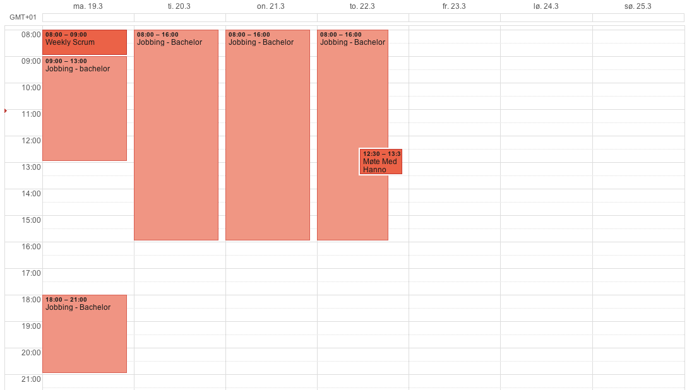
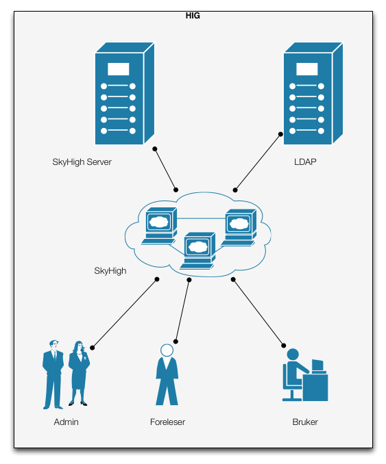

=====================
Bacheloroppgave
=====================

.. figure:: forsideboks.png
   :scale: 50 %

   Figur 1: Forsideboks

|
|
|
|
|
|
|
|
|
|
|
|
|
|
|
|
|
|
|
|
|
|
|
|
|
|
|

:Forfattere:
  Lars Erik Pedersen, Jon Arne Westgaard, Hallvard Westman

:Versjon: 0.5 - 18.04.2012
:Dedikert til: Mamma

.. ``twelvepoint``

.. header:: SkyHigh - Sluttrapport
.. footer:: Pedersen, Westgaard & Westman           -                 ###Page###

.. Overskrift1 = #
.. Overskrift2 = -
.. Overskrift3 = *
.. Overskrift4 = .

.. raw:: pdf

  PageBreak

.. csv-table:: Tabell 1: Sammendrag av bacheloroppgave
   :widths: 15,50  

   "**Tittel:**", "SkyHiGh Adm      **Nr: - Dato: 24.05.12**"
   "**Deltaker(e)**", "Lars Erik Pedersen, Jon Arne Westgaard, Hallvard Westman"
   "**Veileder(e):**", "Hanno Langweg, Høgskolen i Gjøvik"
   "**Oppdragsgiver:**", "Erik Hjelmås, Høgskolen i Gjøvik"
   "**Kontaktperson:**", ""
   "**Stikkord (4stk):**", "sky, virtualisering, pupp"
   "**Antall Sider:**", "**Antall bilag:** **Tilgjengelighet (åpen/konfidensiell):** Åpen"
   "**Kort beskrivelse av bacheloroppgaven:**", "Sette opp en skalerbar sky-tjeneste til bruk i undervisning på HiG"

  - Se vedlegg M
  - Ekstra forside?
  - Skriv et godt sammendrag så det kan presenteres

   
.. raw:: pdf

  PageBreak

.. csv-table:: Tabell 2: Summary of Graduate Project
   :widths: 15,50  

   "**Title:**", "SkyHiGh Adm      **Nr: - Dato: 24.05.12**"
   "**Participants**", "Lars Erik Pedersen, Jon Arne Westgaard, Hallvard Westman"
   "**Supervisor:**", "Hanno Langweg, Høgskolen i Gjøvik"
   "**Employer:**", "Erik Hjelmås, Høgskolen i Gjøvik"
   "**Contact person:**", ""
   "**Keywords:**", "sky, virtualisering, pupp"
   "**Pages:**", "**Antall bilag:** **Tilgjengelighet (åpen/konfidensiell):** Åpen"
   "**Short description of the main project:**", "Sette opp en skalerbar sky-tjeneste til bruk i undervisning på HiG"

.. raw:: pdf

  PageBreak

Forord
#######

Oppdragsgiver er Erik Hjelmås, førsteamenuensis ved Høgskolen i Gjøvik. Erik underviser i Operativsystemer og Systemadministrasjon, hvor han benytter virtuelle maskiner i undervisningen.

Takk til uksysadmin, mjfork, kiall (OpenStack utviklere), samt resten av de hjelpsomme sjelene på #openstack for support over IRC. Deres kunnskap og hjelpsomhet har bidratt i stor grad til å drive prosjektet fremover.

*Underskrift fra alle gruppemedlemmer, samt sted og dato.*

::

  Nå drar vi på McDonalds.

.. contents:: Innholdsfortegnelse

.. sectnum::

.. raw:: pdf
   
  PageBreak

Innledning
###########

| En "nettsky" (Cloud-computing) er levering av databehandling som en tjeneste snarere enn et produkt, der delte ressurser, programvare og informasjon er gitt til datamasiner og andre enheter som et verkøty over nettverket (internett).
| Cloud Computing (nettverkssky) er definert som tilgangen til datamaskiner og deres funksjonalitet via internett, eller et lokalt nettverk. Brukerene av en slik nettverkssky får tradisjonelt tilgang til disse tjenestene via en webtjeneste, enten via en tradisjonell PC eller en mobil applikasjon. Grunnen til at det kalles en nettsky, er at tjenestens fysiske lokasjon er usynlig for brukeren, og også ofte for de som leverer nettskyen. Det skal ikke være mulig for tjenesteleverandøren å peke ut at bruker X's data ligger på server Y. Selve skyen er rent teknisk et sett maskiner og webtjenester som har implementert cloud computing som tjeneste,
|
| I en verden i en stadig framgang har nettskyen gjort sitt inntog for mannen i gata, kanskje nesten uten at man tenker opver det selv. "Alt" lagres i skyen; e-post, kontakter, bokmerker, kalendere, dokumenter, bilder m.m. Innholdet er alltid synkronisert mellom mobiltelefonen, laptopen, kontor-PC'en og nettbrettet.
| Tilgjengelighet har blitt alfa og omega, og nå skal også fysiske maskiner inn i skyen i form av virtuelle maskiner. Slike løsninger gjør hverdagen mer effektiv, og vil forekle lab-arbeid i forbindelse med studier av datasystemer. Ufordringene ligger i ytelse, konfigurasjon og skalerbarhet.

(Wikipedia er nok brukt som kilde her, få med url...)

Organisering av rapporten
--------------------------

.. role:: rubric

:rubric:`og kort beskrivelse av sammenhengen mellom kapitlene`

Prosjektrapporten er delt inn i **9** forskjellige kapitler:

#) Innledning_ - dette kapitlet omhandler bakgrunn, formål, 

#) `Analyse/Diskusjon`_ - Vi skal være kritiske!

#) Kravspesifikasjon_ - hele kravspesifikasjonen for prosjektet

#) Teori_ - Generell teori om OpenStack-arkitekturen og lignende

#) Design_ - Løsning av use-cases

#) Gjennomføring_ - Hvordan vi har gjennomført prosjektet

#) Konklusjon_ - Oppsummering, evaluering

#) Underskrift_ - Navnene våre, skrevet med blå penn

#) `Litteraturliste og referanser`_ - It's kinda in the name

#) Vedlegg_ - Figurer, tabeller, backlog, arbeids-og møtelogg, grupperegler og kildekode

Fullstendig definering -  Oppgavedefinisjon/oppgavebeskrivelse
---------------------------------------------------------------

.. role:: rubric

:rubric:`av oppgaven med utdypning av hva oppgaven går ut på.
Henvisning til eventuelle tidligere arbeider om samme emne.
Skal ikke inneholde noe om det som er gjort i oppgaven og oppnådde resultater`

Nettskyer har fått mye oppmerksomhet de siste årene, og er en teknologi som gjør det mulig for sluttbrukere å kjøre virtuelle maskiner på andres maskinvare og infrastruktur. Dette åpner for muligheter for dynamisk skalering av ressurser, fleksibilitet og økonomiske besparelser.

Slike skyer kan man dra nytte av i undervisning hvor man da kan bruke disse til forskning eller som lab til studenter. I emnene Ethical Hacking And Penetration Testing, Systemadministrasjon og Database- og applikasjonsdrift har virtuelle maskiner vært brukt en stund, hvor elevene får utdelt ett sett med virtuelle maskiner som man da kan kjøre tester og gjøre oppgaver på. På denne måten får man dratt nytte av praktisk undervisning uten å måtte sette opp fysiske maskiner. Skulle man komme i skade for å kjøre en kommando eller gjøre en endring som ødelegger konfigurasjonen, skal det bare et par tastetrykk til for å gjenopprette opprinnelig konfigurasjon.
Dagens løsning er basert på MLN(ref!), men er litt kompleks på administrasjons-siden samt har vist ytelsesproblemer. All administrasjon må gjøres av en administrator, og når en hel klasse bruker de virtuelle maskinene samtidig går mye av tiden til å vente på at kommandoer skal kjøres og at de virtuelle maskinene skal "reagere".
Per dags dato er det ikke mulighet for at studenter/faglig ansatte, på en lettvint måte, kan opprette og administrere en eller flere virtuelle maskiner. 

Navnet SkyHiGh spiller på "sky" og "HiG", og er prosjektet for HiG sin nettsky. Formålet er å få satt opp et system hvor studenter og faglig ansatte kan opprette virtuelle maskiner via en selvbetjenings-løsning uten at en administrator må opprette virtuelle maskiner manuelt til de som behøver dette, samt muligheten for fremtidig skalering av infrastrukturen dette kjører på hvis/når dette blir nødvendig.

Slik vil arbeidsbelastningen på administrator minskes, og forelesere vil kunne få full kontroll over de virtuelle maskiner som brukes i undervisningen.

Formål/hvorfor dette emnet
---------------------------

Mål/Målgruppe
--------------

.. role:: rubric

:rubric:`for rapporten og oppgaven`

SkyHiGh-prosjektet er startet av Erik Hjelmås fra IMT-avdelingen ved Høgskolen i Gjøvik. Prosjektets formål er å tilby forelesere på IMT en enkel måte å opprette og administrere en samling av virtuelle maskiner til bruk i undervisningen, samt mulighet for at enkeltpersoner som har bruk for en virtuell maskin skal kunne opprette og administrere denne selv.

I første omgang vil målgruppen for prosjektet og rapporten være forelesere (og studenter) ved IMT, som har erfaring med bruk av virtuelle maskiner.

Problemområde
--------------

Litt usikker på ka som skal være her, så sett opp ei fin liste:

  - Sette opp en fungerende løsning med OpenStack
  - Løse ytelsesproblemer
  - Løse skaleringsutfordringer
  - Tilpasse OpenStack til prosjektets formål

Omfang
-------

Omfang - kan være ganske stort. (Trenger vi egentlig dette?)

Avgrensing
-----------

*Hentet fra kravspesifikasjonen*
Prosjektet skal først og fremst implementere OpenStack-rammeverket for å virkeliggjøre målene nevnt i 1.2(???). Å bygge en privat skyløsning er et prosjekt som vanligvis spenner over en mye lengre tidsperiode enn vi har til rådighet. Derfor vil vi ikke drive ytelsestesting og analyse (da dette dekkes av en annen bacheloroppgave). Mulighetene for “high availability” og redundans skal ikke dekkes. Primært skal systemet utvikles for å bli brukt på HiG, for de aktuelle emnene, ikke for eksterne brukere. Allikevel bør det være enkelt å utvide det i den retningen.

Studentenes faglige bakgrunn
-----------------------------

.. role:: rubric

:rubric:`- Egen bakgrunn og kompetanse. Hva må læres?    - Python, Django, OpenStack`

| Gruppemedlemmene kommer fra to forskjellige studieretninger, Jon Arne og Lars Erik studerer Drift av Nettverk og Datasystemer og Hallvard studerer Programvareutvikling. Hallvard har kunnskapen som trengs innenfor programmering og utvikling, Jon Arne og Lars Erik stiller med kompetanse innenfor nettverk. Vi har alle gode kunnskaper innen linux, samt C++ og Java fra programmeringsfag ved Høgskolen i Gjøvik. I tillegg kan Hallvard sjonglere. 
|
| **Tilsammen utgjør dette en dødelig kombinasjon.**
|
| Ingen av oss har erfaring med OpenStack, så her får vi litt å sette oss inn i.
| Python er et programmeringsspråk vi har hørt om, men ikke programmert noe i. Siden OpenStack er skrevet i Python kreves det at vi lærer oss dette.
|
| Vi har kjøpt inn en bok om Python-programmering.

Øvrige roller
--------------

Oppdragsgiver er Erik Hjelmås, Førsteamanuensis ved Høgskolen i Gjøvik.

Veileder er Hanno Langweg, Førsteamanuensis ved Høgskolen i Gjøvik.

Arbeidsformer
--------------

.. role:: rubric

:rubric:`samtaler og intervjuer med kilder, reiser, bedriftsbesøk, litteraturstudier, laboratorieforsøk, modellbygging og testing`

Siden ingen av oss har noen erfaring med OpenStack kreves det at vi setter oss godt inn i OpenStack ved prosjektets begynnelse. Dokumentasjonen på http://openstack.org kommer godt med her, i tillegg til å søke etter brukserfaringer på internett. Vi har hatt løpende kontakt med utviklerene av OpenStack vi IRC(ref) på kanalen #openstack og #horizon-dev.

Siden OpenStack er er forholdsvis nytt prosjekt er erfaringene og dokumentasjonen litt mangelfull, så prøv-og-feil-metoden blir hyppig brukt. Etter installasjonen av operativsystemet på serverene vi skal bruke tok vi et disk-image som vi kan rulle tilbake til hvis vi støter på problemer ved installering av OpenStack, slik at vi ikke trenger å installere hele operativsystemet på nytt.

Terminologibruk
----------------

*Er eksempelvis faguttrykk brukt i en spesiell betydning*

Liste over terminologier:

  - **Hypervisor:** In computing, a hypervisor, also called virtual machine manager (VMM), is one of many hardware virtualization techniques allowing multiple operating systems, termed guests, to run concurrently on a host computer. It is so named because it is conceptually one level higher than a supervisory program. The hypervisor presents to the guest operating systems a virtual operating platform and manages the execution of the guest operating systems. Multiple instances of a variety of operating systems may share the virtualized hardware resources. Hypervisors are installed on server hardwarewhose only task is to run guest operating systems. (Wikipedia)
  - **VM/virtuell maskin:** En simulert versjon av et operativsystem
  - **Instans:** Image + flavor
  - **Flavor:** Et sett med virtuell maskinvarekonfigurasjon. Antall virtuelle prosessorer, mengde RAM, lagringsplass
  - **Image:** En diskfil med en ferdig installert virtuell maskin
  - **Prosjekt:** Samling av virtuelle maskiner. Et prosjekt har en kvote tilknyttet seg.
  - **Tenant:** Et prosjekt (OpenStack-terminlogi)
  - **IP-pool:** En rekke IP-adresser
  - **MVC:** Model view controller, et pattern for å skille logikk,data og presentasjon.

Problemområde, avgrensing og oppgavedefinisjon
-----------------------------------------------

.. role:: rubric

:rubric:`Formål/hvorfor dette emnet, Rammer (Gjennomføring og arbeidsmetoder, prosjektorganisering og fremdriftsplan), Øvrige roller (Oppdragsgiver, veileder), Selve rapporten (Organisering, terminologi (bruk norsk), praktisk (angående layout, style, fonter o.l.)`

Rammer (gjennomføring og arbeidsmetoder, prosjektorganisering og fremdriftsplan)
---------------------------------------------------------------------------------

Analyse/Diskusjon
##################

Vi skal være kritiske!

  - Openstack: Modent nok?
    
    - "You can't run OpenStack if you're not doing heavy development at the same time"

  - Skytjenester: Utfordringer med tanke på sikkerhet osv.
  - 
  -
  -
  -
  -

.. raw:: pdf

  PageBreak

Kravspesifikasjon
##################

Mål og rammer
--------------

**Bakgrunn**

En av teknologiene som i det siste har fått mye oppmerksomhet er nettskyer og virtuelle maskiner. En virtuell maskin er enkelt forklart en emulasjon av en komplett datamaskin, og en nettsky er en samling av virtuelle maskiner.
Fordeler som kostnadsbesparelser, bedre utnyttelse av ressurser, enkelt oppsett av nye maskiner samt miljøhensyn (mindre støy, reduksjon i strømforbruk, plassbesparing) kan her trekkes frem.

En virtuell maskin er ikke bare nyttig til bruk for bedrifter og forskningssammenheng, men også for vanlige personer som ønsker å teste ut forskjellige operativsystemer og applikasjoner uten å måtte sette opp en dedikert fysisk maskin.

Høgskolen i Gjøvik har benyttet seg av virtuelle maskiner i blant annet emnene Systemadministrasjon #, Databaser og applikasjonsdrift # og Ethical Hacking & Penetration Testing #.
Bruk av virtuelle maskiner i disse emnene har gitt studentene en liten smak av den virkelige verden i arbeidslivet hvor studentene er delt inn i grupper og blitt tildelt et eget sett med virtuelle maskiner (en virtuell lab), og da kunne jobbe med “reélle” caser mot virtuelle laber som å drifte et lite nettverk, drifte serverapplikasjoner samt teste sårbarheter.
Dette ville ikke ha vært like gjennomførbart ved bruk av fysiske maskiner (plassproblemer, ikke nok maskiner til alle).

http://www.hig.no/studiehaandbok/studiehaandboeker/2010_2011/emner/avdeling_for_informatikk_og_medieteknikk/imt3292_systemadministrasjon

http://www.hig.no/studiehaandbok/studiehaandboeker/2009_2010/emner/avdeling_for_informatikk_og_medieteknikk/imt3441_database_og_applikasjonsdrift

http://www.hig.no/studiehaandbok/studiehaandboeker/2010_2011/emner/avdeling_for_informatikk_og_medieteknikk/imt3491_ethical_hacking_and_penetration_testing

Fordelen med denne løsningen er at det å opprette en virtuell maskin (eller flere) er veldig enkel, skulle noe gå galt på en virtuell maskin kan man rulle tilbake til et “snapshot” (en tidligere versjon av den virtuelle maskinen), man har høy fleksibilitet ved at man kan endre på spesifikasjoner etter behov (som legge til mer minne eller diskplass), samt gjenbrukbarhet (en VM tar kun ressurser på host/server og diskplass, når den ikke er i bruk lengre sletter man selve VM-en for 
og frigjøre ressurser og diskplass).

En utfordring ved den eksisterende løsningen har vært ytelse. I lab-timene har det vært nødvendig å planlegge kjøring av enkelte ressurskrevende kommandoer til spesifikke tidspunkt da dette ellers har ført til at maskinene har blitt uholdbart trege.
Det ønskes derfor en løsning som skalerer godt, og som i tillegg er tilpasset med tanke på brukervennlighet og administrasjon. 
Et forprosjekt i emnet Systemadministrasjon tok for seg OpenNebula, Eucalyptus og OpenStack, og konkluderte med at OpenStack var det mest passende. Løsningen skal brukes av de faglig ansatte, som skal ha mulighet til å enkelt opprette en eller flere virtuelle maskiner og gi studentene tilgang til disse i de forskjellige emnene.

**1.1.1 Definisjoner og akronymer**

Prosjektmål (Effektmål og resultatmål)
***************************************

| **Resultatmål**
| SkyHighs mål er å implementere OpenStack for å realisere en løsning for en privat nettsky ved HiG. Løsningen skal ha følgende funksjonalitet:

 - IaaS, for realisering av virtuelle lab’er i forskjellige emner
 - Mulighet for å migrere virtuelle maskiner fra egen PC og inn i skyen.
 - Et web-basert brukergrensesnitt
 - Administrasjonspanel, der man håndterer prosjekter
 - Brukerpanel der man kan starte, stoppe og restarte egne instanser
 - Mulighet for å utvide brukergruppen, også til eksterne ressurser, f.eks VGS-elever.
 - Implementert autentisering med HiGs systemer via LDAP/FEIDE.

|
| **Effektmål**

SkyHigh skal på sikt overta for eksisterende løsning ved HiG, men skal i første omgang leve side om side med den. Det forventes at løsningen ha følgende effekt:

  - Rette opp/fjerne ytelse- og stabilitetsproblemer ved nåværende løsning
  - Forbedre brukervennlighet og administrasjon
  - Enklere oppsett av prosjekter
  - Mindre arbeidslast på administrator
  - Ha bidratt til OpenStack-prosjektet (OpenSource). 
  - Sette Norge og Gjøvik på OpenStack-kartet (http://maps.google.com/maps/ms?msid=207730393988481837795.0004af95dec257674a36e&msa=0)
  - Være fremtidsrettet og skalerbar

Omfang
-------

Oppgavebeskrivelse
*******************

Oppgaven vår går hovedsaklig ut på å sette opp en nettsky på HiG for de faglig ansatte (primært lærerne) som skal sørge for at foreleserene skal kunne tilby studentene fleksible lab-løsninger i sine emner gjennom et brukervennlig grensesnitt.
Bakgrunnen for oppgaven er at nåværende løsning opplever stabilitets- og ytelsesproblemer, og ett nytt system med OpenStack og lastbalansering forventes å kunne løse dette. For at dette skal realiseres må det være mulighet for å fleksibelt kunne øke ressurser som CPU, minne og lagring på de virtuelle maskinene, samt en lettvint måte å legge til flere noder som kjører de virtuelle maskinene.

I tillegg ønskes det en mulighet for å migrere virtuelle maskiner man har satt opp på egen PC inn i nettskyen, for å teste oppsett på kraftigere maskinvare. Det vil si, å tilby ren regnekraft som tjeneste.

Det skal utvikles en driftsplan og en SLA for den ferdige løsningen, slik at den enkelt kan vedlikeholdes i etterkant av prosjektet.

Avgrensing (Tema med avgrensing)
*********************************
Prosjektet skal først og fremst implementere OpenStack-rammeverket for å virkeliggjøre målene nevnt i 1.2. Å bygge en privat skyløsning er et prosjekt som vanligvis spenner over en mye lengre tidsperiode enn vi har til rådighet. Derfor vil vi ikke drive ytelsestesting og analyse (da dette dekkes av en annen bacheloroppgave). Mulighetene for “high availability” og redundans skal ikke dekkes. Primært skal systemet utvikles for å bli brukt på HiG, for de aktuelle emnene, ikke for eksterne brukere. Allikevel bør det være enkelt å utvide det i den retningen.

Prosjektorganisering
---------------------

Ansvarsforhold og roller
*************************

Oppdragsgiver og veileder
..........................

Vår oppdragsgiver er førsteamanuensis Erik Hjelmås ved Høgskolen i Gjøvik. Erik vil være en sterk faglig ressurs, og være til god hjelp med den tekniske biten av prosjektet. Førsteamanuensis Hanno Langweg er vår veileder. Han vil bistå med teoretisk hjelp rundt det å jobbe i et stort prosjekt, samt komme med innspill til arbeidet underveis.

Prosjektleder
..............

Lars Erik Pedersen er, i følge gruppereglementet, valgt som prosjektleder for gruppa. Det er prosjektleders ansvar å løse eventuelle konflikter som måtte oppstå underveis, selv om hovedmålet er å bli enige i fellesskap. At frister blir overholdt er også prosjektleders overordnede ansvar, samt at fremgangen i prosjektet følger planen så godt som mulig.

Webansvarlig
.............

Hallvard Alte Westman er ansvarlig for gruppens webside. Ansvaret inkluderer oppsett, design og vedlikehold. Resten av gruppa skal ha tilgang til å redigere innhold, slik at alle kan bidra med oppdateringer til websiden.

Kontaktperson
..............

Prosjektleder er kontaktperson for prosjektet. Kontakpersonen skal holde kontakt med oppdragsgiver og veileder og avtale møter med disse. Annen mail- og telefonkorrespondanse kan bli delegert til de andre medlemmene.

Rutiner og regler i gruppa
***************************

Gruppa har opprettet en felles kalender, der det er planlagt 31 timer jobbing per uke med prosjektet. Fredager er fridag, siden Jon Arne og Hallvard har andre fag hele dagen. Helgene er også i utgangspunktet fridager, men dersom det er nødvendig vil også bruke denne tiden til prosjektet. Arbeidet vil i all hovedsak bli utført på vårt tildelte grupperom.

   Figur 2: Ukeplan

Gruppens fulle reglement er lagt ved i vedlegg X. 	

Verktøy
********

Den ferdige prosjektrapporten skal skrives i ReStructuredText som etterpå genereres til et PDF-dokument, men skal først samskrives i Google Docs. Dette gjør at behovet for versjonshåndtering blir minimalt, siden alle hele tiden vil skrive i samme dokument og vi vil spare tid siden vi slipper å håndtere versjonskonflikter.
Alle andre dokumenter er lagret i en felles DropBox for å holde alt synkront for alle gruppemedlemmer. I tillegg tilbyr DropBox automatisk versjonskontroll, som sikrer at vi alltid har en stabil backup av alle viktige filer. Alle egenutviklede script, vil bli versjonskontrollert med github, og vil også bli lagret i DropBox. Websiden vil kjøre Wordpress 3.1.4, da IT-tjenesten ved HIG ikke støtter PHP 5.2.4
Det kan også nevnes at hvert gruppemedlem daglig kjører full inkrementell backup av sin egen laptop mot hver sin private server for å sikre seg mot tap av data.

Planlegging, oppfølging og rapportering
----------------------------------------

Hovedinndeling av prosjektet (Oppdeling i prosjektfaser)
*********************************************************

**Karakteristikker for vårt prosjekt**

Prosjektet vil i første omgang basere seg mye på å utforske og studere OpenStack. Hverken oppdragsgiver eller gruppen har benyttet seg av systemet som skal implementeres tidligere. I første omgang er det da aktuelt med en enkeltinstallasjon av OpenStack, som gruppen kan benytte i den første kartleggingsfasen. 

Basert på kunnskapen vi har tilegnet oss etter installasjon/anvendelse av OpenStack på en node (server) vil vi rulle systemet ut på samtlige noder. Dette vil da være en fase med fullt fokus på å få systemet til å fungere i sin helhet.

Når det tekniske fungerer, vil det være aktuelt å gå inn i en ny kravspesifisering i forbindelse med Horizon. Horizon er webgrensesnittet til OpenStack som skal benyttes av brukerne, og det er her systemutviklingsjobben skal gjøres. Her vil det være nødvendig å gjøre omfattende “research” på hvilken funksjonalitet som alleredet eksisterer i OpenStack og hvilken funksjonalitet oppdragsgiver krever i tillegg.

  - Det kreves tillegning av informasjon i forhold til hver modul som skal utvikles til Horizon. Grunnen til dette er at vi skal jobbe mot Open Source Community som har sine egne standarer som skal overholdes med tanke på kodestruktur, dokumentasjon og lignende. Samtidig må gruppen ha mulighet å sette seg inn i nye språk (Python spesielt).

  - Testing og ferdigstilling vil også være viktig etter hver modul, slik at SkyHigh-IO har mulighet til å gjennomføre stresstesting ved behov. Derfor kreves det at systemet har en viss oppetid under utvikling.

  - Gruppen har behov for at hver modul kan utvikles fleksibelt, da gruppen hele tiden er i en læringsprosess, både i forhold til OpenStack og prosjekter av denne størrelsen. Alle kravene kan heller ikke låses i forkant av hele utviklingsprosessen, da gruppen må forholde seg til OpenStack API-et, og det kan tenkes at flere problemstillinger vil oppstå underveis med tanke på at arbeidsgiver er ukjent med OpenStack.

Integrering med oppdragsgivers eksisterende systemer vil være en egen fase i prosjektet, da dette er en omfattende jobb som er svært ulik de foregående fasene. Dette vil også kreve en egen kravspesifisering.

Det vil underveis være aktuelt å hele tiden sette seg inn i OpenStack Open Source Project, i forhold til konvensjoner etc. 

Gruppen fikk tidlig et inntrykk av at en agil utviklingsmodell måtte benyttes i dette prosjektet siden ingen i gruppen hadde vært borti et slikt prosjekt før. OpenStack er nytt og ingen har utført et slikt prosjekt på HiG tidligere. Arbeidsgiver hadde heller ikke benyttet seg av OpenStack eller Cloud Computing på en slik måte, som gjorde det vanskelig å fastsette rekkefølge på inkrementer i utviklingsperioden. 

Gruppen har valgt å benytte seg av SCRUM som systemutviklingsmodell for videreutviklingen av Horizon. Gruppen konkluderte med at SCRUM passer best med tanke på å jobbe med Open Source-Miljøet, levering av inkrementer, tillegg av krav og tidsestimater. Gruppen ser det også som en fordel i forhold til læringskurven ved OpenStack. 

Vi valgte allikevel å benytte oss av noen konsepter fra inkrementell utvikling. Ved hver demo setter vi av en periode til å teste, samt rulle ut inkrementet på systemet, dette håper vi skal sørge for at SkyHigh - IO får den oppetiden de krever.
Vi har også at vi er inspirert av spiral-modellen ettersom hver sprint vil bestå av en fase der vi innhenter informasjon, en fase der vi utvikler, og en fase der vi tester/ruller ut. 

Plan/krav for statusmøter og beslutningspunkter
************************************************

  - **Sprint planning** innebærer å velge ut krav som skal gjennomføres i en sprint, disse blir hengt opp og låst for denne perioden. Vi vil her gå gjennom hva demoen på slutten av sprinten burde inneholde.
  - **Daily scrum** innebærer at gruppen har et 15 minutter møte på starten av dagen der vi går gjennom hva som har blitt gjort, hva man skal gjøre og hva som gjenstår i forhold til en iterasjon.
  - **Sprint Review:** Det vil være statusrapporter i etterkant av hver iterasjon som et resultat av Sprint Review. I etterkant av hver sprint evaluerer vi iterasjonen og tar med oss videre ting vi kan gjøre bedre og etterlater ting som ikke fungerte så bra. Dette er i hovedsak hva statusrapporten vil inneholde.
  - Møte med arbeidsgiver og veileder vil foregå før hver sprint-planning. Møte med veileder vil i tillegg foregå ukentlig i startfasen.

Ressursbehov
*************

  - Minimum to servere for regnekraft
  - Minimum en server for lagring

Organisering av kvalitetssikring
---------------------------------

Dokumentasjon, standardbruk og kildekode
*****************************************

All koding og scripting som blir gjort skal kommenteres underveis, slik at vi unngår å bruke tid på å forstå hva vi egentlig skrev for fire dager siden. OpenStack bruker Apache 2.0-lisensen, som da betyr at eventuelle moduler som blir kodet til OpenStack-prosjektet må følge denne.

Risikoanalyse
**************

.. csv-table:: Tabell 3: Risikoanalyse
   :header: "**Beskrivelse**","**Sannsynlighet**","**Konsekvens**"

   "Langtids sykdom", "Lav", "Ressursmangel, innsnevring av oppgave, avskjedigelse"
   "Datatap", "Lav", "Dobbeltarbeid"
   "Mangel på kompetanse", "Middels", "Løsninger som ikke følger best practice"
   "Dårlige tidsestimater", "Høy", "Ikke overholde interne frister"
   "Ødeleggende endringer", "Middels", "Ødelegge allerede fungerende moduler"

Som vi ser av tabellen er risikoen høyest for at vi har gjort dårlige eller feilaktige tidsestimater. For å unngå dette må vi planlegge nøye, og heller gjøre for høye estimater enn for lave. Dette vil gi oss litt buffertid på hver arbeidsmodul, som vil være god å ha når det dukker opp noe uforutsett. Vi må også hele tiden sørge for å følge fremgangsplanen og ikke havne på etterskudd.
  
Ellers ser vi en mulighet for at vårt nåværende kompetansenivå kan bli en utfordring. Vi har ingen erfaring med utrulling og drifting av slike virtualiseringsløsninger fra tidligere, annet en de virtuelle lab’ene vi har benyttet i emner her på HiG. En annen utfordring er at OpenStack er skrevet i Python, et programmeringsspråk vi heller ikke har kompetanse innenfor. Her må vi sørge for å utnytte fagmiljøet best mulig, samt å lese oss godt opp gjennom artikler og bøker funnet både på internett og biblioteket.

Suksessfaktorer
................

For at vår løsning skal blir suksessfull, må den kunne erstatte løsningen HiG allerede har i dag 100%. Brukeropplevelsen og ytelsen må bli økt dramatisk både for administratorene (ansatte) og for brukerene (studentene). Et viktig ledd i dette er at driftsplanen blir så god at den kan brukes direkte av IMT, uten noe særlig behov for modifikasjon. Det er viktig at administratorene blir mest mulig selvhjulplne, slik at ikke alt ansvar blir liggende på en person, slik det er i dag. For at løsningen skal skalerere, samt løse ytelesesproblemene ligger mye av “ansvaret” på maskinvaren. Mengden fysisk minne er kritisk for at løsningen skal kunne skalere, samt at løsningen tilrettelegger for å enkelt kunne legge til flere noder.

Plan for gjennomføring
-----------------------

Fremdriftsplan
***************

  - Gantt-skjema (Laget i MS-Project eller tilsvarende)
  - Liste over aktiviteter (Work Breakdown Structure)
  - Milepæler, beslutningspunkter
  - Tids- og ressursplan

Fremdriftsplan

Visjonsdokument
----------------

Innledning visjonsdokument
***************************
Dette dokumentet har som hensikt å presentere prosjektet/oppgaven i ett overordnet format. Noe av informasjonen som finnes i dette dokumentet vil også eksistere i Prosjektplanen som ble konstruert etter HIG´s mal.

Referanser
***********

Mal for dette dokumentet - http://aitel.hist.no/fag/maler-standarder/UP/Visjonsdokumentet_intro.htm

Sammendrag problem og produkt
******************************

Problemsammendrag
..................

.. csv-table:: Tabell 4: Stabilitet og ytelse
   
   "**Problem med**", "Stabilitets- og ytelsesproblemer, ingen lastbalansering eller skalering"
   "**Berører**", "Alle brukere, administrator"
   "**Som resultat av dette**", "Tar lang tid å kjøre kommandoer, de virtuelle maskinene “henger” innimellom, tidvis dårlig tidsutnyttelse i lab-timer. Da man ikke kan koble opp flere noder/servere på systemet vil man ikke kunne skalere systemet opp fra x antall brukere til y antall brukere uten å kjøpe en helt ny maskin"
   "**En vellykket løsning vil**", "Gjennom bedre skalerbarhet og lastbalansering sørge for at de virtuelle maskinene ikke opplever ytelsesproblemer ved å la administrator koble opp flere noder/servere på systemet."

.. csv-table:: Tabell 5: Manuell administrering
   
   "**Problem med**", "Manuell administrering av hver enkelt VM"
   "**Berører**", "Administrator, brukere"
   "**Som resultat av dette**", "Hver enkelt student som har en/flere vm´er må be om at administrator skal utføre enkle oppgaver som de egentlig burde kunne gjort selv. Rett og slett Livs-syklusen til en VM."
   "**En vellykket løsning vil**", "La brukere administrere sin egen/egne vm’ers livs-syklus alt etter hvilket rettigheter administrator har gitt dem."

Produktsammendrag
..................

.. csv-table:: Tabell 6: Produktsammendrag 
   
   "**For**", "Erik Hjelmås"
   "**som**", "Har behov for et helt nytt system som er skreddersydd for hans behov"
   "**produktet navngitt**", "er en nettksy basert på OpenStack"
   "**som**", "  - Lar seg administrere av brukere,  - Skalere,  - Lastbalansere"
   "**i motsetning til**", "dagens system"
   "**Har vårt produkt**", "Løsningene på dagens problemer, i tillegg til nye krav satt av arbeidsgiver (se kravspesifikasjon)"

Overordnet beskrivelse av interessenter og brukere
***************************************************

Oppsummering av interessenter
..............................

.. csv-table:: Tabell 7: Oppsummering av interessenter
   :header: "**Navn**", "**Utdypende beskrivelse**", "**Rolle under utviklingen**"

   "Erik Hjelmås", "Vil veilede den tekniske biten, sette krav i forhold til systemet (ikke bacheloroppgaven) ukentlig", "Arbeidsgiver"
   "Hanno Langweg", "Vil veilede ukentlig i forhold til Bacheloroppgaven", "Veileder"

Oppsummering av brukere
........................

.. csv-table:: Tabell 8: Oppsummering av brukere
   :header: "**Navn**", "**Utdypende beskrivelse**", "**Rolle under utviklingen**", "**Representert av**"

   "Student", "Studentene vil bruke denne tjenesten aktivt i undervisningen. Studenten er kunden som skal betjenes.", "Vil ikke ha noen rolle", "Lars Erik, Jon Arne og Hallvard"
   "Administrator", "Administratoren vil tilby og vedlikeholde nettskyen som en tjeneste for Studentene(se rolle ovenfor)", "Bruker av systemet", "Erik Hjelmås"

Brukermiljøet
..............

Systemet skal vedlikeholdes og administreres av faglig ansatt på IMT ved HiG som har god kompetanse på området. Det forventes alikevell en selvbetjeningsløsning som minsker arbeidsmengde på administrator og lar brukerene administrere sine egne VM-er i størst mulig grad. Forelesere som bruker VM-er i undervisning skal ha mulighet til å på en lettvint måte opprette en eller flere VM-er, og tildele disse til en eller flere studenter eller grupper. De virtuelle maskinene skal være tilgjengelig fra nettverket på HiG, men det legges ikke opp til at det skal være mulig å få tilgang utenifra. 

Beskriv det som er vesentlig med hensyn på de omgivelsene systemet skal passe inn i. Det kan være arbeidsprosesser, andre systemer og dagens maskinvare. Ikke beskriv krav til ny maskinvare. Det beskrives andre steder. 

Alternativer til vårt produkt
..............................

Se oppgave (Forprosjekt i emnet Systemadministrasjon)

  - VMware
  - Amazon
  - Rackspace
  - (Microsoft?)

Produktoversikt
****************

Produktets rolle i brukermiljøet
.................................

Skisse av produktet med hensyn til omgivelsene, ta utgangspunkt i brukermiljøet (3.3)  

   Figure 3: Brukermiljø

Forutsetninger og avhengigheter
................................

.. role:: rubric

:rubric:`Alle viktige forutsetninger og avhengigheter, som hvis de endres, vil endre noe som er skrevet i dette dokumentet`

  - IMT vil stå ansvarlig for dette prosjektet ved ferdigstilling.

Produktets funksjonelle egenskaper
***********************************

  - Bruker kan starte/stoppe sin Virtuelle Maskin
  - Bruker kan laste opp/ned VM
  - Bruker kan rulle tilbake til snapshot
  - Administrator kan opprette/slette VM
  - Administrator kan registrere Image
  - Administrator kan allokere IP-addresser
  - Foreleser kan opprette/slette VM
  - Foreleser kan administrere prosjekter
  - Foreleser kan allokere IP-addresser
  - Løsningen må fungere uansett værforhold

.. raw:: pdf

  PageBreak

Teori
########

Hva er nettsky?
----------------

**Kopiert til** Innledning_. (Kan/skal dette fjernes?)

*En "nettsky" (Cloud-computing)  er levering av databehandling som en tjeneste snarere enn et produkt, der delte ressurser, programvare og informasjon er gitt til datamasiner og andre enheter som et verkøty over nettverket (internett).*
*Cloud Computing (nettverkssky) er definert som tilgangen til datamaskiner og deres funksjonalitet via internett, eller et lokalt nettverk. Brukerene av en slik nettverkssky får tradisjonelt tilgang til disse tjenestene via en webtjeneste, enten via en tradisjonell PC eller en mobil applikasjon. Grunnen til at det kalles en nettsky, er at tjenestens fysiske lokasjon er usynlig for brukeren, og også ofte for de som leverer nettskyen. Det skal ikke være mulig for tjenesteleverandøren å peke ut at bruker X's data ligge rpå server Y. Selve skyen er rent teknisk et sett maskiner og webtjenester som har implementert cloud computing so tjeneste,*

*I en verden i en stadig framgang har nettskyen gjort sitt inntog for mannen i gata, kanskje nesten uten at man tenker opver det selv. "Alt" lagres i skyen; e-post, kontakter, bokmerker, kalendere, dokumenter, bilder m.m. Innholdet er alltid synkronisert mellom mobiltelefonen, laptopen, kontor-PC'en og nettbrettet. Tilgjengelighet har blitt alfa og omega, og nå skal også fysiske maskiner inn i skyen i form av virtuelle maskiner. Slike løsninger gjør hverdagen mer effektiv, og vil forekle lab-arbeid i forbindelse med studier av datasystemer. Ufordringene ligger i ytelse, konfigurasjon og skalerbarhet.*

.. role:: rubric

:rubric:`(Wikipedia er nok brukt som kilde her, få med url...)`

Virtualisering
---------------

Når det gjelder datamaskiner, er virtualisering å lage en virtuell versjon av noe, som en hardware-plattform, et operativsystem, lagringsenhet eller nettverksressurser.
Ved hjelp av virtualisering kan man installere et operativsystem på en virtuell maskin i et virtualiserings-program (VMware, Virtualbox), som da blir lagret som filer på harddisken. Slik kan man teste et operativsystem uten å installere det på selve harddisken over, eller ved siden, av det operativsystemet som allerede er installert.  

OpenStack
----------

OpenStack er et cloud-computing-prosjekt som tilbyr Infrastructure as a Service (IaaS), startet av Rackspace og Nasa. Per 17.april 2012 har over 150 bedrifter sluttet seg til prosjektet, som AMD, Intel, Canonical, SUSE Linux, Red Hat, Cisco, Dell, HP og IBM.

Første versjon, Austin, ble sluppet 21. oktober 2010, og har siden da vært i kontinuerlig utvikling. Nyeste versjon er Essex, sluppet 5.april 2012.

Hovedmålet til prosjektet er å gi alle organisasjoner mulighet til å opprette og tilby nettskyer som kan kjøre på standard maskinvare.

Bakgrunn/fnuz
**************

Moduler
*******

Selve OpenStack er et modulbasert prosjekt, hvor hovedmodulene er Compute (Nova), Image Service (Glance) og Identity Service (Keystone).
OpenStack er skrevet i Python.

Nova
.....

Nova er kjernemodulen i OpenStack som tar seg av opprettelsen og administreringen av de virtuelle maskinene.

Glance
.......

De virtuelle disk-imagene blir administrert via Glance, og støtter disk-formater som Raw, Machine (kernel/ramdisk outside of image, a.k.a. AMI), VHD (Hyper-V), VDI (VirtualBox), qcow2 (Qemu/KVM), VMDK (VMWare) og OVF (VMWare, others).

Keystone
........

Identitets-tjenesten Keystone holder oversikt over alle brukere i OpenStack.

Horizon
........

Selve webgrensesnittet til OpenStack kalles Horizon, og tilbyr administrasjon av kjernefunksjonaliteten i OpenStack. 

(Swift)
.......

Swift er lagringsløsningen scalable object storage.

(Quantum)
..........

Quantum er en modul som gir nettverkstilkobling-as-a-service for enheter som administreres av andre OpenStack-tjenester.

(Melange)
..........

Melange gir nettverks-informasjons-tjenester med fokuks på administrering av IP-adresser. 

MVC
****

Django
.......

Python
.......

Horizon
........

Patterns
*********

.. raw:: pdf

  PageBreak

Design
#######

.. role:: rubric

:rubric:`Hovedtrekk fra design av system beskrives. Fullstendig designdokument bør være vedlegg til prosjektrapporten, mens dette punktet omhandler diskusjon av sentrale forhold. Ulike alternative design som studentene vurderte bør beskrives og valg av alternativ begrunnes.`

Løsning av use-cases
---------------------

.. raw:: pdf

  PageBreak

Gjennomføring
##############

*“Getting OpenStack up and running does earn you the title of Jedi Knight.”*

Implementasjon
---------------

.. role:: rubric

:rubric:`Anvendelsen av ulike verktøy og utviklingsmiljøer beskrives. Er det gjort bevisste valg av verktøy, begrunnes disse. Videre beskrives valgte prinsipper og standarder i kodingen. Eksempler fra kildekoden trekkes frem for å vise hvordan dette er etterlevd i praksis.`

Nettverk
*********

.. figure:: arkitektur.png
   :scale: 300%

   Figur 4: Arkitektur

.. csv-table:: Tabell 9: Routere
   :header: "**Enhet, modell**", "**Nettverkskort**", "**MAC-adresse**", "**IP/Mask**", "**Gateway**"
   
   "Brighton, HP ProLiant DL320", "eth0", "00:1f:29:13:02:8a", "DHCP", " "
   "", "eth1", "00:1f:29:13:02:8b", "10.0.0.1/30", "10.0.0.2"
   "SkyRoute, Cisco 2800", "fa0/0", "ec:44:76:68:16:94", "10.0.0.2/30", ""
   "", "fa0/1", "ec:44:76:68:16:95", "192.168.99.1/24", ""
   "", "fa0/1.10", "''", "192.168.10.1/24", ""
   "", "fa0/1.20", "''", "192.168.20.1/24", ""
   "", "fa0/1.30", "''", "192.168.30.1/24", ""

.. csv-table:: Tabell 10: Switch
   :header: "**Enhet, modell, Management IP**", "**Port**", "**Hastighet**", "**VLAN(s)**", "**Trunk status**"
   :widths: 25, 15, 15, 20, 10  

   "switchd13d24, Cisco SG-200 26, 192.168.99.254/24", "GE1-12", "1000Mbit", "10 (public)", "av"
   "", "GE13-18", "1000mbit", "100-115 (VLAN for VM'er)", "på"
   "", "GE19-24", "1000mbit", "30 (storage)", "av"
   "", "GE25", "1000Mbit", "99 (native/management)", "av"
   "", "GE26", "1000Mbit", "10, 20, 30, 99", "på"

.. csv-table:: Tabell 11: Servere
   :header: "**Navn**", "**CPU**", "**RAM**", "**Disk**", "**IP**"

   "dublin", "Intel Xeon 3060 2.4 GHz", "4GiB", "2 x 250 GB", "eth0: 192.168.10.2, eth1: oppe - ingen IP, eth3: 192.168.30.2"
   "manchester", "Intel Xeon 3060 2.4 GHz", "4GB", "2 x 250 GB", "eth0: 192.168.20.10, eth1: ioppe - ingen IP"
   "newcastle", "Intel Xeon 3060 2.4 GHz", "2GiB", "2 x 250 GB", "eth0: 192.168.20.12, eth1: oppe - ingen IP"
   "cardiff", "Intel Xeon 3060 2.4 GHz", "2GiB", "2 x 250 GB", "eth0: 192.168.20.11, eth1: oppe - ingen IP"
   "kingston", "", "", "12 x 250 GB", "eth0: 192.168.30.20"

I prosjektperioden vil nettverkstopologien være som vist i figuren. Satt i produksjon vil man antageligvis fjerne routeren og DHCP-serveren vi ser øverst i figuren, slik at man benytter seg av offentlige IP’er (globale IP’er delt ut fra HiG). For testformål har vi satt opp vårt eget lokale nettverk bak en dedikert linuxmaskin som kjører NAT og DHCP, slik at vi beskytter testoppsettet fra offentligheten, og unngår å forstyrre noe av HiGs infrastruktur.

På switchen er det satt opp ulike VLAN. Standard management-VLAN er flyttet vekk fra VLAN 1, til VLAN 99, i følge beste praksis. VLAN 10 for internettilgang (public), et dedikert VLAN til lagringsnodene (VLAN 30, storage), og i tillegg er det satt opp åtte trunk-porter for trafikk mellom instansene. Det blir opprettet ett nytt VLAN for hvert prosjekt i OpenStack. Dette vil kunne bli et problem dersom man ruller ut i stor skala, siden maks teoretisk antall VLAN er 4096, og av dem igjen er noen reserverte. For vår oppdragsgiver vil nok dette neppe bli noe problem i første omgang, men gitt et scenario der hver student ved skolen skal få tilgang, i tillegg til de emnene som skal bruke systemet, vil dette bli et problem.

Løsningen på dette problemet kan imdlertid være på vei. Sommeren 2011 lanserte# Cisco nyheten VXLAN (Virtual eXtensible LAN). I korte trekk er dette en utvidelese av dagens VLAN-teknologi, der VLAN-ID feltet i pakken er doblet fra dagens 12 bit til 24 bit. Det åpner for et teoretisk maksimum på over 16 millioner (2^24) unike VLAN-ID’er. Et annet skaleringsproblem er utrulling av VLAN til ulike switcher. I dag er VTP# eneste mulighet, men det er ofte deaktivert av sikkerhetshensyn, og man er da tvunget til å konfigurere switchene mer eller mindre manuelt. VXLAN har muligheten for å distribusjon over lag 3 (f.eks IP). Muligheten for å bygge inn støtte for VXLAN i OpenStack er allerede i utviklerenes tanker#, og vil ganske sikkert bli implementert i fremtidige versjoner.

Valget av DHCP-server falt på *dnsmasq*. Den har en meget enkel konfigurasjon, samtidig som den uten konfigurasjon over hodet, fungerer som DNS-forwarder for alle DHCP-klienter. Eksempel på konfigurasjon ligger i vedlegg B. For å få det interne nettverket bak routeren til å få kontakt med *dnsmasq* måtte det settes opp et DHCP-relay# i *SkyRoute*. I en cisco-router er slik funksjonalitet innebygget, og gjøres med kommandoen

::
  
  ip helper-address <ip>

på det nettverksgrensesnittet pakkene vil komme inn på. I vårt tilfelle innebærer det alle de virtuelle netverksgrensesnittene på **fa0/1**. I tillegg må det legges inn en statisk rute til vårt interne nett på brighton, vi kommandoen:

::

  route -add net 192.168.0.0 netmask 255.255.0.0 gw 10.0.0.2

Ruter som blir lagt inn med denne fremgangsmåten slettes ved restart, og kommandoen ble derfor lagt inn i oppstartsskriptet */etc/rc.local*.

*Iptables* er en modul i linuxkjernen, som driver filtrering av IP-pakker. Ved hjelp av denne kan man filtrere ut hvilke pakker som skal ha aksess til hvilke nett, og hvor de skal sendes. Man har også muligheten til å sette op NAT. Dette utnyttet vi for å dele ut internett til vårt interne nett via *brighton*. Disse filterne ble satt opp:

::
  
  iptables -A FORWARD -s 10.0.0.0/30 -i eth1 -j ACCEPT
  iptables -A FORWARD -s 192.168.10.0/24 -i eth1 -j ACCEPT
  iptables -A FORWARD -d 10.0.0.0/30 -i eth0 -j ACCEPT
  iptables -A FORWARD -d 192.168.10.0/24 -i eth0 -j ACCEPT
  iptables -A FORWARD -s 192.168.30.0/24 -i eth1 -j DROP
  iptables -A FORWARD -d 192.168.30.0/24 -i eth0 -j DROP
  iptables -A FORWARD -s 192.168.99.0/24 -i eth1 -j DROP
  iptables -A FORWARD -d 192.168.99.0/24 -i eth0 -j DROP
  iptables -t nat -A POSTROUTING -o eth0 -j MASQUERADE

De tre første linjene aksepterer trafikk fra gitte nettverk ut mot internett. De tre neste aksepterer trafikk fra internett, til de samme nettverkene. De påfølgende fire linjene, sperrer trafikk både til og fra internett for **VLAN30** og **VLAN99**. Den siste linja forteller at pakker på veg ut mot internett skal oversettes med **NAT**, at alle skal bruke den samme globale IP-adressen, samt at pakkene skal sendes til **eth0**. For at dette skal fungere må man sette et kernel-flagg som muliggjør videresending av IPv4-adresser, slik:

::

  echo 1 > /proc/sys/net/ipv4/ip_forward

Dette blir imdlertid resatt når maskinen starter på nytt, derfor må flagget settes i filen */etc/sysctl.conf*. Filterne i iptables blir også resatt ved en omstart. Derfor ble konfigurasjonen lagret, ved hjelp av kommandoen

::

  iptables-save > /etc/iptables.conf

Konfigurasjonen blir hentet tilbake i oppstarten, ved å legge inn

:: 

   iptables-restore < /etc/iptables.conf

i oppstartsskriptet */etc/rc.local*.

http://blogs.cisco.com/datacenter/introducing-vxlan/

VLAN Trunking Protocol

http://blogs.cisco.com/openatcisco/integrating-vxlan-in-openstack-quantum/

Tjeneste som lytter etter DHCPREQUEST fra andre nettverk, og videresender de til en gitt IP.

Nettverk i OpenStack
*********************

Tjenesten nova-network håndterer alle nettverksoppgaver i OpenStack. Det finnes tre forskjellige modeller å velge i mellom:
  - FlatNetworking
  - FlatDHCP
  - VLAN Network

Uavhengig av hvilken modell man velger, er det mange forskjellige muligheter for infrastruktur i OpenStack. Vi vil ikke gå i dybden på alle disse, men fokusere på den som er gjeldende for vårt oppsett.

Alle våre noder har to nettverkskort. Det ene av disse er satt opp som “public interface” med tilgang til internett. Det andre er satt opp uten IP-adresse. OpenStack setter opp en nettverksbro per prosjekt bundet til dette nettverkskortet, som gir de virtuelle maskinene i samme prosjekt muligheten til å snakke med hverandre. I tillegg sørger nova-network for å legge inn regler i iptables, for å rute trafikk fra instansene til internett via den compute-noden instansen kjører på.

**Flat Networking**

Dette er den enkleste modellen, der man definerer et subnet instansene skal bruke, og ved opprettelse blir det injisert en IP fra dette. Nettverksbroen for å binde sammen eksternt og internt nett må settes opp manuelt på alle noder i infrastrukturen. Alle instanser er koblet til den samme nettverksbroen, og man er begrenset til én slik. Dette gjør denne modellen mest aktuell for mindre implementasjoner.

**Flat DHCP**

Flat DHCP fungerer så og si på samme måten som Flat Networking, men her starter man en DHCP-server for å dele ut IP-adresser til instansene fra det spesifiserte subnettet. Alle instansene er fremdeles koblet til den samme nettverksbroen. DHCP-serveren som benyttes er dnsmasq, og denne settes opp til å lytte på DHCPDISCOVER på nettverksbroen.

I begge disse flate modellene får instansene delt ut offentlige IP-adresser, enten globalt rutbare eller, eller fra et lokalt nett det blir gjort NAT i. nova-network fungerer altså ikke som gateway.

**VLAN Network**

Denne modellen er standardmodellen, og også den vi har valgt. Her opprettes det et eget VLAN, et eget subnet og en egen nettverksbro for hvert prosjekt. For hvert av disse VLANene blir det startet en DHCP-server, og instansene blir tildelt en privat IP-adresse derfra som bare er tilgjengelig innenfor sitt VLAN. For å få tilgang til instansene må man enten benytte seg av VPN, eller konseptet floating IP’s.

CloudPipe er en spesiell instans som opptrer som VPN-server. For å få aksess til instansene må man sette opp en slik, og hente ut sertifikat og nøkkel fra denne. Alternativet til dette er å benytte seg av konseptet floating IP. Man definerer en sett IP-adresser, gjerne et helt subnet, med globale IP-adresser man kan legge til instansene. Måten det fungerer på, er at IP-adressen blir lagt til på prosjektets nettverksbro, og det blir opprettet iptables-regler for å rute trafikken til rett instans. Vi har valgt å bruke floating IP i vår implementasjon, med tanke på brukervennlighet. Her trengs det ingen komplisert oppkobling for sluttbrukeren.

Denne modellen passer godt i større implementasjoner, siden den er mest dynamisk. Her trengs ingen manuell konfigurasjon av nettverksbroer eller andre nettverkskort. Alt blir gjort dynamisk. Modellen avhenger av at man har nettverksutstyr som takler IEEE 802.1Q VLAN-tagging.

Installasjon av OpenStack
**************************

*Controller, compute osv.*

**NOTE: Veldig overordnet og i stikkordsform. Blir fixet nærmere jul!**

Krav til maskinvare og programvare:
På controlleren er anbefalt maskinvare en 64-bit x86 prosessor, 12 GB RAM, 30 GB diskplass og 1 gigabit-nettverkskort. For Volume storage er to disker med 2 TB lagringsplass.
Compute-noder er anbefalt maskinvare 64-bit x86-prosessor, 32 GB RAM, 30 GB diskplass og 2 nettverkskort på 1 GB. 

Det finnes pakker for CentOS, Debian, Fedora, RHEL, Debian og Ubuntu.
Compute bruker PostgreSQL eller MySQL, Object storage bruker SQLite.

Tids-synkronisering som NTP må installeres, i tillegg til at det kreves en root-bruker eller en bruker med sudo-rettigheter.

Installasjon:
Installer ntp
Installer keystone: sudo apt-get install keystone, sett opp database, gjør nødvendige endringer i /etc/keystone/keystone.conf (admin-token o.l.), sett opp tenants, users og roles.
Installer Glance: sudo apt-get install glance, sett opp database, gjør nødvendige endringer i config-filene i /etc/glance/,.

Sett opp nettverk, sett opp database, installer RabbitMQ og nova* (nova-compute nova-volume nova-vncproxy nova-api nova-ajax-console-proxy nova-cert nova-consoleauth nova-doc nova-scheduler nova-network), sett opp /etc/nova/nova.conf, lag nettverk via nova-manage, lag credentilals.

For flere compute-noder er nova-network og nova-compute et krav, samt /etc/nova/nova.conf som peker til controlleren og hvor de andre tjenestene kjører (RabbitMQ o.l.).

Horizon
********

Når compute og controller er installert kan webgrensesnittet og nødvendige pakker installeres: sudo apt-get install libapache2-mod-wsgi openstack-dashboard. Database må settes opp og synces. Webgrensesnittet nås via en webleser på ip-addressen til maskina det ble installert på, og for å logge inn brukes de brukernavn og passord som ble satt opp tidligere.

Infrastruktur
**************

Konfigurasjon
**************

Utvikling
----------

Scrum
******

django, python tutorials

Metode
*******

django, python tutorials

.. raw:: pdf

  PageBreak

Konklusjon (3-8 sider)
#######################

.. role:: rubric

:rubric:`De slutninger som kan trekkes fra resultatene og deres diskusjon skal være logisk og nøkternt oppbygd. Etterrettelighet er vesentlig. Konklusjoner skal fremkomme klart og uten tvetydigheter. Eventuell usikkerhet påpekes. Grunnlaget for slik tvil skal redegjøres under kapittel 6a/6b. De viktigste konklusjoner blir presentert i kortfattet versjon under ”Sammendrag”. Prosjektgruppen bør ta stilling til hva de faglige resultatene kan brukes til, hva gruppen faglig har lært av dette arbeidet, hva som evt. kunne vært gjort annerledes ved en gjentagelse av utviklingsarbeidet, og hvordan eventuelt videre arbeid rundt samme eller beslektet tema bør gjøres. Gruppen bør også kommentere den subjektive opplevelse av hovedprosjektet, og hvordan gruppeprosessen har vært. Kort sagt: Egenevaluering av gruppearbeidet.`

Diskusjon av resulater
-----------------------

Alternativer/muligheter/valg underveis
---------------------------------------

Kritikk av oppgaven
--------------------

Videre arbeid, ny(e) bacheloroppgaver
--------------------------------------

Evaluering av gruppens arbeid
------------------------------

Konklusjon
-----------

.. raw:: pdf

  PageBreak

Underskrift
############

.. role:: rubric

:rubric:`Etter konklusjonen skal underskrift med dato komme. Dersom rapporten inneholder ”Forord” skal underskriften komme der.`

Litteraturliste og referanser
##############################

.. role:: rubric

:rubric:`I rapporten skal det henvises til benyttet litteratur, særlig i kapittel 2. Henvisningene i rapportteksten gis som tallreferanse (Vancouver), og tilsvarende tall brukes i litteraturlisten. Litteraturen skal beskrives ved forfatternavn, boktittel, forlag, utgivelsessted og årstall.`

  - *Sitert fra, relevant støtte-/bakgrunnsstoff)*
  - *URL som fotnote?*
  - *Nummersystemet, Vancouver - ikke Harvard*
  
    - *“Bech-Karlsen [2] er en person vi bruker som eksempel. Han [2] er en kul kar.*
    - *[2] J. Bech-Karlsen, Gode Fagtekster. Oslo: Universitetsforlage, 2003*
    - *Hvem, hva, hvor, når*

¹ http://www.edugeek.net/forums/nix/8907-howto-using-802-1q-vlans-directly-linux.html  14.03.12
² http://manpages.ubuntu.com/manpages/natty/man8/dhcp-helper.8.html  14.03.12
³ http://ubuntuforums.org/showthread.php?t=716192  14.03.12
Cisco CCNA Exploration 4.0 LAN Switching & Wireless, kap 3 VLANs
Cisco CCNA Exploration 4.0 LAN Switching & Wireless, kap 6 Inter-VLAN routing
Cisco CCNA Exploration 4.0 Accessing the WAN, kap 7.1 DHCP  
⁴ http://blogs.cisco.com/datacenter/digging-deeper-into-vxlan/ 14.03.12

.. raw:: pdf

  PageBreak

Vedlegg
########

.. role:: rubric

:rubric:`Vedleggene nummereres, og vedlegg med flere sider skal sidenummeres. Alle vedlegg føres opp i innholdsfortegnelsen. Eksempler på innhold i vedlegg er tabeller, diagrammer, detaljskisser, koblingsskjemaer, designskjemaer, kalibreringskurver, observasjonsdata, utskrifter, komplette beregningseksempler, kode, dataprogrammer og disketter.`

  - *Definisjoner (av ulike ord/uttrykk)*

    - *Eks “tenant”*
  - *Fremdriftsplan, Gantt-diagram, milepæler, ansvarskart*
  - *Logg, møtereferat, statusrapporter*
  - *Designskjemaer*
  - *Kode (Eksempler?)*
  - *Mini-poster(?)*
  - *Kontrakten (m/oppdragsgiver)?*
  - *Stavekontroll*
  - *NB: FIGURER og TABELLER (nummerering, kildehenvisning)*
  - *Sidenummer (Kapittel 1 starter på side 1)*
  - *Topp/bunntekster?*
  - *Hva hadde vi planlagt, hvordan ble det*

Liste over figurer
-------------------

.. figure:: forsideboks.png

   Figur 1: Forsideboks

   Figur 2: Ukeplan

   Figure 3: Brukermiljø

.. figure:: arkitektur.png
   :scale: 300%

   Figur 4: Arkitektur

Liste over tabeller
--------------------

.. csv-table:: Tabell 1: Sammendrag av bacheloroppgave
   :widths: 15,50  

   "**Tittel:**", "SkyHiGh Adm      **Nr: - Dato: 24.05.12**"
   "**Deltaker(e)**", "Lars Erik Pedersen, Jon Arne Westgaard, Hallvard Westman"
   "**Veileder(e):**", "Hanno Langweg, Høgskolen i Gjøvik"
   "**Oppdragsgiver:**", "Erik Hjelmås, Høgskolen i Gjøvik"
   "**Kontaktperson:**", ""
   "**Stikkord (4stk):**", "sky, virtualisering, pupp"
   "**Antall Sider:**", "**Antall bilag:** **Tilgjengelighet (åpen/konfidensiell):** Åpen"
   "**Kort beskrivelse av bacheloroppgaven:**", "Sette opp en skalerbar sky-tjeneste til bruk i undervisning på HiG"

.. csv-table:: Tabell 2: Summary of Graduate Project
   :widths: 15,50  

   "**Title:**", "SkyHiGh Adm      **Nr: - Dato: 24.05.12**"
   "**Participants**", "Lars Erik Pedersen, Jon Arne Westgaard, Hallvard Westman"
   "**Supervisor:**", "Hanno Langweg, Høgskolen i Gjøvik"
   "**Employer:**", "Erik Hjelmås, Høgskolen i Gjøvik"
   "**Contact person:**", ""
   "**Keywords:**", "sky, virtualisering, pupp"
   "**Pages:**", "**Antall bilag:** **Tilgjengelighet (åpen/konfidensiell):** Åpen"
   "**Short description of the main project:**", "Sette opp en skalerbar sky-tjeneste til bruk i undervisning på HiG"

.. csv-table:: Tabell 3: Risikoanalyse
   :header: "**Beskrivelse**","**Sannsynlighet**","**Konsekvens**"

   "Langtids sykdom", "Lav", "Ressursmangel, innsnevring av oppgave, avskjedigelse"
   "Datatap", "Lav", "Dobbeltarbeid"
   "Mangel på kompetanse", "Middels", "Løsninger som ikke følger best practice"
   "Dårlige tidsestimater", "Høy", "Ikke overholde interne frister"
   "Ødeleggende endringer", "Middels", "Ødelegge allerede fungerende moduler"

.. csv-table:: Tabell 4: Stabilitet og ytelse
      
   "**Problem med**", "Stabilitets- og ytelsesproblemer, ingen lastbalansering eller skalering"
   "**Berører**", "Alle brukere, administrator"
   "**Som resultat av dette**", "Tar lang tid å kjøre kommandoer, de virtuelle maskinene “henger” innimellom, tidvis dårlig tidsutnyttelse i lab-timer. Da man ikke kan koble opp flere noder/servere på systemet vil man ikke kunne skalere systemet opp fra x antall brukere til y antall brukere uten å kjøpe en helt ny maskin"
   "**En vellykket løsning vil**", "Gjennom bedre skalerbarhet og lastbalansering sørge for at de virtuelle maskinene ikke opplever ytelsesproblemer ved å la administrator koble opp flere noder/servere på systemet."

.. csv-table:: Tabell 5: Manuell administrering
      
   "**Problem med**", "Manuell administrering av hver enkelt VM"
   "**Berører**", "Administrator, brukere"
   "**Som resultat av dette**", "Hver enkelt student som har en/flere vm´er må be om at administrator skal utføre enkle oppgaver som de egentlig burde kunne gjort selv. Rett og slett Livs-syklusen til en VM."
   "**En vellykket løsning vil**", "La brukere administrere sin egen/egne vm’ers livs-syklus alt etter hvilket rettigheter administrator har gitt dem."

.. csv-table:: Tabell 6: Produktsammendrag 
      
   "**For**", "Erik Hjelmås"
   "**som**", "Har behov for et helt nytt system som er skreddersydd for hans behov"
   "**produktet navngitt**", "er en nettksy basert på OpenStack"
   "**som**", "  - Lar seg administrere av brukere,  - Skalere,  - Lastbalansere"
   "**i motsetning til**", "dagens system"
   "**Har vårt produkt**", "Løsningene på dagens problemer, i tillegg til nye krav satt av arbeidsgiver (se kravspesifikasjon)"

.. csv-table:: Tabell 7: Oppsummering av interessenter
   :header: "**Navn**", "**Utdypende beskrivelse**", "**Rolle under utviklingen**"

   "Erik Hjelmås", "Vil veilede den tekniske biten, sette krav i forhold til systemet (ikke bacheloroppgaven) ukentlig", "Arbeidsgiver"
   "Hanno Langweg", "Vil veilede ukentlig i forhold til Bacheloroppgaven", "Veileder"

.. csv-table:: Tabell 8: Oppsummering av brukere
   :header: "**Navn**", "**Utdypende beskrivelse**", "**Rolle under utviklingen**", "**Representert av**"

   "Student", "Studentene vil bruke denne tjenesten aktivt i undervisningen. Studenten er kunden som skal betjenes.", "Vil ikke ha noen rolle", "Lars Erik, Jon Arne og Hallvard"
   "Administrator", "Administratoren vil tilby og vedlikeholde nettskyen som en tjeneste for Studentene(se rolle ovenfor)", "Bruker av systemet", "Erik Hjelmås"

.. csv-table:: Tabell 9: Routere
   :header: "**Enhet, modell**", "**Nettverkskort**", "**MAC-adresse**", "**IP/Mask**", "**Gateway**"
   
   "Brighton, HP ProLiant DL320", "eth0", "00:1f:29:13:02:8a", "DHCP", " "
   "", "eth1", "00:1f:29:13:02:8b", "10.0.0.1/30", "10.0.0.2"
   "SkyRoute, Cisco 2800", "fa0/0", "ec:44:76:68:16:94", "10.0.0.2/30", ""
   "", "fa0/1", "ec:44:76:68:16:95", "192.168.99.1/24", ""
   "", "fa0/1.10", "''", "192.168.10.1/24", ""
   "", "fa0/1.20", "''", "192.168.20.1/24", ""
   "", "fa0/1.30", "''", "192.168.30.1/24", ""

.. csv-table:: Tabell 10: Switch
   :header: "**Enhet, modell, Management IP**", "**Port**", "**Hastighet**", "**VLAN(s)**", "**Trunk status**"
   :widths: 25, 15, 15, 20, 10  

   "switchd13d24, Cisco SG-200 26, 192.168.99.254/24", "GE1-12", "1000Mbit", "10 (public)", "av"
   "", "GE13-18", "1000mbit", "100-115 (VLAN for VM'er)", "på"
   "", "GE19-24", "1000mbit", "30 (storage)", "av"
   "", "GE25", "1000Mbit", "99 (native/management)", "av"
   "", "GE26", "1000Mbit", "10, 20, 30, 99", "på"

.. csv-table:: Tabell 11: Servere
   :header: "**Navn**", "**CPU**", "**RAM**", "**Disk**", "**IP**"

   "dublin", "Intel Xeon 3060 2.4 GHz", "4GiB", "2 x 250 GB", "eth0: 192.168.10.2, eth1: oppe - ingen IP, eth3: 192.168.30.2"
   "manchester", "Intel Xeon 3060 2.4 GHz", "4GB", "2 x 250 GB", "eth0: 192.168.20.10, eth1: ioppe - ingen IP"
   "newcastle", "Intel Xeon 3060 2.4 GHz", "2GiB", "2 x 250 GB", "eth0: 192.168.20.12, eth1: oppe - ingen IP"
   "cardiff", "Intel Xeon 3060 2.4 GHz", "2GiB", "2 x 250 GB", "eth0: 192.168.20.11, eth1: oppe - ingen IP"
   "kingston", "", "", "12 x 250 GB", "eth0: 192.168.30.20"

Product backlog
----------------

Arbeidslogg
------------

Møtelogg
---------

Grupperegler
-------------

Kildekode
----------

